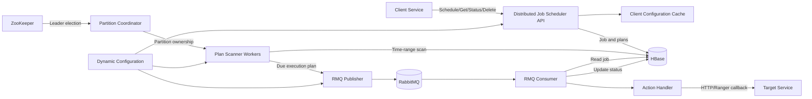
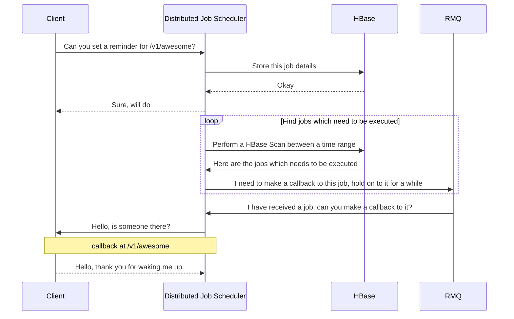
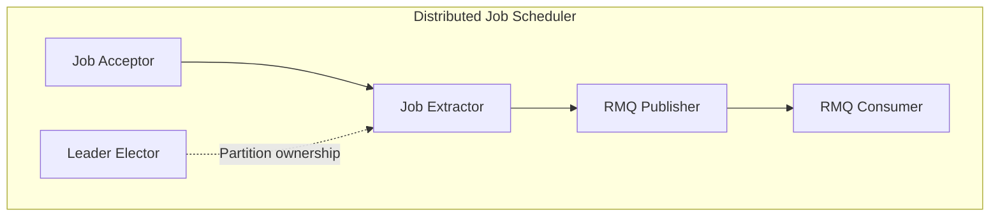
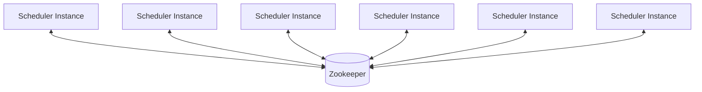

# Design a Distributed Job Scheduler: HLD Interview Guide

## 1. Start With the Problem

We need to design a distributed service that accepts a job with:

- **When to execute:** once, repeatedly, or on a recurring schedule.
- **What to execute:** an API or Ranger callback.

The system must durably store the job, trigger it close to its scheduled time,
retry supported failures, scale horizontally, and expose execution status.

### One-line design

> Persist jobs and time-ordered execution plans in HBase, use
> ZooKeeper-assigned workers to find due plans, publish them to RabbitMQ, and
> let consumers execute callbacks and save results back to HBase.

---

## 2. Questions to Ask the Interviewer

Ask these before drawing the architecture.

### Functional requirements

1. What schedule types are required: one-time, fixed interval, or cron-like?
2. What does a job execute: HTTP callback, message, or internal code?
3. Can users update or cancel jobs?
4. Do we need execution history and status?
5. Are retries required? What is the retry limit and backoff policy?
6. What should happen to a job that is late?
7. Can clients provide their own job ID?

### Scale and SLA

1. How many jobs are created per day?
2. How many executions happen per second at average and peak load?
3. What is the maximum acceptable scheduling delay?
4. How long must job and execution history be retained?
5. What availability target is required?
6. How large is an average job payload?
7. Is execution at-most-once, at-least-once, or exactly-once?

### Clarify the boundary

The Distributed Job Scheduler service schedules and triggers work. The target service owns the business
operation. The Distributed Job Scheduler service should not run arbitrary user code inside its process.

---

## 3. Interview Assumptions

Use these only when the interviewer does not provide numbers:

| Requirement | Assumption |
|---|---:|
| New jobs per day | 10 million |
| Average executions per job | 3 |
| Executions per day | 30 million |
| Peak schedule traffic | 2,000 requests/second |
| Peak execution traffic | 10,000 plans/second |
| Average stored job size | 2 KB |
| Average execution-plan size | 1 KB |
| Status/history retention | 30 days |
| Scheduling precision | Within a few seconds |
| Availability | 99.99% |
| Delivery guarantee | At least once |

### Product assumptions

- Jobs belong to registered clients.
- A client can have multiple partitions.
- A late plan executes only while it is inside its relevancy window.
- The callback target should treat `planId` as an idempotency key.
- Strong consistency across all jobs is unnecessary.
- A direct read of one job or plan status should be fast.

---

## 4. Back-of-the-Envelope Calculations

The goal is not a perfect number. Show that the design matches the scale.

### Write traffic

```text
10 million jobs/day / 86,400 seconds
≈ 116 job creates/second on average
```

With a 10x peak:

```text
≈ 1,160 job creates/second
```

Each job produces three plans:

```text
30 million plans/day / 86,400
≈ 347 plan executions/second on average
```

The design should handle an assumed peak of approximately 10,000 due plans per
second because schedules commonly create traffic spikes at round times.

### Storage

Job definitions:

```text
10 million jobs/day × 2 KB
≈ 20 GB/day
```

Execution plans and status:

```text
30 million plans/day × 1 KB
≈ 30 GB/day
```

Raw storage for 30 days:

```text
(20 GB + 30 GB) × 30
≈ 1.5 TB
```

With HBase replication and storage overhead, provision roughly 3-5 times the
raw estimate:

```text
≈ 4.5-7.5 TB
```

### Queue throughput

At 10,000 plans/second and an approximately 1 KB queue message:

```text
10,000 × 1 KB ≈ 10 MB/second before replication and protocol overhead
```

RabbitMQ queues should be separated by client or workload policy so one noisy
client cannot block every other client.

---

## 5. Core Data Model

The most important modeling decision is to separate a **Job** from an
**Execution Plan**.

| Model | Meaning |
|---|---|
| Job | Durable schedule definition and action |
| Execution Plan | One occurrence of a job at a specific time |
| Execution Status | Result of one plan |
| Client Info | Tenant configuration, partitions, routing, and controls |

### Job

```text
Job
├── jobId
├── clientId
├── schedulingRequest
│   ├── time specification
│   └── scheduled action
├── active
├── relevancyWindowMs
├── routingHeaders
├── createdAt / createdBy
└── updatedAt / updatedBy
```

### Execution Plan

```text
ExecutionPlan
├── planId
├── jobId
├── clientId
├── executionTime
├── executionOrder
├── partition
├── relevancyWindowMs
├── time specification for REPEATED_V2
└── routingHeaders
```

### Execution Status

```text
ExecutionStatus
├── jobId
├── scheduledExecutionTime
├── status: PENDING | SUCCESS | FAILED | DROPPED
├── startTime
├── completionTime
├── elapsedTime
└── callback response
```

Example: one job that runs every hour remains one `Job`, but each hourly
execution has a separate `ExecutionPlan` and status.

---

## 6. APIs

### Schedule a job

```http
POST /jobs/{clientId}/v2/
Content-Type: application/json
```

```json
{
  "jobId": "settlement-reminder",
  "time": {
    "type": "ONCE_ONLY"
  },
  "action": {
    "type": "API_CALL",
    "retryOnFailure": true,
    "ignoreOnFailure": false
  },
  "relevancyWindowMs": 60000
}
```

```json
{
  "success": true,
  "data": {
    "clientId": "payments",
    "jobId": "settlement-reminder",
    "plans": ["SEP-plan-id"],
    "terminationDate": "scheduled-time"
  }
}
```

If `jobId` is not supplied, the Distributed Job Scheduler service generates a UUID.

### Get a job

```http
GET /jobs/{clientId}/v2/{jobId}
```

Returns the job definition and metadata.

### Get one execution status

```http
GET /jobs/{clientId}/v2/{jobId}/tasks/{planId}/status
```

Returns `PENDING`, `SUCCESS`, `FAILED`, or `DROPPED`, along with timing and
response data.

### Delete a job

```http
DELETE /jobs/{clientId}/v2/{jobId}
```

Deactivates the job and removes pending plan rows so scanners do not execute
them.

### API design points

- `clientId` provides tenant scope.
- `jobId` identifies the durable schedule.
- `planId` identifies one execution and can be an idempotency key.
- Schedule creation returns generated plan IDs for later status queries.
- Authentication and authorization are applied at the API layer.

---

## 7. High-Level Architecture



### Component responsibilities

| Component | Responsibility |
|---|---|
| Distributed Job Scheduler API | Validate clients and accept job operations |
| HBase jobs table | Store job metadata and execution status |
| HBase plans table | Time index used to find due executions |
| ZooKeeper | Elect coordinator and assign partitions |
| Scanner workers | Read due plans from owned partitions |
| RabbitMQ publisher | Queue due plans for execution |
| RabbitMQ consumer | Load the job, execute it, and save status |
| Dynamic config | Control scanning, throttling, and client flow |
| Events and metrics | Report failures, delays, expiry, and queue depth |

---

## 8. Database Design

The Distributed Job Scheduler service uses one shared client-info table and isolated jobs/plans tables for
each client.

### Client-info table

| Field | Design |
|---|---|
| Row key | `clientId` |
| Metadata column | Serialized client configuration |
| Scan-state columns | Last scanned timestamp for each partition |

The scan state allows workers to resume backlog processing after a restart.

### Per-client jobs table

#### Row key

```text
[1-byte bucket]:clientId:jobId
```

The bucket prefix spreads rows across HBase regions and reduces hot spotting.

| Column family | Qualifier | Value |
|---|---|---|
| `m` | `data` | Serialized `Job` |
| `p` | `planId` | Serialized `PlanData` |

`PlanData` contains the execution plan, current status, and the corresponding
plans-table row key.

This table supports:

- Direct job lookup using `clientId + jobId`.
- Direct plan-status lookup using `jobId + planId`.
- Reading all plan statuses for one job.

### Per-client plans table

#### Row key

```text
clientId:partition:20-digit-executionTimestamp:jobId
```

| Column family | Qualifier | Value |
|---|---|---|
| `e` | `jobId` | Job ID |
| `e` | `data` | Serialized `ExecutionPlan` |

This row key sorts plans by:

1. Client
2. Partition
3. Execution time
4. Job ID

A worker can perform a bounded range scan for one partition and time window.
It never needs to scan all jobs to find what is due.

### Why is plan data duplicated?

The duplication supports two different access patterns:

| Access pattern | Table |
|---|---|
| Find a job or status by ID | Jobs table |
| Find all plans due in a time range | Plans table |

This is deliberate denormalization. HBase does not provide relational
secondary indexes or joins, so data is written in the shape in which it will
be read.

---

## 9. Why Choose HBase?

### Requirements that fit HBase

- High write volume.
- Very large retained dataset.
- Horizontal scaling through regions.
- Fast point reads by row key.
- Efficient ordered range scans.
- Flexible serialized job and status values.
- Natural TTL support for old records.

The key reason is not only scale. It is that the Distributed Job Scheduler service has two predictable
access patterns:

1. Point lookup by job ID.
2. Range scan by partition and execution timestamp.

Both can be encoded directly into HBase row keys.

### Why not a relational database?

A relational database is simpler at small scale and gives transactions,
constraints, and flexible queries. At high scheduling volume, however:

- A global `WHERE execution_time <= now` query can create index contention.
- A single ordered time index can become a hot write and scan range.
- Horizontal sharding and rebalancing become application concerns.
- The Distributed Job Scheduler service does not require joins for its main execution path.

For a smaller system, PostgreSQL with a partitioned `execution_time` index
would be a good first version. HBase is justified when scale and predictable
key-based access dominate.

### Why not only RabbitMQ delayed messages?

- Very long delays are not the primary strength of a queue.
- Millions of future messages are harder to query, update, or cancel.
- Job status and history still require durable storage.
- Queue topology and retention become coupled to schedule retention.

HBase owns the future schedule. RabbitMQ buffers only work that is ready to
execute.

### Why not Redis?

Redis sorted sets can model time ordering and work well at moderate scale, but
large durable history and multi-terabyte retention are more expensive and
operationally less suitable than HBase for this design.

---

## 10. End-to-End Flows

### A. Schedule flow

```text
Client
  -> Distributed Job Scheduler API
  -> Validate registered/enabled client
  -> Validate action and callback restrictions
  -> Build Job
  -> Expand TimeSpec into ExecutionPlans
  -> Assign planId and partition
  -> Write Job + PlanData to jobs table
  -> Write time-indexed ExecutionPlans to plans table
  -> Return jobId and planIds
```

The Distributed Job Scheduler service serializes the objects as JSON before writing them to HBase. Job
records receive a TTL based on the schedule plus a configured buffer.

### B. Plan-discovery flow

```text
ZooKeeper assigns partition
  -> Worker becomes active
  -> Check RabbitMQ congestion
  -> Calculate scan time window
  -> Range-scan HBase plans table
  -> Filter inactive or expired plans
  -> Publish eligible plans to RabbitMQ
  -> Delete successfully published plan rows
  -> Persist latest safe scan timestamp
```

A publish failure does not delete the plan. A later scan can retry it.

### C. Execution flow

```text
RabbitMQ consumer receives plan
  -> Load Job from HBase
  -> Confirm job is active
  -> Build callback request
  -> Add job and plan tracing headers
  -> Execute API/Ranger action
  -> Validate response status
  -> Save SUCCESS/FAILED/DROPPED status
  -> Acknowledge or retry queue message
```

The default accepted callback response codes are `200`, `201`, `202`, and
`204`, unless the job defines another set.

### D. Retrieval flow

Get job:

```text
clientId + jobId
  -> Compute bucketed jobs-table row key
  -> Read m:data
  -> Deserialize and return Job
```

Get status:

```text
clientId + jobId + planId
  -> Compute jobs-table row key
  -> Read p:planId
  -> Deserialize PlanData
  -> Return ExecutionStatus
```

These are point reads. They do not scan the plans table.

### E. Delete flow

```text
Delete request
  -> Read job and its plan locations
  -> Mark job inactive
  -> Delete pending rows from plans table
  -> Prevent future execution
```

The consumer also checks the job's active flag in case a message was already
queued before deletion.

---

## 11. Partitioning and Horizontal Scaling

### Why partition plans?

Using only execution time as the row-key prefix would send current writes and
reads to the same HBase region. The Distributed Job Scheduler service adds a partition before the timestamp:

```text
clientId:partition:timestamp:jobId
```

Plans are distributed across partitions. Each partition remains time ordered.

### Worker model

If a client has four partitions and four scan configurations:

```text
4 partitions × 4 scan windows = 16 workers
```

Different scan windows can handle recent executions and older backlog without
making one large scan.

### ZooKeeper ownership

For each client:

1. Every Distributed Job Scheduler instance registers as a member.
2. ZooKeeper elects one partition coordinator.
3. The coordinator distributes partitions across live instances.
4. Each instance activates only its assigned workers.
5. A membership change causes reassignment.

This avoids all instances intentionally processing every partition and allows
the scanning layer to scale horizontally.

---

## 12. Repeated V2 Design

Expanding an unbounded recurring job into every future execution would create
unbounded storage.

For `REPEATED_V2`:

1. Store only the next execution plan.
2. When that plan becomes due, calculate and store the following plan.
3. Publish and remove the current plan.
4. Remove completed plan data from the job row.

This keeps storage bounded for schedules that may run forever.

The trade-off is that creating the next plan becomes part of the critical
execution path. The Distributed Job Scheduler service creates the next plan before acknowledging the
current one.

---

## 13. Reliability and Failure Handling

### Delivery guarantee

The HBase-to-RabbitMQ handoff is:

```text
Publish to RabbitMQ -> Delete plan from HBase
```

These operations are not one distributed transaction.

- If publish fails, the HBase plan remains and can be retried.
- If the process crashes after publish but before delete, the plan may be
  published again.

The system therefore provides **at-least-once-oriented execution**, not strict
exactly once.

Downstream services should deduplicate using `planId`.

### Important failure cases

| Failure | Behavior |
|---|---|
| API instance fails after HBase write | Job remains durable |
| Scanner instance fails | ZooKeeper reassigns its partitions |
| HBase is temporarily unavailable | Plans remain durable but execution is delayed |
| RabbitMQ is congested | Flow control pauses extraction |
| RabbitMQ publish fails | Plan is not deleted from HBase |
| Crash after publish, before delete | Duplicate delivery is possible |
| Consumer fails callback | Message can retry or move to sideline policy |
| Callback response is unsuccessful | Status becomes failed unless ignored/retried |
| Job is late | Execute or expire based on relevancy window |
| Job is deleted after queueing | Consumer checks active state before execution |

### Backpressure

Publishers monitor main and sideline queue depth. When pending messages cross
configured thresholds, workers stop extracting more plans and do not advance
their scan state.

This prevents a slow callback system from causing unbounded queue growth.

### Recovery from downtime

Plans remain in HBase. Forward scanners store the last safe timestamp for each
client partition. After restart, workers continue from that state and process
the backlog.

---

## 14. Consistency and Trade-offs

### Consistency model

- Job and plans are written to separate HBase tables.
- Status is stored with the job for fast reads.
- A queued message may briefly exist after a job is deleted.
- The consumer rechecks the latest job state before execution.
- Duplicate delivery is possible, but lost work is avoided where possible.

### Major design trade-offs

| Decision | Benefit | Cost |
|---|---|---|
| Separate jobs and plans tables | Fast ID lookup and time scan | Duplicate data and two writes |
| Random plan partition | Distributes load | One job's plans can span partitions |
| Per-client tables | Tenant isolation | More HBase tables to operate |
| ZooKeeper ownership | Failover and horizontal scale | Coordination dependency |
| RabbitMQ execution buffer | Retry, isolation, and backpressure | Duplicate delivery risk |
| Store status in job row | Fast status API | Large rows for jobs with many plans |
| Repeated V2 next-plan model | Bounded recurring storage | More scheduling logic during extraction |

---

## 15. Bottlenecks and Improvements

### Potential bottlenecks

- Jobs with many plans can create wide HBase job rows.
- Per-client tables can become operationally expensive with many tenants.
- Large numbers of schedules at the same timestamp create execution spikes.
- Callback latency can grow RabbitMQ backlogs.
- A hot or noisy client can consume excessive scanner or queue capacity.
- ZooKeeper is a critical coordination dependency.

### Possible improvements

Discuss these as future options, not requirements for the first design:

- Add explicit downstream idempotency contracts using `planId`.
- Apply per-client API, scanner, publisher, and consumer quotas.
- Add jitter for jobs that do not require exact wall-clock execution.
- Archive old execution history to cheaper object storage.
- Use transactional outbox or stronger deduplication if duplicates are
  unacceptable.
- Split very wide job histories into separate status rows.
- Auto-tune partitions based on client traffic.

---

## 16. Security and Observability

### Security

- Authenticate schedule and delete APIs.
- Authorize operations within the supplied `clientId`.
- Do not persist incoming authorization headers as routing headers.
- Validate or whitelist callback hosts.
- Support system authentication when calling protected targets.
- Protect against internal-network access through user-controlled URLs.

### Observability

Track:

- Schedule requests and failures.
- HBase scan latency and rows scanned.
- Due plans found per client and partition.
- RabbitMQ publish and consume failures.
- Main and sideline queue depth.
- Schedule, scan, publish, consume, and execution delay.
- Expired plans.
- Callback response status and latency.
- ZooKeeper leadership and partition reassignment.

The key business metric is:

```text
actual callback start time - planned execution time
```

---

## 17. Explain the Design in 40 Minutes

| Time | Discussion |
|---|---|
| 0-4 min | Clarify requirements and delivery guarantee |
| 4-8 min | State assumptions and calculate scale |
| 8-13 min | Define Job versus Execution Plan |
| 13-18 min | Present APIs and HLD |
| 18-25 min | Explain HBase row keys and why HBase |
| 25-31 min | Walk through schedule, scan, queue, and execute |
| 31-36 min | Explain partitioning, ZooKeeper, and scaling |
| 36-40 min | Cover failures, at-least-once delivery, and trade-offs |

### Opening script

> I will first clarify schedule types, execution SLA, scale, retention, and
> delivery guarantees. I will model the durable job separately from each
> execution occurrence. Jobs and statuses need fast point reads, while due
> plans need ordered time-range scans, so I will store both access patterns in
> HBase. ZooKeeper assigns plan partitions to scanner workers, RabbitMQ
> decouples discovery from execution, and consumers perform callbacks and save
> the result.

### Closing summary

> The Distributed Job Scheduler service is durable, horizontally scalable, and multi-tenant.
> HBase is both the source of truth and the time index, ZooKeeper coordinates
> partition ownership, and RabbitMQ absorbs execution load and failures. The
> design prioritizes availability and no lost schedules, so execution is
> at-least-once and target services use `planId` for idempotency.

---

## 18. Common Interview Follow-up Questions

**How do you find jobs due now without scanning everything?**  
The plans-table row key contains partition followed by execution timestamp.
Workers range-scan only their assigned partition and time window.

**Why separate a job from a plan?**  
The job is the reusable definition. A plan represents one execution and needs
its own time, partition, ID, and status.

**Why use two HBase tables?**  
One table is optimized for lookup by job ID. The other is optimized for
time-range scans. One row-key design cannot efficiently serve both patterns.

**How does the system scale?**  
Increase client partitions, HBase regions, scanner instances, RabbitMQ
capacity, and consumers. ZooKeeper redistributes partitions across instances.

**How is duplicate execution handled?**  
The Distributed Job Scheduler service provides at-least-once-oriented delivery. The stable `planId` is
passed to the callback and should be used for downstream deduplication.

**What happens when the service is down for ten minutes?**  
Plans remain in HBase. After recovery, workers resume from persisted scan state.
Each plan's relevancy window decides whether to execute it late or expire it.

**How do you stop one client from affecting others?**  
The Distributed Job Scheduler service uses client-specific tables, partitions, queues/configuration, rate
limits, and flow-control thresholds.

**Would you choose HBase for a small startup system?**  
Not initially. PostgreSQL with indexed and partitioned execution rows is
simpler. HBase becomes useful when write volume, retained data, and time-range
scanning require horizontal scale.

**Can exactly-once execution be guaranteed?**  
Not for an arbitrary remote callback without cooperation from the target.
Exactly-once business behavior requires an idempotency key or a transaction
shared with the target system.

---

## 19. Distributed Job Scheduler Source Map

| Design area | Main implementation |
|---|---|
| Boot and dependency wiring | `App`, `CoreModule`, `HBaseModule` |
| Schedule/get/delete APIs | `Jobs`, `JobsV2`, `BaseJobs` |
| Persistence interface | `ScheduleStore` |
| Job and plan persistence | `HBaseScheduleStore` |
| Client metadata and scan state | `HBaseClientInfoStore` |
| Runtime initialization | `JobScheduler`, `SchedulerRefresher` |
| Due-plan scanning | `ExecutionPlanExtractor`, `ExecutionPlanExtractionWorker` |
| Partition coordination | `LoadBalancingLeaderElector` |
| Queue operations | `PublisherActor`, `ConsumerActor` |
| Callback execution | Action Handler, HTTP Client |

---

## 20. From the Confluence page of the Distributed Job Scheduler service:

### Deep Dive into the Distributed Job Scheduler service powering over 2 Billion daily jobs at PhonePe

> In this article, we will take a look at the internals of the Distributed Job Scheduler service - the system that powers job scheduling across various teams at PhonePe.

---

### What is the Distributed Job Scheduler service?

The Distributed Job Scheduler is a Scheduled Executor Service which is Distributed, Durable and Fault Tolerant. Wow, that's a handful! Let's dissect it!

**Scheduled Executor Service** - A term taken from Java in which clients can submit jobs which can be executed as per their requirement. Instead of executing arbitrary Java code, we limit it to only providing a HTTP callback to the provided URL endpoint at the specified time duration. Clients can schedule jobs which can be executed once, or at a fixed intervals e.g. after every one day or daily at 5 PM.

**Distributed** - Given the scale we are dealing with, it's a no-brainer that we would need a service which can scale horizontally.

**Durable** - Any submitted task is stored in a durable storage allowing the service to recover from failures.

**Fault Tolerant** - Any failure during job execution is handled gracefully as per the client configuration. In case a client wants the job to be retried, we automatically retry the jobs as per their retry strategy.

### Scale

- Over 2 Billion callbacks are made daily as per the schedule defined.
- Capability to handle over 100,000 job schedules per second with a single digit millisecond latency.
- No lag in the job execution at p99 which in the worst case can extend to 1 minute.

---

### Architecture - 1000 foot view

1. Clients schedule Jobs.
2. Jobs get executed.
3. Clients receive callbacks.
4. Profit.



#### How the flow works

Whenever a client schedules jobs, we store the job details in HBase and immediately send an acknowledgement back to the client.

Asynchronously, the Distributed Job Scheduler worker threads keep on performing HBase scans between a time range to find the list of eligible jobs which needs execution. Once found, those jobs are immediately pushed to RabbitMQ (RMQ) in order to avoid blocking the worker threads. As the callback is an HTTP callback to an URL endpoint, it can be time consuming, hence it's important to do it in different threads.

RMQ Consumer threads actively listen to any pending messages present in the queues and immediately consume the messages. After message consumption and validation, a callback is made to the client as per the job details present.

#### Why HBase?

> HBase is a sparse, distributed, persistent, multidimensional sorted map, which is indexed by a RowKey, ColumnKey, and timestamp. It allows us to efficiently query by a specific key or perform scans based on a start/stop key.

#### Why RabbitMQ?

> RabbitMQ is a messaging broker - an intermediary for messaging. It gives applications a common platform to send and receive messages, and messages a safe place to live until consumed. It's based on a widely accepted AMQP model.

---

### Architecture - Deep Dive

The Distributed Job Scheduler service can be divided into 5 modules - each one entrusted to perform a single responsibility.



#### Job Acceptor

This is a Client Facing Module. It's responsibility is to accept and validate the incoming request from clients, persist the job details in HBase and return an acknowledgement back to the client. While persisting the job details, a random Partition Id is assigned to the job id. We will cover the role of partition id in the subsequent sections.

#### Job Extractor

Its responsibility is to find jobs which are eligible for execution. If the scheduled execution time of a job <= current time, a job becomes eligible. It finds eligible plans by running a HBase scan query between a time range. Once an eligible plan is found, the plans are pushed to RMQ one by one (without waiting for the job execution) to perform the next scan as soon as possible.

#### Leader Elector

Its responsibility is to assign leaders amongst multiple Distributed Job Scheduler instances so that only one instance is responsible for a particular partition of a client. If there are multiple instances running, each instance trying to find eligible jobs of a client  between a time range, they all will get the same data, which will result in duplicate executions of the same job, which no one wants.

> **How to ensure exactly once guarantee of the job? Zookeeper to the rescue!**



1. During the application startup, the application instance registers itself with zookeeper with a unique worker id.
2. It then proceeds to check if there is a leader already elected. If not, it tries to become a leader.
3. In case it becomes a leader, it moves on to perform the partition assignment.

If you are still reading this article (kudos), you must have heard about the term Partition Id mentioned earlier. How is it helpful? It helps us in increasing the concurrent scans that we can perform on HBase without ensuring any overlap. If there were no partitions, we could only perform 1 concurrent scan but if we increased the partitions to 64, we just increased our concurrency by 64.

But with great power comes great responsibility! As we still have to ensure that no two instances scan the same partition otherwise it will lead to double execution of the same job! This is where partition assignment comes into the picture. The leader instance is responsible for assigning partitions to the workers - in a round robin manner. This ensures fairness in partition distribution and ensures no two workers read the same partition.

#### RMQ Publisher

Once the list of eligible plans is fetched and some validations are performed, the messages are pushed to RMQ which acts as our message queue. While publishing the message we enforce Rate limiter and Circuit Breaker.

> **Rate Limiter** ensures that we don't publish more than what we can consume - otherwise it can lead to the instability of the RMQ cluster - because of a huge backlog of messages.

> **Circuit Breaker** ensures Back-pressure propagation. If the client is unhealthy and is unable to acknowledge the callbacks, it does not make sense to make subsequent calls to it in the immediate future.

#### RMQ Consumer

It listens to the incoming messages in the RMQ Queues and executes it by making a HTTP call to the specific URL endpoint. Any failure while making the call is handled by client specific retry strategies.

Some clients don't want to retry and just want to drop failed messages, whereas some want to perform retries based on exponential backoff with random jitter. In case the retries are exhausted and the callback still fails, the message is pushed to a Dead-Letter-Queue. It's kept there until the messages are moved back to the main queue or the messages expire.
