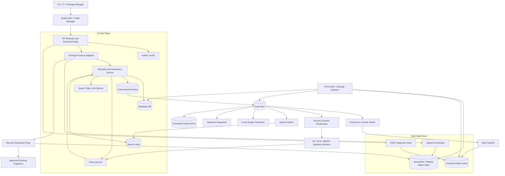
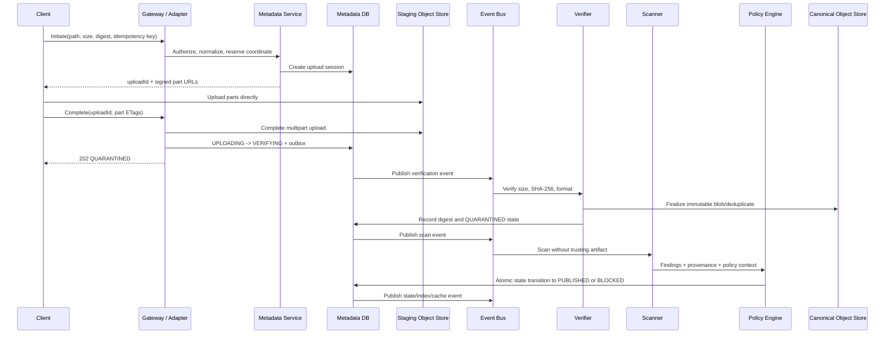
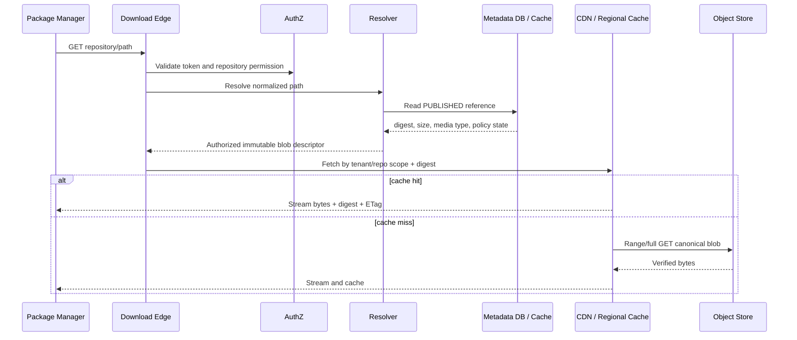
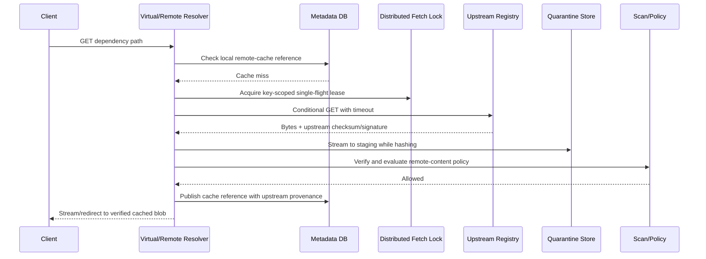

# Artifact Repository (JFrog Artifactory-like) - High-Level Design Interview

> **Interview duration:** 60 minutes
>
> **Candidate level:** Software engineer with 6-7 years of experience
>
> **Prompt:** "Design an artifact repository where users can publish and fetch artifacts. Then discuss scalability, metrics, reliability, extensibility, and malicious artifacts."

---

## Table of Contents

1. [What the interviewer is testing](#1-what-the-interviewer-is-testing)
2. [How to approach the interview](#2-how-to-approach-the-interview)
3. [Clarifying requirements](#3-clarifying-requirements)
4. [Scope, assumptions, and guarantees](#4-scope-assumptions-and-guarantees)
5. [Back-of-the-envelope estimation](#5-back-of-the-envelope-estimation)
6. [Core domain model](#6-core-domain-model)
7. [API and protocol design](#7-api-and-protocol-design)
8. [Data model and storage choices](#8-data-model-and-storage-choices)
9. [High-level architecture](#9-high-level-architecture)
10. [Adding an artifact end to end](#10-adding-an-artifact-end-to-end)
11. [Fetching an artifact end to end](#11-fetching-an-artifact-end-to-end)
12. [Consistency, immutability, and idempotency](#12-consistency-immutability-and-idempotency)
13. [Content-addressable storage and deduplication](#13-content-addressable-storage-and-deduplication)
14. [Package formats, repositories, and dependency resolution](#14-package-formats-repositories-and-dependency-resolution)
15. [Scalability and performance](#15-scalability-and-performance)
16. [Caching and remote repositories](#16-caching-and-remote-repositories)
17. [Reliability, failure handling, and disaster recovery](#17-reliability-failure-handling-and-disaster-recovery)
18. [Security, malicious artifacts, and software supply chain](#18-security-malicious-artifacts-and-software-supply-chain)
19. [Observability, metrics, SLOs, and alerts](#19-observability-metrics-slos-and-alerts)
20. [Extensibility](#20-extensibility)
21. [Lifecycle management and garbage collection](#21-lifecycle-management-and-garbage-collection)
22. [Multi-region design](#22-multi-region-design)
23. [Alternatives and trade-offs](#23-alternatives-and-trade-offs)
24. [Failure-mode walkthrough](#24-failure-mode-walkthrough)
25. [Interviewer follow-up questions](#25-interviewer-follow-up-questions)
26. [Five-minute final answer](#26-five-minute-final-answer)
27. [Interview cheat sheet](#27-interview-cheat-sheet)

---

## 1. What the Interviewer Is Testing

An artifact repository looks like a file server at first, but a senior-level design must identify that it is actually several systems:

- A strongly consistent **metadata registry** for package coordinates, versions, manifests, permissions, and lifecycle state.
- A high-throughput **blob data plane** for large immutable binaries.
- A **package protocol translation layer** for Maven, npm, PyPI, NuGet, OCI, and generic files.
- A **cache and proxy** for external registries.
- A **software-supply-chain security gate** that treats every upload as untrusted.
- A **governance system** for retention, promotion, audit, legal hold, and provenance.

The interviewer is likely testing whether the candidate can:

- Clarify artifact semantics rather than immediately drawing object storage.
- Separate metadata traffic from multi-gigabyte upload/download traffic.
- Make publication atomic from the client's point of view.
- Prevent clients from reading partial, corrupt, quarantined, or unauthorized content.
- Support resumable transfer, range reads, checksums, and deduplication.
- Explain mutable tags versus immutable digests.
- Scale bandwidth independently from metadata QPS.
- Handle hot artifacts, cache stampedes, and upstream registry outages.
- Detect and contain a malicious artifact without making the repository unavailable.
- Define measurable SLOs and reconciliation processes.
- Evolve to new package types and scanners without rewriting the core.

> **Candidate opening:** "I will first clarify the repository types, package formats, mutability, security gate, and scale. Then I will estimate storage and bandwidth, define APIs and data, draw separate control and blob data planes, and deep-dive into publish, fetch, malicious-artifact handling, and failure recovery."

---

## 2. How to Approach the Interview

### 2.1 Minute-by-Minute Plan

| Time | Candidate activity | Expected output |
|---|---|---|
| 0-5 min | Clarify use cases | Package types, local/remote/virtual repos, upload/download, security |
| 5-9 min | Fix scope and guarantees | Immutability, visibility, consistency, tenancy, availability |
| 9-13 min | Estimate capacity | Blob storage, metadata QPS, ingress, egress, cache size |
| 13-18 min | Define domain and APIs | Coordinates, versions, manifests, upload sessions, download |
| 18-25 min | Choose data stores | Relational metadata, object storage, cache/CDN, search index |
| 25-32 min | Draw architecture | Control plane, data plane, event pipeline, scanners |
| 32-40 min | Deep dive: artifact upload | Multipart upload, checksum, finalize, scan, publish |
| 40-45 min | Deep dive: artifact fetch | Resolution, authorization, CDN, ranges, remote proxy |
| 45-51 min | Scale and reliability | Sharding, hot blobs, reconciliation, DR |
| 51-56 min | Malicious artifacts and security | Quarantine, scanners, policy, revocation, audit |
| 56-59 min | Metrics and extensibility | SLIs, alerts, plugin boundaries |
| 59-60 min | Summarize trade-offs | Core invariants and bottlenecks |

### 2.2 Whiteboard Order

Use this order so that the discussion stays coherent:

1. Write functional and non-functional requirements.
2. State the consistency and publication contract.
3. Estimate blob volume and bandwidth.
4. Define identifiers and APIs.
5. Draw the architecture.
6. Walk upload and download paths.
7. Add failure handling and security.
8. Close with scale, metrics, and trade-offs.

Do not spend the first 20 minutes discussing every Maven or OCI endpoint. The key design is protocol-neutral; package adapters translate each ecosystem into the common model.

---

## 3. Clarifying Requirements

### 3.1 Simulated Interview Conversation

> **Interviewer:** Design a repository like JFrog Artifactory. Users should be able to add and fetch artifacts.

> **Candidate:** "Should I support generic binaries only, or package-manager protocols such as Maven, npm, PyPI, and OCI images?"

> **Interviewer:** Start with generic binaries and Maven. Explain how the design extends to npm and OCI.

> **Candidate:** "Do we need only hosted repositories, or also remote proxy repositories and virtual repositories that combine several sources?"

> **Interviewer:** Support all three: local, remote, and virtual.

> **Candidate:** "Are versions immutable after publication? Some ecosystems have mutable tags such as `latest`."

> **Interviewer:** Artifact bytes at a version are immutable. Aliases and tags can move, with audit history and optimistic concurrency.

> **Candidate:** "Does an uploaded artifact become immediately downloadable, or must it pass malware, vulnerability, signature, and policy checks first?"

> **Interviewer:** It must pass an asynchronous security policy before general release. The publisher can inspect its quarantined upload.

> **Candidate:** "What scale, artifact size, retention, and latency should I design for?"

> **Interviewer:** Design for 100 million logical artifact records, 5 PB of unique blobs, 200,000 uploads and 50 million downloads per day. Files range from 1 KB to 20 GB. A hot release can receive millions of downloads."

> **Candidate:** "Is this multi-tenant and multi-region? What availability and disaster-recovery targets are required?"

> **Interviewer:** Yes. Strong tenant isolation, 99.99% metadata availability, 99.999% download availability for already-published artifacts, RPO under five minutes, and RTO under 30 minutes.

> **Candidate:** "Should clients search by package name and metadata, and do we need retention, promotion, and audit?"

> **Interviewer:** Yes. Support metadata search, staged promotion from development to production, configurable retention, legal hold, and an immutable audit trail.

### 3.2 Questions Worth Asking

| Area | Clarifying question | Why it changes the design |
|---|---|---|
| Formats | Generic, Maven, npm, PyPI, NuGet, OCI? | Each protocol has different paths, manifests, and resolution semantics |
| Repository type | Local, remote proxy, virtual/aggregate? | Adds upstream fetch, cache, priority, and conflict handling |
| Artifact size | Maximum and average size? | Determines multipart upload, streaming, timeouts, and chunking |
| Mutability | Can a version be overwritten? Can tags move? | Determines cache safety and consistency |
| Security | Scan before publish or scan after publish? | Determines state machine and publication latency |
| Integrity | Which checksum/signature algorithms? | Determines content identity and verification |
| Visibility | Must read-after-publish be immediate? | Determines metadata replication and routing |
| Traffic | Upload/download count and bandwidth? | Data-plane capacity is usually the dominant constraint |
| Tenancy | Organizations, projects, and repository-level RBAC? | Determines keys, quotas, encryption, and audit |
| Geography | Single region, active-passive, active-active? | Determines ownership and replication semantics |
| Search | Exact coordinate lookup or full-text/property search? | Determines whether a search index is necessary |
| Promotion | Copy bytes or promote metadata? | Metadata-only promotion is faster and avoids duplication |
| Retention | Delete by age, count, usage, or policy? | Requires reachability analysis and delayed GC |
| Compliance | Legal hold, immutability/WORM, audit retention? | Affects deletion and storage configuration |
| Availability | Can upload pause while downloads continue? | Encourages independent control and data planes |

---

## 4. Scope, Assumptions, and Guarantees

### 4.1 Functional Requirements

| ID | Requirement |
|---|---|
| FR-1 | Create local, remote, and virtual repositories |
| FR-2 | Upload an artifact using single-request or resumable multipart upload |
| FR-3 | Fetch by repository path, package coordinate, version, tag, or digest |
| FR-4 | Verify size and cryptographic checksum before accepting content |
| FR-5 | Scan, quarantine, approve, reject, and revoke artifacts |
| FR-6 | Support generic files and Maven initially |
| FR-7 | Proxy and cache artifacts from approved external repositories |
| FR-8 | Search by package, version, checksum, properties, build, and scan status |
| FR-9 | Promote an immutable artifact across development, staging, and production |
| FR-10 | Apply RBAC, tenant quotas, retention, legal hold, and audit policies |
| FR-11 | Support range downloads, conditional requests, and resumable transfers |
| FR-12 | Emit webhooks/events for upload, scan, publish, promotion, and revocation |

### 4.2 Non-Functional Requirements

| ID | Target |
|---|---|
| NFR-1 | Published bytes are immutable and addressed by SHA-256 digest |
| NFR-2 | No acknowledged published artifact is silently lost |
| NFR-3 | A client never receives partial or quarantined content as a published artifact |
| NFR-4 | 99.99% control-plane availability |
| NFR-5 | 99.999% published-artifact download availability |
| NFR-6 | p99 metadata resolution under 100 ms in-region |
| NFR-7 | Download first-byte p99 under 500 ms on a regional cache hit |
| NFR-8 | Scale to 5 PB unique blobs and bursty multi-region egress |
| NFR-9 | Tenant isolation, encryption, least privilege, and immutable audit |
| NFR-10 | RPO below 5 minutes and RTO below 30 minutes |

### 4.3 Explicit Semantics

1. **Blob immutability:** Bytes identified by a digest never change.
2. **Coordinate immutability:** A released `(repository, package, version, classifier)` cannot point to different bytes. Development snapshot policy may be configured separately.
3. **Mutable references:** Tags such as `latest` may move using compare-and-set and complete audit history.
4. **Upload acknowledgment:** Completing an upload means the bytes and metadata intent are durable, not necessarily generally downloadable.
5. **Publication acknowledgment:** `PUBLISHED` means policy passed, metadata is committed, and the blob is readable in the artifact's home region.
6. **Read-after-publish:** The publishing region provides immediate read-after-write for the canonical coordinate.
7. **Integrity:** A download returns the exact bytes represented by its digest or fails; it never returns corrupt bytes under a valid digest.
8. **Deletion:** User deletion removes references first. Physical blobs are removed later only when unreferenced and outside the recovery window.
9. **Multi-region:** Immutable bytes replicate asynchronously. Mutable metadata has a single writer per repository or uses consensus.
10. **Search:** Search indexes are eventually consistent and are never the authority for downloads.

### 4.4 Artifact State Machine

```text
INITIATED
    |
    v
UPLOADING
    |
    v
VERIFYING -------> CORRUPT
    |
    v
QUARANTINED -----> REJECTED
    |
    v
SCANNING --------> SCAN_FAILED_RETRYABLE
    |
    v
POLICY_EVALUATION
    |             \
    v              v
PUBLISHED       BLOCKED
    |
    +-----------> REVOKED
    |
    v
DELETED_REFERENCE -> GC_ELIGIBLE -> BLOB_DELETED
```

Only `PUBLISHED` artifacts are visible through normal resolution. Administrators may inspect blocked artifacts through a separate, tightly authorized quarantine path.

### 4.5 Out of Scope

- Building or compiling source code inside the repository.
- Replacing a source-control system.
- A general-purpose public file-sharing product.
- Runtime deployment orchestration.
- Guaranteeing that a vulnerability database has no unknown vulnerabilities.
- Executing arbitrary artifacts as part of normal metadata extraction.

---

## 5. Back-of-the-Envelope Estimation

> **Candidate:** "For this system, bytes per second and the ratio of logical references to unique blobs matter more than request count alone."

### 5.1 Given Workload

| Metric | Value |
|---|---:|
| Logical artifact records | 100 million |
| Unique stored bytes | 5 PB |
| Uploads/day | 200,000 |
| Downloads/day | 50 million |
| Maximum artifact size | 20 GB |
| Assumed average upload | 25 MB |
| Assumed average download | 25 MB |
| Peak-to-average traffic factor | 4x |
| Metadata retention after delete | 90 days |

### 5.2 Request Rate

```text
Average uploads/sec   = 200,000 / 86,400 = ~2.3/sec
Peak uploads/sec      = ~10/sec

Average downloads/sec = 50,000,000 / 86,400 = ~579/sec
Peak downloads/sec    = ~2,300/sec
```

These request rates look small, but bandwidth is substantial and individual files can be 20 GB. Multipart requests, range reads, package metadata requests, and OCI layer fan-out produce much higher operation counts than artifact counts.

### 5.3 Daily Storage Growth

```text
Raw ingress/day = 200,000 x 25 MB = 5 TB/day
```

Assume:

- 30% of uploaded bytes already exist because builds repeat dependencies or layers.
- Content-addressable deduplication leaves 70% unique bytes.
- Object storage keeps three durable copies internally.

```text
New unique logical storage/day = 5 TB x 0.70 = 3.5 TB/day
Annual logical growth          = ~1.28 PB/year before retention
Physical provider storage      = provider-dependent; replication is usually included in billing
```

Metadata is much smaller:

```text
100M artifact records x 2 KB/indexed record = ~200 GB
Replication and indexes at 3x               = ~600 GB
```

This confirms the natural split: relational/distributed metadata plus object storage for bytes.

### 5.4 Download Bandwidth

```text
Logical egress/day = 50M x 25 MB = 1.25 PB/day
Average egress     = 1.25 PB / 86,400 = ~14.5 GB/sec
Peak egress        = ~58 GB/sec
```

If regional edge caches and client-side checksum caches achieve an 80% byte hit ratio:

```text
Origin average egress = 14.5 GB/sec x 0.20 = ~2.9 GB/sec
Origin peak egress    = 58 GB/sec x 0.20   = ~11.6 GB/sec
```

A CDN or regional caching layer is not optional at this scale.

### 5.5 Scanner Capacity

If 5 TB arrives each day:

```text
Average scanning throughput = 5 TB / 86,400 = ~58 MB/sec
At 4x peak with 2x safety   = provision at least ~500 MB/sec aggregate
```

Actual capacity is limited by decompression, number of files, vulnerability analysis, and sandbox CPU, not only raw bytes. A 100 MB archive containing one million tiny files is far more expensive than one 100 MB binary.

### 5.6 Cache Sizing

Artifact popularity is usually Zipfian. If the hottest 2% of unique bytes serve 80% of download bytes, caching approximately 100 TB regionally could dramatically reduce origin traffic. Actual cache size should be chosen from measured reuse-distance curves, not this assumption.

---

## 6. Core Domain Model

### 6.1 Terminology

| Term | Meaning |
|---|---|
| **Tenant** | Organization owning projects, repositories, policies, and quotas |
| **Repository** | Namespace and policy boundary |
| **Local repository** | Stores artifacts uploaded by users/build systems |
| **Remote repository** | Proxy/cache for an upstream registry |
| **Virtual repository** | Ordered view over local and remote repositories |
| **Package coordinate** | Ecosystem-specific identity, such as Maven group/artifact/version |
| **Artifact reference** | Mapping from a repository path/coordinate to an immutable blob |
| **Blob** | Immutable byte sequence identified by SHA-256 |
| **Manifest** | Metadata referencing one or more blobs, especially for OCI |
| **Tag/Alias** | Mutable name pointing to an immutable version or manifest digest |
| **Upload session** | Temporary, resumable state before finalize |
| **Promotion** | Add an existing blob/version to another repository or maturity stage |
| **Scan result** | Versioned security findings produced by one scanner/database version |
| **Policy decision** | Allow, block, quarantine, or require approval |

### 6.2 Identity

Use different IDs for different purposes:

```text
artifact_id     = system-generated stable metadata ID
coordinate      = ecosystem-specific human/package-manager identity
blob_digest     = sha256:<64 hex chars>, identity of exact bytes
upload_id       = random opaque ID for a temporary upload session
event_id        = globally unique ID for asynchronous processing
```

A coordinate points to a blob digest. Multiple coordinates can reference the same blob.

### 6.3 Example Maven Coordinate

```text
tenant: acme
repository: maven-release
groupId: com.acme.payment
artifactId: payment-client
version: 2.4.1
classifier: sources
extension: jar

canonical path:
com/acme/payment/payment-client/2.4.1/payment-client-2.4.1-sources.jar
```

### 6.4 Example OCI Model

```text
repository: containers-prod
name: payment-service
tag: 2026.08.30       -> mutable/controlled alias
manifest digest: sha256:abc...
manifest:
  config digest: sha256:def...
  layer digests:
    - sha256:111...
    - sha256:222...
```

OCI demonstrates why one logical artifact can reference several deduplicated blobs.

---

## 7. API and Protocol Design

### 7.1 Repository Management

```http
POST   /v1/repositories
GET    /v1/repositories/{repositoryId}
PATCH  /v1/repositories/{repositoryId}
DELETE /v1/repositories/{repositoryId}
```

Example:

```json
{
  "name": "maven-release",
  "type": "LOCAL",
  "packageType": "MAVEN",
  "writePolicy": "IMMUTABLE_RELEASE",
  "securityPolicyId": "policy-production",
  "retentionPolicyId": "retain-2-years",
  "homeRegion": "ap-south-1"
}
```

### 7.2 Initiate Resumable Upload

```http
POST /v1/repositories/maven-release/uploads
Authorization: Bearer <token>
Idempotency-Key: 24ad9a0d-...
Content-Type: application/json
```

```json
{
  "path": "com/acme/payment/payment-client/2.4.1/payment-client-2.4.1.jar",
  "size": 26214400,
  "checksum": {
    "algorithm": "SHA-256",
    "value": "c74f..."
  },
  "contentType": "application/java-archive",
  "properties": {
    "build.id": "build-98122",
    "git.commit": "4f09c2a"
  }
}
```

Response:

```http
HTTP/1.1 201 Created
```

```json
{
  "uploadId": "upl_01K...",
  "partSize": 67108864,
  "expiresAt": "2026-08-30T16:00:00Z",
  "alreadyExists": false,
  "parts": [
    {
      "partNumber": 1,
      "uploadUrl": "https://blob-upload.example/signed/..."
    }
  ]
}
```

If the trusted SHA-256 digest is already stored and tenant policy permits checksum deployment, the service may skip byte transfer and create a new reference after authorization and policy checks. A claimed checksum alone must not allow a tenant to infer or attach to another tenant's private content.

### 7.3 Upload Parts and Resume

For small artifacts:

```http
PUT /v1/repositories/{repo}/artifacts/{path}
Digest: sha-256=<base64 digest>
Content-Length: 1048576
```

For large artifacts, the client uploads parts directly to object storage using short-lived signed URLs:

```http
PUT <signed-part-url>
Content-Length: 67108864
```

Resume:

```http
GET /v1/uploads/{uploadId}
```

```json
{
  "uploadId": "upl_01K...",
  "state": "UPLOADING",
  "completedParts": [
    {"partNumber": 1, "etag": "\"8f2...\""}
  ],
  "missingParts": [2, 3, 4]
}
```

### 7.4 Complete Upload

```http
POST /v1/uploads/{uploadId}:complete
Idempotency-Key: 460a1b62-...
```

```json
{
  "parts": [
    {"partNumber": 1, "etag": "\"8f2...\""},
    {"partNumber": 2, "etag": "\"1a9...\""}
  ]
}
```

Response:

```http
HTTP/1.1 202 Accepted
Location: /v1/artifacts/art_01K...
```

```json
{
  "artifactId": "art_01K...",
  "digest": "sha256:c74f...",
  "state": "QUARANTINED",
  "statusUrl": "/v1/artifacts/art_01K..."
}
```

`202` is intentional: verification, scanning, and policy evaluation are asynchronous.

### 7.5 Resolve and Download

Metadata:

```http
HEAD /v1/repositories/maven-release/artifacts/com/acme/payment/payment-client/2.4.1/payment-client-2.4.1.jar
```

```http
HTTP/1.1 200 OK
Content-Length: 26214400
Content-Type: application/java-archive
ETag: "sha256:c74f..."
Digest: sha-256=<base64 digest>
X-Artifact-State: PUBLISHED
```

Download:

```http
GET /v1/repositories/maven-release/artifacts/{normalizedPath}
Range: bytes=67108864-
If-None-Match: "sha256:c74f..."
```

The edge may:

- Stream the blob itself.
- Return a `302/307` to a short-lived signed object/CDN URL.
- Use signed cookies for clients downloading many related blobs.

The response supports:

- `206 Partial Content` for range requests.
- `304 Not Modified` for a matching ETag.
- `404` when the coordinate is absent or intentionally hidden.
- `409/423` for a publisher querying an artifact still under quarantine.
- `410 Gone` for an explicitly revoked digest when revealing revocation is permitted.

### 7.6 Search

```http
GET /v1/search/artifacts
    ?repository=maven-release
    &package=com.acme.payment:payment-client
    &versionRange=%5B2.0,3.0%29
    &scanStatus=PASSED
    &cursor=...
```

Search is backed by an eventually consistent index. The returned artifact ID is revalidated against authoritative metadata before issuing a download token.

### 7.7 Promotion

```http
POST /v1/artifacts/{artifactId}:promote
If-Match: "version-8"
Idempotency-Key: 7159...
```

```json
{
  "targetRepository": "maven-production",
  "targetPath": "com/acme/payment/payment-client/2.4.1/payment-client-2.4.1.jar",
  "requiredSourceState": "PUBLISHED"
}
```

Promotion creates a metadata reference to the same immutable blob. It does not copy 25 MB or 20 GB of bytes unless data residency requires another physical region.

### 7.8 Important Response Codes

| Code | Meaning |
|---|---|
| `201` | Upload session or repository created |
| `202` | Bytes accepted; asynchronous verification/security processing continues |
| `206` | Partial/range content |
| `304` | Client cache is current |
| `400` | Invalid path, digest, size, coordinate, or manifest |
| `401/403` | Authentication or authorization failure |
| `404` | Not found or hidden to avoid information disclosure |
| `409` | Immutable coordinate conflict or idempotency-key misuse |
| `412` | Optimistic concurrency precondition failed |
| `413` | Artifact or expanded archive exceeds policy |
| `422` | Invalid package metadata or manifest graph |
| `423` | Artifact is quarantined/locked |
| `429` | Tenant request, storage, bandwidth, or scanner quota exceeded |
| `503` | Required dependency is unavailable; retry is safe where documented |

---

## 8. Data Model and Storage Choices

### 8.1 Repositories

```sql
CREATE TABLE repositories (
    tenant_id              UUID         NOT NULL,
    repository_id          UUID         NOT NULL,
    name                   VARCHAR(200) NOT NULL,
    repository_type        VARCHAR(20)  NOT NULL,
    package_type           VARCHAR(20)  NOT NULL,
    write_policy           VARCHAR(30)  NOT NULL,
    security_policy_id     UUID         NOT NULL,
    retention_policy_id    UUID,
    home_region            VARCHAR(32)  NOT NULL,
    version                BIGINT       NOT NULL,
    created_at             TIMESTAMPTZ  NOT NULL,
    updated_at             TIMESTAMPTZ  NOT NULL,
    PRIMARY KEY (tenant_id, repository_id),
    UNIQUE (tenant_id, name)
);
```

For a virtual repository, an ordered child table stores local/remote members. Its version changes whenever ordering changes so resolution caches can be invalidated safely.

### 8.2 Artifact References

```sql
CREATE TABLE artifact_references (
    tenant_id              UUID         NOT NULL,
    repository_id          UUID         NOT NULL,
    normalized_path        VARCHAR(2048) NOT NULL,
    path_hash              CHAR(64)     NOT NULL,
    artifact_id            UUID         NOT NULL,
    package_namespace      VARCHAR(500),
    package_name           VARCHAR(500),
    package_version        VARCHAR(200),
    classifier             VARCHAR(200),
    coordinate_hash        CHAR(64),
    blob_digest            CHAR(71)     NOT NULL,
    size_bytes             BIGINT       NOT NULL,
    media_type             VARCHAR(255),
    state                  VARCHAR(30)   NOT NULL,
    metadata_version       BIGINT       NOT NULL,
    scan_summary           JSONB,
    created_by             UUID         NOT NULL,
    created_at             TIMESTAMPTZ  NOT NULL,
    published_at           TIMESTAMPTZ,
    deleted_at             TIMESTAMPTZ,
    PRIMARY KEY (tenant_id, repository_id, path_hash),
    UNIQUE (tenant_id, artifact_id)
);
```

Important indexes:

```sql
CREATE INDEX artifact_coordinate_idx
    ON artifact_references
       (tenant_id, repository_id, coordinate_hash);

CREATE INDEX artifact_digest_idx
    ON artifact_references (tenant_id, blob_digest);

CREATE INDEX artifact_gc_idx
    ON artifact_references (deleted_at)
    WHERE deleted_at IS NOT NULL;
```

The path and coordinate hashes keep B-tree keys bounded even when protocol paths are long. A lookup hashes the canonical path/coordinate and then compares the stored full value, so a theoretical hash collision cannot return the wrong artifact.

### 8.3 Blob Catalog

```sql
CREATE TABLE blobs (
    blob_digest            CHAR(71)    NOT NULL,
    size_bytes             BIGINT      NOT NULL,
    storage_class          VARCHAR(30) NOT NULL,
    canonical_object_key   VARCHAR(500) NOT NULL,
    integrity_state        VARCHAR(30) NOT NULL,
    encryption_key_ref     VARCHAR(500),
    first_seen_at          TIMESTAMPTZ NOT NULL,
    last_verified_at       TIMESTAMPTZ,
    gc_not_before          TIMESTAMPTZ,
    PRIMARY KEY (blob_digest)
);
```

Whether this catalog is global or tenant-scoped is a security and compliance decision:

- **Global deduplication:** Best storage efficiency, but must prevent digest-existence side channels and cross-tenant key mistakes.
- **Tenant-scoped deduplication:** Simpler isolation and deletion semantics, but stores duplicate public dependencies.
- **Encryption-domain deduplication:** A practical compromise; deduplicate only within a tenant or trusted organization boundary.

### 8.4 Upload Sessions

```sql
CREATE TABLE upload_sessions (
    tenant_id              UUID         NOT NULL,
    upload_id              UUID         NOT NULL,
    repository_id          UUID         NOT NULL,
    normalized_path        VARCHAR(2048) NOT NULL,
    expected_digest        CHAR(71),
    expected_size          BIGINT,
    staging_object_key     VARCHAR(500) NOT NULL,
    state                  VARCHAR(30)  NOT NULL,
    idempotency_key        VARCHAR(200) NOT NULL,
    request_fingerprint    CHAR(64)     NOT NULL,
    expires_at             TIMESTAMPTZ  NOT NULL,
    created_by             UUID         NOT NULL,
    created_at             TIMESTAMPTZ  NOT NULL,
    updated_at             TIMESTAMPTZ  NOT NULL,
    PRIMARY KEY (tenant_id, upload_id),
    UNIQUE (tenant_id, idempotency_key)
);
```

Part lists can live in object storage's multipart-upload service. Persist only the provider upload ID and enough information to reconcile.

### 8.5 Scan Results and Policy Decisions

```sql
CREATE TABLE artifact_assessments (
    tenant_id              UUID         NOT NULL,
    artifact_id            UUID         NOT NULL,
    assessment_id          UUID         NOT NULL,
    scanner_type           VARCHAR(50)  NOT NULL,
    scanner_version        VARCHAR(100) NOT NULL,
    vulnerability_db_ver   VARCHAR(100),
    status                 VARCHAR(30)  NOT NULL,
    result_ref             VARCHAR(1000),
    summary                JSONB        NOT NULL,
    started_at             TIMESTAMPTZ  NOT NULL,
    completed_at           TIMESTAMPTZ,
    PRIMARY KEY (tenant_id, artifact_id, assessment_id)
);
```

Never overwrite old scan results. A newly discovered CVE can produce a new assessment and policy decision for the same immutable bytes.

### 8.6 Tags and Aliases

```sql
CREATE TABLE artifact_aliases (
    tenant_id              UUID         NOT NULL,
    repository_id          UUID         NOT NULL,
    alias_name             VARCHAR(500) NOT NULL,
    target_digest          CHAR(71)     NOT NULL,
    version                BIGINT       NOT NULL,
    updated_by             UUID         NOT NULL,
    updated_at             TIMESTAMPTZ  NOT NULL,
    PRIMARY KEY (tenant_id, repository_id, alias_name)
);
```

Update with compare-and-set:

```sql
UPDATE artifact_aliases
SET target_digest = :new_digest,
    version = version + 1,
    updated_by = :actor,
    updated_at = CURRENT_TIMESTAMP
WHERE tenant_id = :tenant
  AND repository_id = :repo
  AND alias_name = :alias
  AND version = :expected_version;
```

### 8.7 Transactional Outbox and Audit

Every authoritative metadata transaction also writes:

- An outbox event for scanners, indexing, replication, cache invalidation, and webhooks.
- An append-only audit event containing actor, action, resource, policy context, request ID, timestamp, and result.

The outbox closes the database-to-broker dual-write gap. Consumers deduplicate by event ID.

### 8.8 Storage Selection

| Data | Recommended store | Why |
|---|---|---|
| Repository/artifact metadata | Sharded PostgreSQL or distributed SQL | Transactions, uniqueness, CAS, relational lookup |
| Artifact bytes | Durable object storage | Cheap PB-scale storage, multipart, ranges, lifecycle tiers |
| Upload staging | Separate object-storage prefix/bucket | Isolation, expiry, no accidental publication |
| Hot download cache | CDN and regional cache | High egress and hot-release absorption |
| Search | OpenSearch/Elasticsearch-like index | Full-text, properties, version filters |
| Events | Kafka/Pulsar/managed durable queue | Replay, decoupling, fan-out |
| Scan reports/SBOMs | Object storage plus indexed summary | Reports can be large and versioned |
| Quota counters/rate limits | Redis-like distributed cache | Fast expiring counters; not authority for ownership |
| Audit | Append-only log/object archive | Tamper evidence, compliance retention |
| Secrets/signing keys | KMS/HSM/secret manager | Rotation, access control, hardware-backed signing |

Object storage is not a replacement for the metadata database. Listing object keys is too slow and does not provide package semantics, authorization, scan state, aliases, or transactional publication.

---

## 9. High-Level Architecture

### 9.1 Component Diagram



### 9.2 Control Plane

The control plane handles:

- Repository configuration.
- Authentication, authorization, and policy.
- Package coordinate parsing and normalization.
- Artifact state and reference metadata.
- Upload session coordination.
- Tag mutation and promotion.
- Search queries and audit access.

It handles small requests and requires stronger consistency.

### 9.3 Blob Data Plane

The data plane handles:

- Multipart upload directly to object storage.
- Large streaming downloads.
- HTTP range requests.
- CDN and regional caching.
- Cross-region blob replication.

The API service must not proxy all multi-gigabyte bytes through its heap. It should issue narrowly scoped signed URLs or use a dedicated streaming proxy with bounded buffers and backpressure.

### 9.4 Asynchronous Security and Event Plane

The event plane decouples expensive work:

- Checksum and file-format verification.
- Metadata extraction.
- Malware and vulnerability scans.
- SBOM generation.
- Policy evaluation.
- Search indexing.
- Webhooks.
- Replication.
- Retention and garbage collection.

Each consumer records progress idempotently. A failed scanner delays publication but does not corrupt upload metadata.

### 9.5 Reconciliation Plane

The reconciler closes gaps that ordinary request paths cannot:

- Expire abandoned upload sessions and abort multipart uploads.
- Find completed staging objects without metadata.
- Find metadata references whose canonical blob is missing.
- Retry unpublished outbox events.
- Re-run stuck verification/scan jobs.
- Compare object size/checksum with blob catalog.
- Restore missing regional replicas.
- Recompute reference counts/reachability before GC.
- Purge revoked objects from caches.

At scale, reconciliation is partitioned by tenant, digest prefix, and time range.

---

## 10. Adding an Artifact End to End

### 10.1 Upload Sequence



### 10.2 Step-by-Step Details

#### Step 1: Authenticate, authorize, and normalize

The gateway:

1. Authenticates the user, CI workload, or service account.
2. Authorizes `artifact:write` for the tenant and repository.
3. Applies request-rate, concurrent-upload, and storage quotas.
4. Sends the path to the package adapter.
5. Normalizes separators, Unicode, dot segments, case policy, and ecosystem-specific coordinates.
6. Rejects path traversal, reserved paths, invalid names, oversized metadata, and ambiguous encodings.

Never use a raw client path as an object-store key.

#### Step 2: Reserve the coordinate

The metadata service checks:

- Is the repository writable?
- Does the release coordinate already exist?
- Is overwrite forbidden?
- Is this idempotency key new or a retry of the same request?
- Is the declared size within policy?
- Is the digest algorithm allowed?

It creates an upload session with an expiry. Reserving the coordinate avoids two publishers racing to release different bytes under the same immutable version.

#### Step 3: Upload bytes

- Small files can stream through a dedicated upload proxy.
- Large files use object-storage multipart upload.
- Signed URLs contain only the staging key, upload ID, part number, size bound, method, and short expiry.
- Network TLS protects transit.
- The staging bucket denies public read and ordinary artifact download roles.
- The client can retry an individual part without restarting.

The service must apply both declared-size and actual-size limits.

#### Step 4: Complete multipart upload

The client submits part numbers and ETags. The coordinator asks object storage to assemble the staging object, then records a durable `VERIFYING` state and outbox event.

Do not trust a multipart ETag as the artifact SHA-256. Provider ETags may be MD5-like, multipart-specific, encrypted, or implementation-dependent.

#### Step 5: Verify integrity

The verifier checks:

- Actual byte length equals the declaration.
- Server-computed SHA-256 equals the client-provided digest, if supplied.
- Object-storage checksum metadata matches where supported.
- The package envelope is structurally valid.
- Manifest references and declared media types are valid.

If verification fails, mark the upload `CORRUPT`, deny download, retain it for a short forensic/debug window, and emit an audit event.

For very large files, compute SHA-256 during upload in the streaming proxy or use a storage service supporting trusted checksum-on-write. If direct multipart upload cannot produce the desired digest, a verification worker must stream the object once before publication.

#### Step 6: Finalize into content-addressable storage

Canonical object key:

```text
blobs/sha256/c7/4f/c74f...full-digest
```

The first digest prefixes spread keys across storage/cache partitions.

If a verified blob with the same digest and size already exists in the permitted deduplication domain:

- Reuse it.
- Do not copy bytes.
- Create a new artifact reference only after policy evaluation.

If it does not exist:

- Copy/promote the staging object into the immutable canonical area.
- Configure object lock/versioning where compliance requires it.
- Verify the destination.
- Record it in the blob catalog.

#### Step 7: Quarantine and scan

The artifact remains unavailable to normal readers. The scanner orchestrator submits bounded jobs for:

- File-type identification using magic bytes.
- Archive inventory and safe metadata extraction.
- Antivirus/static malware scanning.
- Dependency and license analysis.
- SBOM generation.
- Vulnerability matching.
- Signature and provenance verification.
- Secret detection where policy enables it.

#### Step 8: Evaluate policy

Example policy:

```text
allow publication when:
    malware_result == CLEAN
    AND signature.issuer IN trusted_issuers
    AND provenance.builder IN approved_builders
    AND critical_vulnerabilities == 0
    AND forbidden_licenses == 0
    AND artifact_size <= repository.max_size
```

The policy engine returns a versioned decision with evidence. A human approval workflow can be inserted for production repositories.

#### Step 9: Publish atomically

In one metadata transaction:

1. Confirm the artifact is still in the expected state.
2. Confirm the policy and scan versions are current enough.
3. Set the artifact reference to `PUBLISHED`.
4. Set `published_at`.
5. Add an outbox event and audit event.

The blob already exists. Therefore metadata publication is the small atomic commit that makes the artifact visible.

#### Step 10: Notify and index

Asynchronous consumers:

- Update search.
- Send webhook/build notification.
- Begin cross-region replication.
- Warm selected caches for a planned release.
- Persist SBOM/provenance relations.

Search or webhook failure does not roll back publication.

### 10.3 Idempotent Upload Completion

If the client times out after `:complete`:

- It retries with the same idempotency key.
- The service compares the stored request fingerprint.
- If identical, return the existing artifact/upload status.
- If the same key has different content, return `409 Conflict`.

State transitions are conditional:

```sql
UPDATE upload_sessions
SET state = 'VERIFYING',
    updated_at = CURRENT_TIMESTAMP
WHERE tenant_id = :tenant
  AND upload_id = :upload
  AND state = 'UPLOADING';
```

Zero updated rows means completion already happened or the state is invalid. The service reads and returns the existing result rather than starting a second finalization.

---

## 11. Fetching an Artifact End to End

### 11.1 Hosted Artifact Fetch



### 11.2 Resolution Rules

The resolver:

1. Authenticates the caller.
2. Normalizes the path through the correct package adapter.
3. Resolves virtual repository members in configured order.
4. Checks that the reference is `PUBLISHED`.
5. Re-evaluates dynamic deny rules, such as emergency revocation.
6. Checks repository read permission.
7. Returns an immutable descriptor: digest, size, media type, object region, ETag, and cache policy.

The download token should bind:

- Tenant and repository or a non-forgeable resolved authorization decision.
- Exact digest/object key.
- Allowed HTTP method.
- Expiration.
- Optional byte range and client/network constraints.

### 11.3 Streaming Versus Redirect

| Option | Advantages | Disadvantages |
|---|---|---|
| API streams bytes | Central authorization, easy revocation, hides storage | Expensive bandwidth, more failure points, connection pressure |
| Signed object URL | Removes API from data path, scalable, supports ranges | Revocation waits for short TTL, storage URL may be visible |
| CDN signed URL/cookie | Global performance and origin protection | More cache-key and purge complexity |

Recommended:

- Resolve and authorize through the control plane.
- Deliver through a CDN/regional blob gateway using a short-lived signed token.
- Use a streaming proxy for highly sensitive repositories requiring immediate per-request enforcement.

### 11.4 Cache-Key Safety

Do not key a private cache only by the user-supplied URL. Safer choices:

```text
cache key = encryption_domain + blob_digest
```

or:

```text
cache key = tenant_id + repository_id + normalized_path + metadata_version
```

The first gives better deduplication, but authorization must occur before cache access. The cache response must never bypass repository authorization because another tenant cached the same digest.

### 11.5 Integrity on Download

- Return `Digest` and strong ETag based on SHA-256.
- Object storage validates its own checksums.
- Cache nodes verify the object when filling the cache.
- Clients/package managers may verify checksums/signatures independently.
- A background scrubber periodically re-hashes or uses provider integrity checks.
- On mismatch, stop serving, mark the replica unhealthy, fail over, alert, and repair from a known-good replica.

### 11.6 Range and Resume

Large artifacts require:

```http
Range: bytes=1073741824-2147483647
If-Match: "sha256:c74f..."
```

`If-Match` ensures a resumed request does not combine bytes from two versions of a mutable path. Since the underlying digest is immutable, range assembly is safe.

### 11.7 Avoiding a Database Read per Download

The resolver can cache immutable descriptors:

```text
key: tenant + repository + normalized_path + repository_config_version
value: digest + size + state + authorization policy version
TTL: short for mutable paths, long for digest URLs
```

Rules:

- Digest-addressed published data can have a long cache lifetime.
- Tags and virtual-repository routes need short TTL or event invalidation.
- Revocation has a dedicated denylist checked at the edge and a purge event.
- A cache hit still requires authentication and authorization unless the repository is public.

---

## 12. Consistency, Immutability, and Idempotency

### 12.1 Why Metadata Needs Strong Consistency

The system must not allow:

- Two different blobs under the same immutable release coordinate.
- A tag update that silently overwrites a concurrent update.
- Publication before the blob is durable.
- Download after a blocking policy decision.
- GC while an artifact is still reachable.

Use transactions, uniqueness constraints, and compare-and-set on metadata. Blob bytes are immutable, making their replication and caching simpler.

### 12.2 Atomic Publication Across Database and Object Storage

There is no distributed transaction between object storage and the metadata database. Use an ordered state machine:

```text
1. Store staging bytes.
2. Verify bytes.
3. Ensure canonical immutable blob exists.
4. Commit PUBLISHED metadata reference.
5. Emit outbox event.
```

Failure behavior:

- Crash before step 3: upload remains resumable/reconcilable.
- Crash after blob creation but before step 4: an orphan blob exists but is not visible; GC later removes it.
- Crash after step 4: artifact is valid; outbox relay eventually publishes events.

This favors harmless orphan bytes over a metadata reference to missing bytes.

### 12.3 Immutable Coordinates and Mutable Tags

For releases:

```text
PUT existing coordinate with same digest     -> idempotent success
PUT existing coordinate with different digest -> 409 Conflict
```

For tags:

```text
tag "latest": digest-A -> digest-B
```

Require `If-Match`/expected version. Record who moved it, from which digest, to which digest, why, and when.

Clients seeking reproducibility should lock dependencies by immutable version plus digest, not a mutable tag.

### 12.4 Idempotency Surfaces

| Operation | Idempotency strategy |
|---|---|
| Initiate upload | Tenant-scoped idempotency key + request hash |
| Upload part | Upload ID + part number; replacing same part is safe before completion |
| Complete upload | Conditional state transition + idempotency key |
| Create artifact reference | Unique repository path/coordinate |
| Scan event | Unique `(artifact, scanner, scanner version, DB version)` |
| Publish | Conditional `QUARANTINED/POLICY_EVALUATION -> PUBLISHED` |
| Promotion | Unique target coordinate + idempotency key |
| Delete reference | Tombstone; repeated delete returns current state |
| Outbox consumer | Store processed event ID or use natural unique key |

### 12.5 Core Invariants

1. A published artifact reference points to one existing verified blob.
2. One digest represents exactly one byte sequence and size.
3. A release coordinate never changes digest.
4. Normal download resolution returns only `PUBLISHED` artifacts.
5. Every state transition is valid and audited.
6. Every published metadata change has a durable outbox event.
7. A blob is physically deleted only if no live, quarantined, legal-hold, manifest, replication, or recovery reference reaches it.
8. Tenant authorization is evaluated before issuing access to bytes.
9. A stale alias writer cannot overwrite a newer alias version.
10. A scanner timeout can delay publication but cannot silently approve content.

---

## 13. Content-Addressable Storage and Deduplication

### 13.1 Why SHA-256 Addressing

Benefits:

- Integrity validation.
- Natural immutability.
- Deduplication across coordinates and OCI layers.
- Stable ETag and cache key.
- Easy replication comparison.
- Safe metadata-only promotion.

Do not use a weak checksum such as MD5 or SHA-1 as the security identity. Legacy package checksum files may still be served for compatibility, but SHA-256 or stronger remains authoritative.

### 13.2 Deduplication Flow

```text
verified_digest = SHA256(staging_bytes)

if blob_catalog contains verified_digest:
    verify stored size matches
    discard redundant staging bytes
else:
    atomically create canonical object if absent
    insert blob catalog row

create artifact reference -> verified_digest
```

Concurrent first uploads of the same digest use:

- Conditional object create (`If-None-Match: *`) where available.
- A digest-keyed database uniqueness constraint.
- Idempotent finalization if both workers copy equivalent bytes.

### 13.3 Reference Counts Versus Reachability

A simple increment/decrement counter can drift because of retries, failed transactions, manifests, replication, or bugs. Use:

- Transactional reference accounting for fast eligibility.
- Periodic mark-and-sweep/reachability reconciliation as the final authority.
- A long deletion grace period.

### 13.4 Information-Disclosure Risk

An API that says "digest already exists; upload skipped" can reveal that another tenant stores a known private artifact. Mitigations:

- Deduplicate only within an encryption/tenant domain.
- Return indistinguishable responses and timing.
- Require proof of possession by uploading random challenged byte ranges before server-side linking.
- Never grant read access merely because a caller knows the digest.

### 13.5 Encryption and Deduplication Trade-off

Random per-object encryption prevents storage-level deduplication. Common options:

- Provider server-side encryption with a shared key per trusted domain, while application metadata deduplicates plaintext digest.
- Tenant-specific keys and tenant-scoped deduplication.
- Convergent encryption is generally avoided unless its equality-leakage risks are explicitly accepted.

---

## 14. Package Formats, Repositories, and Dependency Resolution

### 14.1 Protocol Adapter Boundary

Each package adapter implements:

```text
normalizeRequest(protocolRequest) -> canonical operation
parseCoordinate(path/manifest)    -> package coordinate
validateMetadata(bytes/headers)   -> validation result
renderMetadata(common model)      -> protocol response
resolutionRules()                 -> ordered lookup behavior
```

The core does not need Maven-specific logic in blob storage or scanner orchestration.

### 14.2 Maven

Support:

- Standard group/artifact/version paths.
- POM, JAR, source, Javadoc, checksums, and metadata.
- Snapshot policy separately from immutable release policy.
- Maven metadata generation/update under a package-level lock or CAS.

For snapshots, prefer unique timestamped snapshot builds internally. Mutable `maven-metadata.xml` can point to them.

### 14.3 npm

Support:

- Package metadata documents.
- Immutable tarballs.
- Dist-tags such as `latest`, modeled as aliases.
- Scoped packages and URL encoding.

The tarball digest is immutable; the package metadata and dist-tags are versioned mutable metadata.

### 14.4 OCI

Support:

- Blob upload sessions.
- Blob mounting/reuse.
- Manifests and indexes.
- Tags pointing to manifest digests.
- Multi-architecture manifest lists.

Before publishing a manifest, ensure every referenced layer/config digest exists and is authorized in the repository.

### 14.5 Virtual Repository Resolution

Given ordered members:

```text
virtual "all-maven":
  1. internal-release
  2. internal-snapshot
  3. approved-central-proxy
```

Resolution:

1. Normalize once.
2. Query members in policy-defined order.
3. Stop at the first allowed published match.
4. Record the source repository in the response/audit.
5. Cache the resolution keyed by virtual-repository configuration version.

If two repositories contain different bytes under the same coordinate, deterministic priority prevents nondeterminism, but the system should surface the conflict to administrators.

### 14.6 Dependency Confusion Defenses

- Internal namespaces can be pinned to internal repositories.
- Virtual repository policy can forbid falling through to public upstream for protected names.
- Upstream allowlists and namespace ownership rules.
- Detect a public package shadowing an internal coordinate.
- Preserve upstream checksums and signatures.
- Show provenance/source repository in metadata and audit.

---

## 15. Scalability and Performance

### 15.1 Scale the Control and Data Planes Independently

Control-plane nodes scale on:

- Metadata QPS.
- Authentication and policy evaluation latency.
- Connection pools and database CPU.

Data-plane nodes/CDN scale on:

- Concurrent transfers.
- Bytes per second.
- Cache fill rate.
- Open connections and range requests.

Scanner workers scale on:

- Queue age.
- Compressed and expanded bytes.
- File count.
- CPU and memory per scanner type.

### 15.2 Metadata Partitioning

Candidate shard keys:

| Key | Benefit | Risk |
|---|---|---|
| `tenant_id` | Isolation and tenant-local queries | One giant tenant is hot |
| hash of `(tenant, repository)` | Most operations stay local | Very large repository is hot |
| hash of `(tenant, repository, package)` | Better distribution | Repository-wide listing scatters |
| digest prefix | Excellent blob catalog distribution | Coordinate lookup needs another index |

Recommended:

- Repository/reference metadata: hash `(tenant_id, repository_id, package_hash_prefix)`.
- Blob catalog: SHA-256 prefix.
- Upload sessions: hash `(tenant_id, upload_id)`.
- Audit/events: tenant plus time bucket.
- Search: separate index partitioned by tenant/repository.

Large tenants can receive dedicated shards. A routing directory maps repositories/package ranges to shards.

### 15.3 Avoid Hot Rows

Do not synchronously update a single repository row for every download or byte. Use:

- Append-only access events sampled/aggregated asynchronously.
- Distributed counters with periodic roll-up.
- Time-bucketed quota usage.
- Probabilistic popularity sketches for cache decisions.

Artifact download counts can be eventually consistent.

### 15.4 Hot Artifact Release

A single new SDK or container base layer may receive millions of downloads.

Mitigations:

- CDN/regional caches keyed by digest.
- Pre-warm expected release blobs.
- Request coalescing: one origin fetch per cache key.
- Origin shield between edge and object storage.
- Long immutable cache lifetime for digest URLs.
- Per-tenant and per-client bandwidth fairness.
- Multi-part/range support.
- Protect origin with circuit breakers and concurrency limits.

### 15.5 Upload Scalability

- Direct multipart upload bypasses API servers.
- Use at least 64-128 MB parts for multi-GB objects, within provider limits.
- Limit concurrent parts per tenant/client.
- Hash staging keys to avoid prefix concentration.
- Apply backpressure based on storage and scan queues.
- Separate metadata acceptance from expensive scan work.

### 15.6 Scanner Scaling

Partition jobs by scan type and risk:

```text
quick-verification queue
malware queue
archive-inventory queue
dependency/SBOM queue
signature/provenance queue
deep-sandbox queue
```

This prevents a slow sandbox workload from blocking basic checksum verification. Use weighted fair scheduling by tenant and artifact age.

### 15.7 Search Scaling

- Index only searchable metadata, not artifact bytes.
- Send versioned documents through the event bus.
- Use cursor/search-after pagination rather than deep offsets.
- Route queries by tenant.
- Rebuild indexes from authoritative metadata and event history.
- Revalidate artifact state before download because index results may be stale.

### 15.8 Backpressure

When downstream components are saturated:

- Reject or delay new upload sessions with `429` and `Retry-After`.
- Allow existing multipart sessions to finish within quota if possible.
- Keep published downloads available.
- Prioritize verification for production release repositories.
- Bound event queues and use disk-backed brokers.
- Never silently mark an artifact passed because a scanner is overloaded.

---

## 16. Caching and Remote Repositories

### 16.1 Cache Layers

```text
Package-manager local cache
        |
        v
Enterprise edge / CDN cache
        |
        v
Regional artifact cache / origin shield
        |
        v
Canonical object storage
```

Metadata has separate caches:

- Authorization decision cache.
- Coordinate-to-digest resolution cache.
- Virtual repository routing cache.
- Negative cache for absent upstream coordinates.

### 16.2 Cache Policy

| Resource | Cache behavior |
|---|---|
| Digest URL | Long TTL, immutable |
| Immutable release coordinate | Long TTL after resolution to digest |
| Mutable tag/alias | Short TTL plus event invalidation |
| Package metadata | Short/moderate TTL, conditional revalidation |
| `404` from local repo | Short negative TTL |
| `404` from remote upstream | Bounded negative TTL to protect upstream |
| Revoked digest | Immediate denylist and purge |

### 16.3 Remote Repository Fetch



### 16.4 Cache Stampede Protection

When 10,000 builds request the same uncached dependency:

- One worker acquires a short fetch lease.
- Others wait briefly, subscribe to completion, or receive a retry response.
- The worker streams once from upstream.
- Renew the lease while progressing; use fencing tokens so an expired owner cannot publish over a newer one.
- The resulting digest is cached immutably.

The distributed lock is an optimization. Database uniqueness and digest verification remain correctness boundaries.

### 16.5 Upstream Failure Policy

If upstream is unavailable:

- Serve a previously verified cached artifact according to repository policy.
- Do not replace a valid cached artifact with an upstream error.
- Apply timeouts, retries with jitter, circuit breakers, and per-upstream bulkheads.
- Return a clear `502/503` for an uncached artifact.
- Optionally support a strict "offline mode" for reproducible/hermetic builds.

### 16.6 Upstream Mutation

If an upstream serves different bytes for the same supposedly immutable version:

- Retain the previously verified cached digest.
- Record and alert on checksum drift.
- Quarantine the new bytes.
- Require policy/admin action before changing any mutable cache reference.
- Never silently swap bytes for an internal consumer.

---

## 17. Reliability, Failure Handling, and Disaster Recovery

### 17.1 Availability by Capability

The system should degrade by plane:

| Failure | Desired behavior |
|---|---|
| Search unavailable | Exact fetch and upload continue; search returns unavailable |
| Scanner unavailable | Uploads remain quarantined; published downloads continue |
| Metadata primary unavailable | Existing digest-token downloads may continue briefly; mutations stop/fail over |
| CDN region unavailable | Route to another edge or object origin |
| One object-store replica unavailable | Read from another replica/region |
| Upstream registry unavailable | Serve verified cache; uncached remote fetch fails |
| Event bus unavailable | Metadata transaction/outbox continues until bounded backlog limit |

### 17.2 Object Durability

- Use multi-AZ durable object storage.
- Enable versioning/object lock where required.
- Replicate to a disaster-recovery region.
- Perform periodic integrity scrubbing.
- Maintain inventory manifests and compare them with the blob catalog.
- Test restoration, not only backup creation.

### 17.3 Metadata Durability

- Synchronous replication across availability zones.
- Point-in-time recovery and encrypted backups.
- Transaction-log shipping to DR.
- Regular restore drills.
- Schema migrations compatible with rolling deployments.
- Quorum/leader fencing to avoid split-brain writes.

### 17.4 Outbox Reliability

```text
metadata transaction:
    update artifact state
    append audit event
    insert outbox event

relay:
    read unpublished events
    publish to broker
    mark published
```

The relay may publish twice. Consumers are idempotent. Partition outbox rows to prevent an ever-growing hot table and archive old published rows.

### 17.5 Failure During Upload

| Failure point | Recovery |
|---|---|
| Client dies mid-part | Retry part or let session expire |
| API dies after session creation | Client resumes by upload ID |
| Storage completes but DB update fails | Reconciler finds staging object and session |
| DB says complete but event not published | Outbox relay republishes |
| Verifier dies while hashing | Lease expires and another verifier restarts |
| Canonical copy succeeds but metadata fails | Orphan remains invisible and later GC/reconcile handles it |
| Scan worker crashes | Retry from durable queue with attempt limit |
| Policy service unavailable | Fail closed; remain quarantined |

### 17.6 Failure During Download

- Support byte ranges and retry from last confirmed offset.
- Use immutable ETag with `If-Match`.
- Retry another cache/origin only before response headers or at a valid range boundary.
- Never concatenate bytes from different digests.
- Track partial-transfer failures and origin errors separately.

### 17.7 Reconciliation Jobs

| Job | Purpose |
|---|---|
| Upload sweeper | Abort expired multipart sessions and delete staging bytes |
| Finalization reconciler | Resume sessions stuck in verification/finalization |
| Reference validator | Ensure published references point to present verified blobs |
| Replica repairer | Restore missing/corrupt regional copies |
| Outbox sweeper | Republish stuck events |
| Scan sweeper | Requeue abandoned scan leases |
| Cache purge reconciler | Retry revocation purge until all edges acknowledge |
| GC marker/sweeper | Safely collect unreachable blobs after grace |

### 17.8 Disaster Recovery

Targets:

```text
RPO < 5 minutes
RTO < 30 minutes
```

Plan:

1. Continuously replicate immutable blobs to DR.
2. Stream metadata logs/events to DR.
3. Keep infrastructure and encryption-key access ready.
4. Fence the failed region's writers.
5. Promote the DR metadata replica.
6. Switch global routing.
7. Reconcile metadata against replicated blob inventory.
8. Keep a documented degraded mode for blobs not yet replicated at failover.

For critical production artifacts, do not mark globally available until at least two regions hold the blob. Lower tiers may publish regionally first.

### 17.9 Chaos and Recovery Testing

Regularly test:

- Kill an upload coordinator during finalize.
- Drop outbox publication.
- Corrupt a cache entry.
- Make a scanner time out.
- Remove one object replica.
- Simulate upstream checksum drift.
- Expire a remote-fetch lease while a worker is paused.
- Fail over the metadata leader.
- Restore metadata and blobs into an isolated recovery environment.

---

## 18. Security, Malicious Artifacts, and Software Supply Chain

### 18.1 Threat Model

Threats include:

- Malware, ransomware, backdoors, and trojanized dependencies.
- Vulnerable libraries and forbidden licenses.
- Zip bombs, decompression bombs, nested archives, and huge file counts.
- Path traversal (`../`), absolute paths, symlinks, and archive extraction attacks.
- Parser exploits against package metadata/scanners.
- Secrets embedded in artifacts.
- Forged signatures or untrusted build provenance.
- Dependency confusion and typosquatting.
- Artifact substitution or checksum collision attempts.
- Stolen CI credentials publishing a malicious release.
- Unauthorized cross-tenant reads.
- Signed-URL leakage.
- Denial of service via giant uploads, tiny-file archives, or expensive scans.

### 18.2 Quarantine Is a Security Boundary

Uploaded bytes first enter a separate quarantine bucket/prefix:

- No public access.
- No normal download role.
- Separate IAM credentials for scanner workers.
- Separate encryption keys where required.
- Short default retention for rejected data.
- Object events alone cannot publish content.

Only the metadata service can transition a verified artifact to `PUBLISHED`, and only after a versioned policy decision.

### 18.3 Safe Scanning Pipeline

Scanner workers run in isolated sandboxes:

- No default outbound internet.
- Read-only artifact mount.
- Ephemeral filesystem.
- Non-root user.
- Seccomp/AppArmor-like syscall restrictions.
- CPU, memory, disk, process, file-count, recursion-depth, and wall-clock limits.
- Destroy environment after each job.
- Separate high-risk deep analysis from ordinary parsing.

Never load an untrusted library into the repository service process or execute an uploaded installer to "inspect" it.

### 18.4 Archive Safety

Before or during extraction:

- Limit compressed bytes.
- Limit total expanded bytes and compression ratio.
- Limit file count, nesting depth, filename length, and metadata size.
- Reject absolute paths and paths escaping the extraction root.
- Handle symlinks/hard links safely or reject them.
- Avoid device files, FIFOs, and special entries.
- Detect recursive archive bombs.
- Stream inspection where possible instead of fully extracting.

Example policy:

```text
maxCompressedSize      = 20 GB
maxExpandedSize        = 100 GB
maxCompressionRatio    = 100:1
maxFiles               = 1,000,000
maxArchiveDepth        = 10
scanTimeout            = 30 minutes
```

Exceeding a limit is a policy failure, not an automatic approval.

### 18.5 Security Analysis Types

| Analysis | Detects |
|---|---|
| Antivirus/static malware | Known signatures and suspicious byte patterns |
| Package inventory/SCA | Components and known CVEs |
| SBOM generation | Dependency bill of materials |
| License policy | Forbidden or incompatible licenses |
| Signature verification | Whether bytes were signed by a trusted identity |
| Provenance verification | Approved source, builder, workflow, and inputs |
| Secret scanning | Tokens, private keys, credentials |
| Configuration scanning | Unsafe container/package configuration |
| Behavioral sandbox | Suspicious runtime behavior for selected high-risk content |

No scanner is perfect. Defense in depth and provenance are as important as malware signatures.

### 18.6 Signature and Provenance

Prefer keyless/workload identity or managed signing keys in KMS/HSM. Store:

- Artifact digest.
- Signature.
- Certificate/issuer identity.
- Build provenance/attestation.
- Source commit and build workflow.
- Builder identity.
- Timestamp/transparency evidence where applicable.

Verify that the attested digest equals the uploaded digest. A valid signature over a different digest is irrelevant.

### 18.7 Policy Engine

Policy input:

```json
{
  "tenant": "acme",
  "repository": "maven-production",
  "actor": "ci/payment-release",
  "artifact": {
    "digest": "sha256:c74f...",
    "type": "MAVEN",
    "size": 26214400
  },
  "scan": {
    "malware": "CLEAN",
    "criticalCves": 0,
    "highCves": 2,
    "forbiddenLicenses": []
  },
  "provenance": {
    "verified": true,
    "builder": "trusted-ci-prod"
  }
}
```

Policy output:

```json
{
  "decision": "ALLOW",
  "policyVersion": "production-policy-42",
  "reasons": [],
  "validUntil": "2026-09-06T00:00:00Z"
}
```

Version every policy and decision so an auditor can reproduce why publication was allowed.

### 18.8 Newly Discovered Malicious Artifact

An artifact may be safe at upload time and become known-malicious later.

Response:

1. Ingest new threat intelligence/CVE data.
2. Identify affected digests through SBOM/component indexes.
3. Create a new assessment; never overwrite history.
4. Atomically transition affected references to `REVOKED` or policy-defined warning state.
5. Add the digest to the globally distributed edge denylist.
6. Purge CDN and regional caches.
7. Stop generating signed URLs.
8. Notify repository owners and downstream consumers/webhooks.
9. Record who downloaded the artifact, subject to privacy/retention policy.
10. Preserve quarantined evidence under restricted access/legal policy.
11. Require explicit exception/waiver with expiry to restore access.

Revocation races with already issued signed URLs. Keep URL TTL short, check a signed denylist at the edge, and use a streaming gateway for repositories requiring immediate revocation.

### 18.9 Authentication and Authorization

- OIDC/SAML for users and workload identity for CI.
- Short-lived tokens rather than long-lived static API keys.
- RBAC/ABAC at tenant, project, repository, path/namespace, and action.
- Distinct permissions: read, write, promote, delete, administer, approve, quarantine-read.
- Step-up approval or two-person control for production promotion/deletion.
- Deny by default.
- Audit every sensitive action.

### 18.10 Tenant Isolation

- Tenant ID is part of every authoritative metadata key and query.
- Repository authorization occurs before coordinate resolution details are returned.
- Separate encryption keys for regulated tenants.
- Per-tenant storage, request, bandwidth, and scan quotas.
- Dedicated shards/buckets for the highest-isolation tier.
- Avoid observable cross-tenant digest-existence behavior.

### 18.11 Other Security Controls

- TLS/mTLS in transit; encryption at rest.
- Secret manager/KMS for upstream credentials and signing keys.
- SSRF prevention: remote upstreams require validated allowlisted HTTPS destinations; block private/link-local metadata addresses.
- Egress proxy for scanner and upstream traffic.
- CSRF protections for browser administration surfaces.
- Strict content-security policy for rendered metadata; never render artifact HTML inline from the repository domain.
- Log redaction: never log bearer tokens, signed URLs, or embedded credentials.
- Rate limits and anomaly detection on failed reads, mass downloads, and destructive operations.

---

## 19. Observability, Metrics, SLOs, and Alerts

### 19.1 Service-Level Objectives

| Capability | SLI | Example SLO |
|---|---|---|
| Published download availability | Successful eligible downloads / valid download attempts | 99.999% monthly |
| Metadata availability | Successful valid metadata operations / attempts | 99.99% monthly |
| Resolution latency | Time to authorize and resolve coordinate | p99 < 100 ms |
| Cache-hit first byte | Request to first response byte | p99 < 500 ms |
| Publication latency | Complete upload to `PUBLISHED`, excluding explicit approval | 99% < 10 min for artifacts < 1 GB |
| Integrity | Downloads with verified digest / successful downloads | 100%; any mismatch is critical |
| Replication freshness | Publish to required replica availability | 99% < 5 min |
| Revocation convergence | Revoke commit to edge denial | 99.9% < 60 sec |

Use separate SLOs for metadata, download, scan, remote upstream, and search. A scanner outage must not consume the published-download error budget.

### 19.2 RED Metrics

For each API/component:

- **Rate:** requests/sec, bytes/sec, artifacts/sec.
- **Errors:** by operation, status, dependency, tenant tier, and retryability.
- **Duration:** p50/p95/p99 latency, time to first byte, full transfer duration.

Avoid raw `tenant_id`, artifact path, digest, or user ID as unbounded metric labels. Put those in structured logs/traces with access controls.

### 19.3 Upload Metrics

| Metric | Why it matters |
|---|---|
| Upload sessions created/completed/expired | Client success and abandonment |
| Uploaded bytes/sec and part retry rate | Capacity and network quality |
| Checksum mismatch rate | Corruption, buggy clients, or attack |
| Finalization latency | Staging-to-canonical health |
| Staging bytes and oldest staging object age | Leaks and stuck workflows |
| Immutable-coordinate conflict rate | Client/release process errors |
| Upload quota rejections | Capacity/noisy-neighbor signal |

### 19.4 Download and Cache Metrics

| Metric | Why it matters |
|---|---|
| Download request and byte rate | Demand/capacity |
| First-byte and transfer latency | User experience |
| CDN/regional cache request hit ratio | Request efficiency |
| CDN/regional cache byte hit ratio | Origin bandwidth efficiency |
| Origin egress bytes/sec | Cost and saturation |
| Range request and resume rate | Large-file/client behavior |
| Client-aborted downloads | Network or performance issue |
| Hot-key concentration | Need pre-warm, throttling, or sharding |
| Integrity mismatch count | Critical correctness/security signal |

Byte hit ratio is usually more useful than request hit ratio because one missed 20 GB artifact costs more than thousands of tiny metadata hits.

### 19.5 Metadata and Database Metrics

- QPS and latency by query.
- Transaction conflict/serialization retry rate.
- Connection-pool saturation.
- Replica lag.
- Lock wait time.
- Shard size and hot-shard skew.
- Coordinate cache hit ratio.
- Tag CAS conflict rate.
- Outbox unpublished count and oldest age.

### 19.6 Scanner and Policy Metrics

- Queue depth and age by scanner/risk/tenant tier.
- Scan throughput in artifacts, compressed bytes, expanded bytes, and files.
- p95/p99 scan time by type and size bucket.
- Timeout, crash, and retry rate.
- Sandbox resource-limit violations.
- Malware/vulnerability/license block rate.
- Policy evaluation latency and error rate.
- Artifact age in each nonterminal state.
- Threat-database version lag.

### 19.7 Remote Repository Metrics

- Upstream latency/error/status by approved host.
- Remote cache hit ratio.
- Single-flight waiter count.
- Circuit-breaker state.
- Checksum drift incidents.
- Negative-cache hit rate.
- Upstream bytes and cost.

### 19.8 Reliability and DR Metrics

- Missing/corrupt replica count.
- Cross-region replication lag in events and bytes.
- Backup age and restore-test result.
- Reconciler backlog and oldest unresolved inconsistency.
- GC candidate count, bytes, and failed deletes.
- Revocation purge acknowledgments by region/edge.
- Metadata-to-blob inventory mismatch.

### 19.9 Logs and Traces

Every request carries:

```text
request_id
trace_id
tenant_id (restricted log field)
actor/workload identity
repository_id
operation
artifact_id or hashed path
digest prefix where safe
policy decision ID
source region / target region
result and error class
bytes transferred
```

Trace:

```text
gateway -> authz -> resolver -> metadata/cache -> signed token -> CDN -> origin
```

For asynchronous upload:

```text
complete -> outbox -> verifier -> finalizer -> scanners -> policy -> publish
```

Propagate trace context through events, but use durable business IDs for correlation because a scan may outlive trace retention.

### 19.10 Alerts

| Severity | Alert |
|---|---|
| Critical | Any verified digest mismatch or published reference to a missing blob |
| Critical | Published download SLO burn rate |
| Critical | Unauthorized cross-tenant access signal |
| Critical | Revoked digest still served after convergence target |
| High | Replication lag threatens RPO |
| High | Scanner queue age exceeds publication SLO |
| High | Outbox oldest age rising |
| High | Origin egress or connection saturation |
| Medium | Cache byte hit ratio drops materially |
| Medium | Staging/GC backlog grows |
| Medium | Upstream checksum drift detected |

Use multi-window burn-rate alerts rather than alerting on every single transient `5xx`.

---

## 20. Extensibility

### 20.1 Package-Type Plugin Interface

Add a package type without modifying storage:

```text
PackageAdapter
  - protocolName()
  - routeDefinitions()
  - normalizePath()
  - parseCoordinate()
  - validateUploadMetadata()
  - resolve()
  - renderProtocolMetadata()
  - referencedBlobDigests()
```

Adapters run in-process only if trusted and carefully versioned. Third-party adapters should run out-of-process with a stable gRPC/HTTP contract.

### 20.2 Scanner Plugin Interface

```text
Scanner
  - supportedMediaTypes()
  - requiredInputs()
  - resourceProfile()
  - scan(blobDescriptor, limits)
  - normalizedFindings()
  - scannerVersion()
  - threatDatabaseVersion()
```

The orchestrator deals in normalized findings, allowing policy to combine multiple vendors.

### 20.3 Policy Extensibility

- Versioned declarative rules.
- Tenant and repository inheritance.
- Pre-upload admission policy.
- Pre-publication content policy.
- Continuous post-publication re-evaluation.
- Time-bound waivers with approver and reason.

Keep policy evaluation separate from scanner implementation. A scanner reports facts; policy decides whether those facts are acceptable.

### 20.4 Storage Abstraction

```text
BlobStore
  - initiateMultipart()
  - signPartUpload()
  - completeMultipart()
  - head()
  - openRange()
  - copyIfAbsent()
  - deleteVersion()
  - replicationStatus()
```

Do not hide every provider behavior behind the lowest common denominator. Expose explicit capabilities such as conditional create, checksum-on-write, object lock, and cross-region replication.

### 20.5 Event-Driven Extensions

Events:

```text
ArtifactUploadCompleted
ArtifactVerified
ArtifactScanCompleted
ArtifactPublished
ArtifactBlocked
ArtifactPromoted
ArtifactRevoked
ArtifactDownloaded (sampled/aggregated)
ArtifactDeleted
```

Consumers can add:

- Search indexing.
- Notifications.
- Replication.
- Analytics.
- Compliance export.
- Build/deployment integration.

Version event schemas, preserve unknown fields, and use an event registry/compatibility checks.

### 20.6 Workflow Extensibility

Represent publication as an explicit workflow/state machine rather than nested synchronous calls. New stages such as legal approval, data-loss prevention, or custom signing can be inserted without changing upload transport.

### 20.7 Feature Rollout

- Repository-level capability flags.
- Protocol version negotiation.
- Dual-read/dual-write only during bounded migrations.
- Backfill workers for new derived metadata.
- Shadow policy evaluation before enforcement.
- Canary scanner versions and compare findings before switching.

---

## 21. Lifecycle Management and Garbage Collection

### 21.1 Retention Policies

Examples:

- Keep releases for two years.
- Keep the latest 50 snapshots per package.
- Delete snapshots unused for 90 days.
- Keep any artifact referenced by a production build.
- Never delete an artifact under legal hold.
- Move cold but retained blobs to archive storage.

Retention marks references; it does not immediately delete bytes.

### 21.2 Mark and Sweep

```text
Mark:
  Traverse live artifact references, aliases, manifests, build records,
  quarantine holds, legal holds, and replication/recovery references.
  Mark every reachable digest for GC epoch E.

Sweep:
  Find blobs not marked in epoch E and older than grace period.
  Recheck reachability transactionally.
  Write deletion tombstone.
  Delete replicas/object versions.
  Record completion in audit.
```

Use a grace period such as 7-30 days so accidental deletion, replication lag, stale events, and race conditions can be recovered.

### 21.3 Deletion Race

Race:

1. GC decides digest D is unreferenced.
2. A promotion creates a new reference to D.
3. GC deletes D.

Prevent it with a blob lifecycle state and conditional reference creation:

```text
AVAILABLE -> GC_PENDING -> DELETING -> DELETED
```

- Promotion may reference only `AVAILABLE`.
- GC sets `GC_PENDING` with a future deadline.
- Any legitimate new reference can cancel `GC_PENDING` before the deadline.
- Final sweep rechecks reachability and state.

### 21.4 Storage Tiering

- Hot: recent/high-download artifacts.
- Cool: infrequent access but immediate retrieval.
- Archive: compliance retention with restore delay.

Do not archive a blob only because one old reference is cold if another hot coordinate references the same digest. Tiering decisions are per blob using aggregate reachability/access.

---

## 22. Multi-Region Design

### 22.1 Recommended Model

Use:

- Global edge for reads.
- A **home region per repository** for metadata writes.
- Multi-region replicated immutable blobs.
- Read replicas/caches in consumer regions.
- Global routing directory for repository ownership.

This avoids active-active conflicts for immutable coordinates and mutable tags.

### 22.2 Write Flow

1. Client reaches nearest edge.
2. Edge routes metadata mutation to repository home region.
3. Bytes upload to home-region staging.
4. Verify, scan, and publish regionally.
5. Replicate blob to required regions.
6. Replicate metadata/events.
7. Mark `GLOBAL_READY` when the configured replication policy is met.

Production can require `GLOBAL_READY` before promotion/deployment. Development may use regional publication for lower latency.

### 22.3 Read Flow

- Resolve from local metadata replica/cache if sufficiently fresh.
- Serve digest from nearest verified blob replica/CDN.
- For a newly published artifact absent locally, fetch from home region and cache or return a bounded retry according to consistency policy.
- Emergency denylist/revocation propagates through a high-priority global channel.

### 22.4 Why Not Unrestricted Active-Active Writes?

Two regions could concurrently:

- Publish different bytes under the same coordinate.
- Move the same tag to different digests.
- Delete and promote the same blob.

Possible solutions are global consensus, repository ownership, or conflict resolution. Repository home-region ownership is simpler and usually acceptable because upload latency is less important than download latency.

### 22.5 Region Failover

- Lease/fence the old repository writer.
- Promote replicated metadata.
- Route writes to the failover home.
- Continue reads from replicated immutable blobs.
- Track artifacts whose bytes or scan reports did not meet RPO.
- Reconcile before claiming full health.

Never allow both old and new homes to accept tag/release mutations without fencing.

---

## 23. Alternatives and Trade-offs

### 23.1 Store Blobs in a Relational Database?

**Rejected at scale.**

Advantages:

- Easy transaction with metadata.
- Simple backup model at tiny scale.

Disadvantages:

- Poor fit for 20 GB objects and PB storage.
- Expensive replication, backup, and range streaming.
- Database I/O competes with metadata.

Use object storage and make metadata publication the atomic visibility point.

### 23.2 Proxy Every Byte Through Application Servers?

Useful for strict enforcement, but expensive. Prefer signed CDN/object URLs for normal private artifacts and retain a streaming gateway option for high-security repositories.

### 23.3 Scan Synchronously Before Upload Response?

Synchronous scanning makes a request last minutes and creates timeout/retry ambiguity. Return `202 QUARANTINED`, expose status, and publish asynchronously.

### 23.4 Scan Before or After Deduplication?

- **Before dedup:** Strong tenant isolation but repeated expensive work.
- **After digest verification:** Reuse scan results for identical bytes, but policy/provenance can differ.

Recommended:

- Reuse byte-dependent results by `(digest, scanner version, threat DB version)`.
- Re-evaluate tenant/repository policy and provenance for every artifact reference.

### 23.5 Global or Tenant-Scoped Deduplication?

Choose based on isolation tier. Global public cache can deduplicate broadly; regulated private repositories can use tenant-scoped encryption and dedup.

### 23.6 Strong or Eventual Search?

Exact artifact fetch uses strongly consistent authoritative metadata. Full-text search is eventually consistent because temporary staleness is acceptable and revalidation protects correctness.

### 23.7 Reference Count or Mark-and-Sweep?

Use both: transactional counts/status for operational efficiency and periodic reachability for correctness.

### 23.8 Build a CDN?

Usually no. Use a managed CDN/object store unless custom on-premises constraints, data residency, or proprietary protocol behavior justify operating regional cache nodes.

### 23.9 Store One Copy per Repository?

Simple isolation but wasteful. Content-addressable blobs plus repository references make promotion instant and deduplicate identical layers/packages.

---

## 24. Failure-Mode Walkthrough

| Scenario | Detection | Behavior | Recovery |
|---|---|---|---|
| Duplicate upload request | Idempotency key/coordinate uniqueness | Return existing session/artifact | No duplicate metadata |
| Wrong declared checksum | Server digest comparison | Mark corrupt; never publish | Client uploads corrected bytes |
| Upload abandoned | Session expiry/staging age | Keep invisible | Abort multipart and delete staging |
| Verifier crash | Expired job lease | Artifact stays quarantined | Retry idempotently |
| Scanner unavailable | Queue age/health | Fail closed; downloads of published artifacts continue | Scale/recover scanners |
| Policy service unavailable | Error rate | Keep quarantined | Retry decision |
| Blob finalized, DB commit fails | Orphan inventory | Blob remains invisible | Reconcile or later GC |
| DB published, event relay fails | Outbox age | Artifact remains valid in home region | Relay republishes |
| Search index stale | Event/index lag | Search may omit result; exact fetch works | Replay/reindex |
| Cache serves corrupt bytes | Digest verification/telemetry | Stop serving cache entry | Purge and refill from good replica |
| Hot artifact overload | Cache miss coalescing/origin metrics | Apply backpressure; keep cache hits | Pre-warm/scale origin shield |
| Upstream registry down | Circuit breaker | Serve verified cache; miss fails | Retry after recovery |
| Upstream coordinate mutates | Digest drift | Keep old verified version; quarantine new | Admin/policy review |
| New critical CVE found | Continuous re-evaluation | Revoke/warn according to policy | Purge, notify, waiver or patched release |
| CDN purge incomplete | Purge acknowledgment lag | Edge denylist blocks digest | Retry purge/reconcile |
| Region fails | Health/routing | Serve replicated reads; fence writer | Promote DR and reconcile |
| GC/reference race | Lifecycle CAS/reachability recheck | Refuse new reference to deleting blob or cancel pending GC | Restore/re-upload if already deleted |
| Signed URL leaks | Access anomaly/token expiry | Scope and short TTL limit exposure | Revoke digest/token key where required |

---

## 25. Interviewer Follow-up Questions

### Q1. Why not simply store files in S3 and paths in PostgreSQL?

That is the correct starting point, but incomplete. The design also needs atomic publication, resumable upload, package semantics, immutable coordinates, authorization, checksum verification, quarantine, scan/policy state, deduplication, CDN delivery, remote proxy behavior, audit, retention, and reconciliation.

### Q2. How do you guarantee a client never downloads a partial upload?

Upload into an unresolvable staging namespace. After multipart completion, verify size and digest, create/reuse the immutable canonical blob, then atomically publish the metadata reference. Normal resolution only returns `PUBLISHED`.

### Q3. What if the service crashes after object storage completes multipart upload but before the database is updated?

The upload session remains nonterminal and the staging object is invisible. A reconciler compares sessions with staging objects and resumes finalization or expires them.

### Q4. What if the database says `PUBLISHED` but the blob is missing?

The ordered workflow prevents normal publication before the blob exists. A missing blob after publication indicates corruption, accidental deletion, or replication failure. The resolver fails closed, repairs from another replica, raises a critical alert, and never returns different bytes.

### Q5. Why is SHA-256 both an ETag and a storage key?

It gives a stable identity for immutable bytes, supports integrity checks, deduplication, caching, and safe replication comparison. Provider multipart ETags are not sufficient because they are not guaranteed to be a full-content cryptographic digest.

### Q6. Can checksum deployment let a client skip upload?

Only within an authorized deduplication domain and after preventing digest-existence side channels. Knowing a digest is not proof of ownership or read permission. Proof-of-possession challenges can strengthen this path.

### Q7. How do you make promotion atomic?

Ensure the target region has the verified blob, then transactionally create the target repository reference and audit/outbox event. Since bytes are immutable and already exist, promotion is a metadata operation.

### Q8. How do you handle `latest`?

Model it as a mutable alias pointing to an immutable digest. Update with optimistic concurrency, audit every move, and keep cache TTL short or invalidate by event.

### Q9. How do you avoid duplicate external downloads for a remote repository?

Use a coordinate-scoped single-flight lease so only one worker fetches. Stream into quarantine while hashing. Correctness still relies on digest verification and unique metadata, not the lease.

### Q10. What if Maven Central changes bytes for an existing version?

Do not silently replace the cached artifact. Detect checksum drift, retain the known verified digest, quarantine the new bytes, alert, and require policy/admin resolution.

### Q11. How do you scan a 20 GB artifact?

Use streaming checksums and file-type detection, size-aware queues, scanner-specific partial/streaming analysis, bounded sandbox resources, and asynchronous status. Some analyses may inspect manifests/SBOMs rather than fully expand all bytes. Policy defines whether incomplete analysis blocks publication.

### Q12. How do you defend against zip bombs?

Use expanded-size, compression-ratio, file-count, nesting-depth, disk, memory, CPU, and time limits in an isolated scanner. Reject unsafe paths and links. Exceeding limits blocks/quarantines; it never counts as a clean scan.

### Q13. A scanner is down. Do uploads fail?

Bytes may still be accepted into quarantine if capacity allows, but publication fails closed. Existing published downloads remain available. Alert on queue age and apply upload backpressure before quarantine storage becomes unsafe.

### Q14. How do you handle a malicious artifact discovered after publication?

Create a new assessment, atomically revoke affected references, distribute an edge denylist, purge caches, stop issuing URLs, notify consumers, preserve audit/evidence, and require an expiring waiver or fixed release.

### Q15. How do you invalidate signed URLs immediately?

Pure object-store URLs are hard to revoke before expiry. Keep TTL short, route through a CDN/edge that checks a fast signed revocation list, rotate signing keys for broad emergencies, or use a per-request streaming gateway for the strictest tier.

### Q16. How do you guarantee exactly-once scanning?

Do not require exactly once. Deliver scan events at least once and make assessment creation idempotent using `(artifact digest, scanner version, threat DB version)`. Duplicate work is harmless; duplicate contradictory state transitions are prevented by CAS/policy versioning.

### Q17. How do you delete deduplicated content safely?

Delete the repository reference first. After a grace period, mark-and-sweep all reference types and recheck reachability under a blob lifecycle transition before deleting physical replicas.

### Q18. What is the best shard key?

There is no universal one. Partition repository references by tenant/repository plus package hash, blob catalog by digest prefix, sessions by upload ID, and audit by tenant/time. Give very large tenants dedicated shards.

### Q19. What happens during a metadata outage?

New resolution and mutations may fail or move to a replica. Already authorized immutable digest downloads can continue briefly through edge caches/tokens if security policy allows. Revocation guarantees determine how long that degraded mode is safe.

### Q20. Why separate request hit ratio from byte hit ratio?

A cache could hit thousands of 1 KB metadata files but miss one 20 GB image. Request hit ratio looks excellent while origin bandwidth is overwhelmed. Byte hit ratio reveals the actual data-plane benefit.

### Q21. How do you support a new package format?

Add a protocol adapter for routing, normalization, coordinate parsing, validation, metadata rendering, and manifest references. Reuse common upload, blob, scan, policy, search, audit, and lifecycle services.

### Q22. How do you prevent dependency confusion?

Reserve internal namespaces, pin them to internal repositories, prevent public fallback for protected names, allowlist upstreams, expose provenance, and alert on public/internal name collisions.

### Q23. CP or AP?

Metadata mutation is CP: during partition, reject conflicting publication/tag changes rather than violate immutability. Immutable blob reads are highly available and can be served from replicas/caches, subject to authorization and revocation.

### Q24. What are the most important alerts?

Any digest mismatch, a published reference to a missing blob, cross-tenant authorization failure, revoked bytes still served, replication lag threatening RPO, and sustained published-download SLO burn.

### Q25. What would you build first?

Start with one region, local generic/Maven repositories, PostgreSQL metadata, object storage, multipart upload, checksum verification, quarantine, one scanner pipeline, policy, signed downloads, outbox, and reconciliation. Add CDN, remote/virtual repositories, search, more formats, and multi-region as measured load and product needs grow.

---

## 26. Five-Minute Final Answer

> **Candidate:** "I would separate the system into a strongly consistent metadata control plane and a high-throughput immutable blob data plane. A repository path or package coordinate maps to a SHA-256 content-addressed blob. Release coordinates are immutable; tags are versioned mutable aliases."

> "For upload, the client first creates an idempotent upload session. Large files go directly to a quarantine object-store prefix through multipart signed URLs. On completion, a worker verifies actual size and server-computed SHA-256, validates package structure, and creates or reuses the canonical digest object. The artifact stays quarantined while isolated workers perform malware, vulnerability, license, SBOM, signature, and provenance analysis. A versioned policy decision atomically changes metadata to `PUBLISHED`; only then can normal resolution return it."

> "For download, an authenticated resolver normalizes the package path, resolves local/remote/virtual repository rules, confirms `PUBLISHED` state and authorization, then returns a short-lived CDN/object token for the exact digest. Immutable digest URLs have long cache lifetimes and support ranges, ETags, and resume. Authorization happens before cache access, and an edge denylist handles emergency revocation."

> "Metadata lives in sharded relational or distributed SQL storage because coordinate uniqueness, tag CAS, state transitions, and audit require transactions. Blobs live in multi-AZ object storage. CDN and regional caches absorb hot releases; an event bus drives scanning, indexing, replication, webhooks, and policy re-evaluation. A transactional outbox and reconcilers recover every database/broker/object-store gap."

> "I scale metadata by tenant/repository/package hash, blobs by digest prefix, scanners by separate work queues, and downloads independently by bytes per second. Reliability comes from immutable bytes, multi-region replication, resumable transfers, idempotent workers, checksums, backups, and tested failover. If a published artifact later becomes malicious, I revoke its metadata, push the digest to the edge denylist, purge caches, notify consumers, and preserve the evidence and audit trail."

> "The core invariants are: published metadata always references an existing verified blob; a release coordinate never changes bytes; normal users never see quarantined content; no stale writer can move a tag; and no blob is garbage-collected while any live or legal-hold reference reaches it."

---

## 27. Interview Cheat Sheet

### Opening Questions

```text
Formats? Generic/Maven/npm/OCI?
Local, remote, and virtual repositories?
Immutable versions and mutable tags?
Maximum/average artifact size?
Scan before publication?
Scale: records, PB, upload/download bytes?
Multi-tenant and multi-region?
Search, promotion, retention, legal hold?
SLO, RPO, and RTO?
```

### Architecture in One Line

```text
Client -> Gateway/Package Adapter -> Metadata DB
       -> Multipart Quarantine Object Store
       -> Verify -> Scan -> Policy -> Publish
       -> CDN/Regional Cache -> Immutable Object Store
```

### Upload

```text
authorize
-> normalize/reserve coordinate
-> multipart staging upload
-> complete idempotently
-> verify server-side SHA-256 and size
-> finalize content-addressed blob
-> quarantine
-> scan + policy
-> atomic metadata publication
-> index/replicate/notify asynchronously
```

### Download

```text
authenticate/authorize
-> normalize and resolve local/remote/virtual path
-> require PUBLISHED and not revoked
-> map coordinate to digest
-> signed CDN/object access
-> range + ETag + Digest
-> verify and cache immutable bytes
```

### Data Stores

```text
Transactional DB: repositories, references, states, aliases, outbox
Object storage: staging, canonical blobs, reports, SBOMs
CDN/cache: immutable downloads
Search index: eventual metadata search
Broker: scan/index/replication/webhook events
KMS/HSM: encryption/signing keys
```

### Security

```text
quarantine by default
fail closed on scan/policy failure
isolated bounded scanners
zip-bomb/path-traversal defenses
SHA-256 + signatures + provenance
RBAC/ABAC + short-lived tokens
dependency-confusion protections
continuous re-scan and emergency revocation
```

### Scale

```text
separate metadata QPS from blob bandwidth
direct multipart upload
CDN + origin shield + request coalescing
shard metadata by tenant/repo/package hash
blob catalog by digest prefix
scanner queues by workload
backpressure on scan age/quarantine capacity
```

### Reliability

```text
immutable blobs
ordered finalize-before-publish workflow
transactional outbox
idempotent consumers
reconciliation
multi-AZ object storage and DB
cross-region replication
mark-and-sweep with grace period
restore and chaos drills
```

### Metrics

```text
download availability, first byte, bytes/sec
request and byte cache-hit ratios
upload completion/checksum mismatch
scan queue age/publication latency
outbox and replication lag
missing/corrupt replicas
revocation convergence
origin bandwidth and hot-key concentration
```

### Senior-Level Trade-offs to Say Explicitly

- Strong consistency for metadata mutations, high availability for immutable blob reads.
- Asynchronous scan for reliability and scale, but publication fails closed.
- Signed CDN delivery for scale; streaming gateway for immediate revocation/security.
- Deduplicate bytes, but re-evaluate policy and provenance for every reference.
- Reference counting for speed plus reachability GC for correctness.
- Home-region writes avoid active-active conflicts; global caches keep reads fast.
