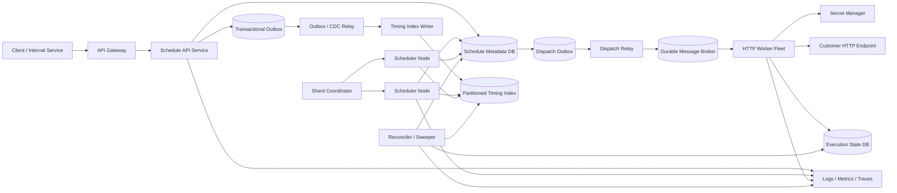
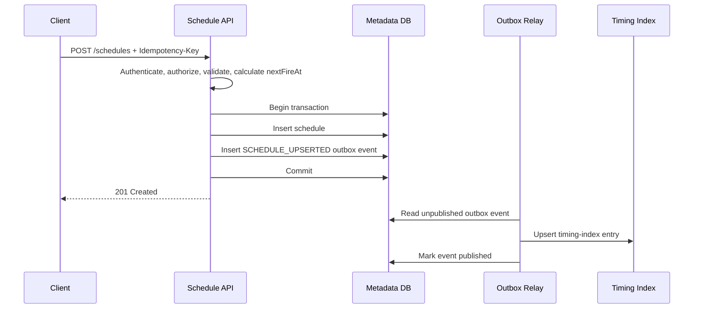
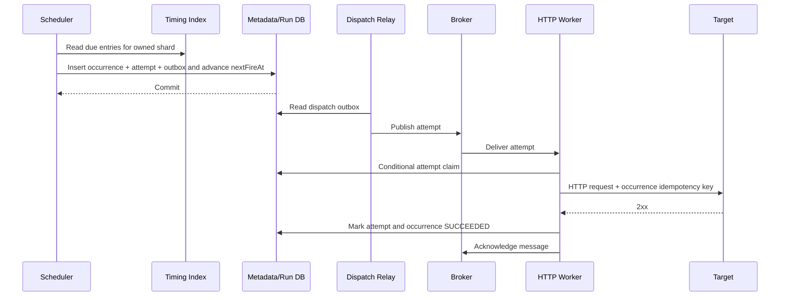
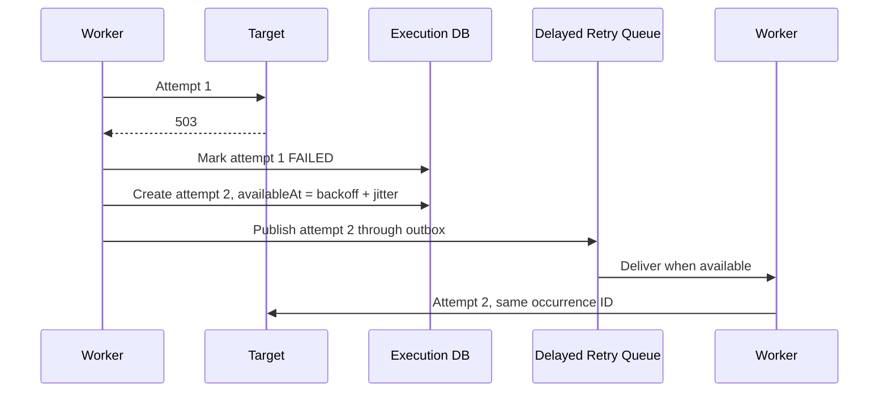

# Job Scheduler System - High-Level Design (HLD Interview)

> **Interview duration:** 60 minutes
> **Candidate level:** Software engineer with 6-7 years of experience
> **Prompt:** "Design a distributed job scheduler similar to a managed cron service."

---

## Table of Contents

1. [What the interviewer is testing](#1-what-the-interviewer-is-testing)
2. [Minute-by-minute interview plan](#2-minute-by-minute-interview-plan)
3. [Clarifying requirements](#3-clarifying-requirements)
4. [Scope and guarantees](#4-scope-and-guarantees)
5. [Back-of-the-envelope estimation](#5-back-of-the-envelope-estimation)
6. [API design](#6-api-design)
7. [Data model and storage](#7-data-model-and-storage)
8. [High-level architecture](#8-high-level-architecture)
9. [Core scheduling and dispatch algorithm](#9-core-scheduling-and-dispatch-algorithm)
10. [End-to-end flows](#10-end-to-end-flows)
11. [Correctness, delivery semantics, and idempotency](#11-correctness-delivery-semantics-and-idempotency)
12. [Retries, timeouts, cancellation, and recovery](#12-retries-timeouts-cancellation-and-recovery)
13. [Recurring schedules, time zones, and misfires](#13-recurring-schedules-time-zones-and-misfires)
14. [Partitioning, scaling, and hot spots](#14-partitioning-scaling-and-hot-spots)
15. [Multi-region design](#15-multi-region-design)
16. [Security and multi-tenancy](#16-security-and-multi-tenancy)
17. [Observability and SLOs](#17-observability-and-slos)
18. [Alternatives and trade-offs](#18-alternatives-and-trade-offs)
19. [Failure-mode walkthrough](#19-failure-mode-walkthrough)
20. [Interviewer follow-up questions](#20-interviewer-follow-up-questions)
21. [Final interview summary](#21-final-interview-summary)

---

## 1. What the Interviewer Is Testing

A good answer is not merely "store a timestamp and poll it." The interviewer is looking for whether the candidate can:

- Turn an ambiguous prompt into explicit product and reliability requirements.
- Separate the **control plane** from the **execution data plane**.
- Reliably find jobs whose execution time has arrived without scanning the full database.
- Prevent two scheduler nodes from independently dispatching the same logical occurrence.
- Explain what "exactly once" does and does not mean in a distributed system.
- Handle crashes between state changes and message publication.
- Scale by partitioning schedule ownership.
- Deal with cron, daylight-saving time, retries, timeouts, and misfires.
- Make availability-versus-consistency trade-offs intentionally.
- Define operational signals that prove the scheduler is healthy.

The strongest answer establishes correctness first, then scales the same model.

---

## 2. Minute-by-Minute Interview Plan

| Time | Candidate activity | Expected output |
|---|---|---|
| 0-5 min | Clarify the product | Job types, target, scale, precision, guarantees, tenancy |
| 5-8 min | State scope and assumptions | Functional requirements, NFRs, out-of-scope items |
| 8-12 min | Estimate capacity | Schedule count, execution QPS, storage, bandwidth |
| 12-16 min | Define external APIs | Create, update, pause, trigger, inspect, cancel |
| 16-22 min | Model the data | Schedule, occurrence/run, attempt, outbox |
| 22-30 min | Draw the architecture | API, metadata store, scheduler, broker, workers |
| 30-40 min | Deep dive into due-job discovery | Buckets, leases, claiming, dispatch, next fire time |
| 40-48 min | Discuss correctness and failure recovery | At-least-once, idempotency, outbox, heartbeats |
| 48-53 min | Scale and multi-region | Sharding, hot buckets, regional ownership |
| 53-57 min | Security and observability | Isolation, secrets, SLOs, alerts |
| 57-60 min | Trade-offs and summary | Alternatives, bottlenecks, final design |

> **Candidate:** "I will first clarify what we schedule and what guarantee is required. Then I will estimate scale, propose the APIs and data model, draw the main components, and spend most of the time on due-job discovery and failure semantics."

---

## 3. Clarifying Requirements

### 3.1 Simulated Interview Conversation

> **Interviewer:** Design a job scheduler.

> **Candidate:** "Is this an in-process scheduler for one application, or a distributed platform used by many services?"

> **Interviewer:** A distributed platform used by many teams.

> **Candidate:** "What can a job execute: an HTTP callback, a message, or arbitrary user code?"

> **Interviewer:** Start with authenticated HTTP callbacks. The architecture should allow other executor types later.

> **Candidate:** "Do we support one-time and recurring schedules? How precise must triggering be?"

> **Interviewer:** Both. Ninety-nine percent of jobs should be dispatched within one second of the expected time.

> **Candidate:** "What delivery guarantee do clients expect?"

> **Interviewer:** Do not lose jobs. Duplicate execution is acceptable if rare and documented.

> **Candidate:** "Can callbacks be long-running? Do we need retries, timeouts, pause, resume, cancellation, and manual triggering?"

> **Interviewer:** Yes. A callback can run for up to 30 minutes. Support configurable retries and those lifecycle operations.

> **Candidate:** "What scale should I design for?"

> **Interviewer:** One hundred million active schedules, one billion executions per day, with a peak of 100,000 executions per second.

> **Candidate:** "Is this multi-tenant and multi-region?"

> **Interviewer:** Yes. Strong isolation is required. A schedule has a home region; cross-region disaster recovery is required.

### 3.2 Questions to Ask

| Area | Question | Why it changes the design |
|---|---|---|
| Work type | HTTP callback, queue message, container, or arbitrary code? | Determines worker isolation and dispatch protocol |
| Trigger type | One-time, fixed-delay, fixed-rate, or cron? | Determines next-fire calculation and overlap semantics |
| Precision | Milliseconds, seconds, or minutes? | Determines polling interval, timing wheel, and cost |
| Guarantee | At-most-once or at-least-once? | Determines whether loss or duplication is preferred |
| Duration | Fire-and-forget or long-running? | Determines heartbeats, leases, and timeout handling |
| Scale | Number of schedules and executions per second? | Determines storage, sharding, and broker capacity |
| Failure policy | Retry count, backoff, dead letter? | Determines attempt model and delayed retry mechanism |
| Concurrency | May occurrences of one schedule overlap? | Determines per-schedule concurrency control |
| Time | UTC only or named time zones? | Determines DST behavior and cron representation |
| Mutation | Can users update, pause, resume, or cancel? | Requires versions and race-safe state transitions |
| Tenancy | Quotas and noisy-neighbor protection? | Requires tenant-aware partitioning and admission control |
| Geography | Active-active or home-region ownership? | Determines duplicate prevention across regions |
| Retention | How long is run history retained? | Determines hot database versus archive split |

---

## 4. Scope and Guarantees

### 4.1 Functional Requirements

| ID | Requirement |
|---|---|
| FR-1 | Create a one-time job scheduled for a future instant |
| FR-2 | Create a recurring job using cron or a fixed interval |
| FR-3 | Configure the HTTP target, authentication reference, headers, and payload |
| FR-4 | Update, pause, resume, and delete a schedule |
| FR-5 | Manually trigger an ad hoc occurrence |
| FR-6 | Retry failed attempts using a configurable policy |
| FR-7 | Enforce execution timeout and per-schedule concurrency policy |
| FR-8 | Inspect schedule status and paginated execution history |
| FR-9 | Cancel a queued or running execution on a best-effort basis |
| FR-10 | Send terminal failures to a dead-letter destination |

### 4.2 Non-Functional Requirements

| ID | Target |
|---|---|
| NFR-1 | No acknowledged schedule occurrence is silently lost |
| NFR-2 | At-least-once dispatch; duplicate delivery is possible |
| NFR-3 | 99% dispatch within 1 second; 99.9% within 5 seconds |
| NFR-4 | Control-plane availability: 99.99% |
| NFR-5 | Dispatch-plane availability: 99.995% |
| NFR-6 | Scale to 100M active schedules and 100K peak dispatches/sec |
| NFR-7 | Durable schedule metadata and execution history |
| NFR-8 | Tenant isolation, encryption, auditability, quotas, and rate limits |
| NFR-9 | Regional failure recovery with RPO under 1 minute and RTO under 15 minutes |

### 4.3 Explicit Semantics

The candidate should define these before drawing boxes:

1. **Time definition:** Store instants as UTC. Preserve the user's IANA time zone, such as `Asia/Kolkata`, for recurring-calendar calculation.
2. **Acknowledged create:** A successful create means schedule metadata and the durable scheduling intent are committed.
3. **Dispatch guarantee:** At-least-once. A unique occurrence ID remains stable across dispatch retries.
4. **Completion:** An HTTP `2xx` response means success. Other responses, network failures, and timeouts follow the retry policy.
5. **Cancellation:** Strong for an unclaimed occurrence; best-effort after remote execution starts.
6. **Update:** A versioned update affects future occurrences, not an occurrence that has already been durably created.
7. **Ordering:** No global ordering. Occurrences for one schedule are ordered by planned fire time, subject to its overlap policy.
8. **Clock source:** Scheduler hosts use synchronized clocks. Database time is used for leases where practical.

### 4.4 Out of Scope

- Running arbitrary untrusted binaries or containers.
- Full workflow DAG orchestration and dependencies between jobs.
- Sub-second hard real-time scheduling.
- Distributed transactions with the customer's target service.
- Indefinite execution beyond the configured 30-minute maximum.

These can be discussed as extensions, but they should not obscure the core scheduler.

---

## 5. Back-of-the-Envelope Estimation

> **Candidate:** "The important number is occurrences per second, not only schedules. I will size both the control plane and execution plane."

### 5.1 Given and Assumed Traffic

| Metric | Value |
|---|---:|
| Active schedules | 100 million |
| Executions/day | 1 billion |
| Average executions/sec | 1B / 86,400 = ~11,600 |
| Peak executions/sec | 100,000 |
| Average create/update QPS | 1,000 |
| Peak create/update QPS | 10,000 |
| Average attempts per occurrence | 1.05 |
| Peak attempt dispatch rate | ~105,000/sec |

The average schedule fires ten times per day, but the distribution will be highly uneven. Minute and hour boundaries are natural hot spots.

### 5.2 Storage

Assumptions:

- Average schedule row including indexes: approximately 2 KB.
- Average execution occurrence and attempt metadata: approximately 1 KB.
- Payloads over 64 KB are placed in object storage and referenced by URI.
- Hot execution history retention: 30 days.

| Data | Calculation | Approximate size |
|---|---|---:|
| Active schedule metadata | 100M x 2 KB | 200 GB |
| Run metadata/day | 1B x 1 KB | 1 TB/day |
| 30-day hot run history | 30 x 1 TB | 30 TB |
| Replication/index overhead | 2-3x | 60-90 TB |

This immediately suggests:

- Schedule metadata can live in a sharded relational or distributed SQL store.
- High-volume run history should be partitioned by date and archived to object storage.
- Unbounded response bodies must not be stored inline.

### 5.3 Broker Throughput and Bandwidth

If a dispatch message averages 1 KB:

```text
105,000 attempts/sec x 1 KB = approximately 105 MB/sec ingress
```

With replication factor 3, broker disk/network write traffic is roughly 315 MB/sec before protocol overhead. This is a modest multi-broker cluster, not one broker.

### 5.4 Concurrency

If average HTTP duration is 500 ms:

```text
100,000 executions/sec x 0.5 sec = 50,000 concurrent requests
```

At the 30-minute maximum, a pathological workload would be enormous, so every tenant needs concurrency quotas and admission control. Workers must not create an unbounded thread per request.

### 5.5 Timing Buckets

With one-second buckets and 100K peak jobs/sec, a single hot bucket contains 100K occurrences. Adding virtual shards, for example 128 lanes per second, reduces one scheduling unit to roughly:

```text
100,000 / 128 = approximately 781 occurrences per lane at peak
```

---

## 6. API Design

### 6.1 Create a Schedule

```http
POST /v1/schedules
Authorization: Bearer <token>
Idempotency-Key: 6c42988f-...
Content-Type: application/json
```

```json
{
  "name": "generate-daily-report",
  "trigger": {
    "type": "CRON",
    "expression": "0 9 * * 1-5",
    "timeZone": "Asia/Kolkata"
  },
  "target": {
    "type": "HTTP",
    "url": "https://reports.internal.example/v1/generate",
    "method": "POST",
    "headers": {
      "Content-Type": "application/json"
    },
    "credentialRef": "secret://team-a/report-service",
    "body": {
      "report": "DAILY_SALES"
    }
  },
  "retryPolicy": {
    "maxAttempts": 5,
    "initialBackoffSeconds": 10,
    "maxBackoffSeconds": 600,
    "multiplier": 2.0,
    "jitter": true,
    "retryableStatusCodes": [408, 429, 500, 502, 503, 504]
  },
  "timeoutSeconds": 120,
  "overlapPolicy": "FORBID",
  "misfirePolicy": "FIRE_ONCE_NOW"
}
```

```http
HTTP/1.1 201 Created
Location: /v1/schedules/sch_01J6...
ETag: "version-1"
```

```json
{
  "scheduleId": "sch_01J6...",
  "status": "ACTIVE",
  "version": 1,
  "nextFireAt": "2026-08-31T03:30:00Z",
  "createdAt": "2026-08-28T17:47:48Z"
}
```

The `Idempotency-Key` prevents duplicate schedule creation when the client retries after a timeout.

### 6.2 Other APIs

```text
GET    /v1/schedules/{scheduleId}
GET    /v1/schedules?status=ACTIVE&cursor=...&limit=100
PATCH  /v1/schedules/{scheduleId}        If-Match: "version-7"
POST   /v1/schedules/{scheduleId}:pause
POST   /v1/schedules/{scheduleId}:resume
POST   /v1/schedules/{scheduleId}:trigger
DELETE /v1/schedules/{scheduleId}        If-Match: "version-7"

GET    /v1/schedules/{scheduleId}/runs?cursor=...&limit=100
GET    /v1/runs/{runId}
POST   /v1/runs/{runId}:cancel
POST   /v1/runs/{runId}:retry
```

### 6.3 Update Semantics

An update uses optimistic concurrency:

```http
PATCH /v1/schedules/sch_123
If-Match: "version-7"
```

- If version 7 is still current, write version 8 and recompute `next_fire_at`.
- If another writer has already changed it, return `412 Precondition Failed`.
- The scheduler checks the schedule version when materializing an occurrence.

### 6.4 Important Response Codes

| Code | Meaning |
|---|---|
| `201` | Schedule created |
| `400` | Invalid cron, time zone, target, or retry policy |
| `401/403` | Authentication or authorization failure |
| `404` | Schedule/run not found in the tenant |
| `409` | Idempotency key reused with a different request |
| `412` | Stale schedule version |
| `422` | Semantically valid JSON but unsupported scheduling combination |
| `429` | Tenant quota or control-plane rate limit exceeded |

---

## 7. Data Model and Storage

### 7.1 Core Entities

```text
Schedule
  1 ---- creates ---- N ScheduleOccurrence (Run)
  1 ---- has -------- N ScheduleVersion (optional audit history)

ScheduleOccurrence
  1 ---- has -------- N Attempt
```

An **occurrence** is the logical firing at a planned time. An **attempt** is one delivery try for that occurrence. Keeping them separate is essential: a retry is not a new scheduled firing.

### 7.2 Schedule Metadata

```sql
CREATE TABLE schedules (
    tenant_id          UUID         NOT NULL,
    schedule_id        UUID         NOT NULL,
    name               VARCHAR(200) NOT NULL,
    status             VARCHAR(20)  NOT NULL,
    trigger_type       VARCHAR(20)  NOT NULL,
    trigger_spec       JSONB        NOT NULL,
    time_zone          VARCHAR(64),
    target_spec        JSONB        NOT NULL,
    credential_ref     VARCHAR(500),
    retry_policy       JSONB        NOT NULL,
    timeout_seconds    INTEGER      NOT NULL,
    overlap_policy     VARCHAR(20)  NOT NULL,
    misfire_policy     VARCHAR(20)  NOT NULL,
    next_fire_at       TIMESTAMPTZ,
    version            BIGINT       NOT NULL,
    home_region        VARCHAR(32)  NOT NULL,
    created_at         TIMESTAMPTZ  NOT NULL,
    updated_at         TIMESTAMPTZ  NOT NULL,
    PRIMARY KEY (tenant_id, schedule_id)
);
```

Useful indexes:

```sql
CREATE INDEX schedules_due_idx
    ON schedules (home_region, next_fire_at, schedule_id)
    WHERE status = 'ACTIVE';

CREATE UNIQUE INDEX schedules_tenant_name_idx
    ON schedules (tenant_id, name);
```

At large scale, hash-partition first by `tenant_id` or `schedule_id`, then index by `next_fire_at` within each shard. A global B-tree ordered only by `next_fire_at` becomes a write hot spot.

### 7.3 Occurrences

```sql
CREATE TABLE schedule_occurrences (
    tenant_id          UUID         NOT NULL,
    occurrence_id      UUID         NOT NULL,
    schedule_id        UUID         NOT NULL,
    schedule_version   BIGINT       NOT NULL,
    planned_fire_at    TIMESTAMPTZ  NOT NULL,
    available_at       TIMESTAMPTZ  NOT NULL,
    state               VARCHAR(24)  NOT NULL,
    attempt_count       INTEGER      NOT NULL DEFAULT 0,
    lease_owner         VARCHAR(200),
    lease_token         BIGINT,
    lease_expires_at    TIMESTAMPTZ,
    terminal_reason     VARCHAR(2000),
    created_at          TIMESTAMPTZ  NOT NULL,
    updated_at          TIMESTAMPTZ  NOT NULL,
    PRIMARY KEY (tenant_id, occurrence_id),
    UNIQUE (tenant_id, schedule_id, planned_fire_at)
);
```

The unique constraint on `(tenant, schedule, planned_fire_at)` prevents two materializers from creating two logical occurrences for the same firing.

### 7.4 Attempts

```sql
CREATE TABLE execution_attempts (
    tenant_id          UUID         NOT NULL,
    occurrence_id      UUID         NOT NULL,
    attempt_number     INTEGER      NOT NULL,
    state              VARCHAR(20)  NOT NULL,
    worker_id          VARCHAR(200),
    dispatched_at      TIMESTAMPTZ,
    started_at         TIMESTAMPTZ,
    heartbeat_at       TIMESTAMPTZ,
    completed_at       TIMESTAMPTZ,
    response_code      INTEGER,
    error_code         VARCHAR(100),
    response_ref       VARCHAR(1000),
    PRIMARY KEY (tenant_id, occurrence_id, attempt_number)
);
```

### 7.5 Transactional Outbox

```sql
CREATE TABLE outbox_events (
    shard_id           INTEGER      NOT NULL,
    event_id           UUID         NOT NULL,
    aggregate_id       UUID         NOT NULL,
    event_type         VARCHAR(100) NOT NULL,
    payload             JSONB        NOT NULL,
    created_at          TIMESTAMPTZ  NOT NULL,
    published_at        TIMESTAMPTZ,
    PRIMARY KEY (shard_id, event_id)
);
```

When an occurrence is claimed, the attempt row and `DISPATCH_ATTEMPT` outbox event are committed atomically. A separate relay publishes the event to the broker. This closes the database-to-broker dual-write gap.

### 7.6 Storage Choices

| Data | Recommended store | Reason |
|---|---|---|
| Schedule metadata | Sharded PostgreSQL or distributed SQL | Transactions, conditional updates, indexed due-time query |
| Near-future timing index | Same DB initially; bucketed KV store at higher scale | Efficient due-item discovery |
| Dispatch events | Kafka/Pulsar or durable managed queue | Buffering, partition ordering, replay |
| Attempt hot state | Partitioned relational/distributed KV | Conditional updates and operational lookup |
| Historical runs | Columnar store/object storage | Cheap retention and analytics |
| Large request/response payload | Object storage | Avoid bloating metadata and broker messages |
| Secrets | Secret manager/KMS | Rotation and access audit |

### 7.7 Why Not Use Redis as the Source of Truth?

A Redis sorted set is excellent for a moderate near-term delay queue:

```text
score = fire timestamp
member = occurrence ID
```

However, at 100M schedules it introduces:

- Expensive memory use.
- Persistence and failover complexity.
- A hot sorted-set range around `now`.
- Dual-write consistency with schedule metadata.

Redis can be an acceleration layer. Durable metadata plus reconciliation remains the source of truth.

---

## 8. High-Level Architecture

### 8.1 Component Diagram



### 8.2 Control Plane

The control plane receives relatively low-QPS management operations:

- Authenticate and authorize the tenant.
- Validate cron expressions, time zones, target allowlists, and quotas.
- Store versioned schedule metadata.
- Atomically record an outbox event.
- Serve schedule and run queries.

It should not synchronously wait for the scheduler or worker.

### 8.3 Timing Plane

The timing plane answers one question efficiently:

> Which schedule occurrences should become runnable now?

Its responsibilities:

- Own deterministic partitions using leases.
- Read only a bounded time range.
- Materialize each logical occurrence once.
- Compute and persist the next fire time.
- Create dispatch intent transactionally.
- Recover expired ownership safely.

### 8.4 Dispatch Plane

The durable broker separates scheduling from execution:

- Absorbs top-of-minute bursts.
- Allows worker fleets to scale independently.
- Supports replay after worker failures.
- Enables separate topics/queues by executor type or priority.
- Provides backpressure rather than overloading endpoints immediately.

### 8.5 Worker Plane

An HTTP worker:

1. Consumes a dispatch event.
2. Conditionally claims the attempt using its attempt ID and fencing token.
3. Resolves the credential reference.
4. Applies tenant concurrency and destination rate limits.
5. Sends the HTTP request with stable idempotency headers.
6. Heartbeats while the call is running where appropriate.
7. Records the result.
8. Schedules a retry or marks the occurrence terminal.
9. Acknowledges the broker message only after durable state update.

### 8.6 Reconciliation Plane

The reconciler is not an optional afterthought. It proves eventual correctness:

- Find active schedules whose `next_fire_at` is in the past but have no occurrence.
- Re-index schedules missing from the timing index.
- Reclaim expired scheduler and worker leases.
- Republish unpublished outbox events.
- Detect attempts stuck beyond timeout.
- Compare broker lag, due lag, and database state.

---

## 9. Core Scheduling and Dispatch Algorithm

### 9.1 Why a Full Table Scan Fails

This query is logically correct:

```sql
SELECT *
FROM schedules
WHERE status = 'ACTIVE'
  AND next_fire_at <= now()
ORDER BY next_fire_at
LIMIT 1000;
```

At 100M rows and many polling nodes, it causes:

- Repeated scans of the same hot index range.
- Lock contention among schedulers.
- Duplicate reads.
- Poor partition locality.
- A thundering herd every polling interval.

The system needs explicit partition ownership.

### 9.2 Partitioned Time Buckets

Represent the timing index key as:

```text
bucket = floor(next_fire_epoch_seconds / bucket_width)
lane = hash(schedule_id) mod lane_count
key = (home_region, bucket, lane)
sort key = (next_fire_at, schedule_id, schedule_version)
```

Example with one-second buckets and 128 lanes:

```text
(us-east, 1787936400, lane-000)
(us-east, 1787936400, lane-001)
...
(us-east, 1787936400, lane-127)
```

Each scheduler owns a set of lanes, not the entire current second.

### 9.3 Rolling Scheduling Horizon

Do not necessarily put every occurrence for the next ten years into a hot timing index.

- Store the recurrence definition and `next_fire_at` durably.
- Keep only a rolling horizon, such as the next 24 hours, in the timing index.
- A horizon loader continuously indexes schedules entering the window.
- The reconciler detects missed index writes.

This bounds timing-index size without sacrificing long-term schedules.

### 9.4 Shard Ownership

A coordinator stores leases:

```text
shard_id
owner_id
lease_epoch       // monotonically increasing fencing token
lease_expires_at
```

Scheduler nodes:

1. Acquire unowned or expired shards.
2. Renew every few seconds.
3. Stop processing immediately if renewal fails.
4. Include `lease_epoch` in claims.
5. Let the database reject writes using an old epoch.

The fencing token protects the system when a paused old owner resumes after another node has acquired its shard.

### 9.5 Scheduler Loop

```text
every 200 ms:
    assert shard lease is valid
    now = trustedClock.now()
    upperBound = now + lookAhead

    candidates = timingIndex.read(
        shard = ownedShard,
        fireTime <= upperBound,
        limit = batchSize
    )

    for candidate in candidates:
        begin transaction

        schedule = lock/read schedule metadata

        if schedule is not ACTIVE:
            remove stale timing item
            commit
            continue

        if candidate.version != schedule.version:
            replace stale index entry with current next fire time
            commit
            continue

        occurrenceId = deterministicId(
            tenantId, scheduleId, schedule.nextFireAt
        )

        insert occurrence if absent
        apply overlap and misfire policy

        if occurrence is runnable:
            insert attempt number 1
            insert DISPATCH_ATTEMPT outbox event

        nextFireAt = trigger.nextAfter(schedule.nextFireAt)
        update schedule set next_fire_at = nextFireAt
        insert next timing-index intent
        delete consumed timing-index intent

        commit
```

In practice, timing-index mutations may be emitted through outbox/CDC rather than performed inside a cross-store transaction.

### 9.6 Claim Query

For a relational implementation, schedulers can safely claim rows using:

```sql
SELECT occurrence_id
FROM schedule_occurrences
WHERE shard_id = :shard
  AND state = 'SCHEDULED'
  AND available_at <= CURRENT_TIMESTAMP
ORDER BY available_at
FOR UPDATE SKIP LOCKED
LIMIT 500;
```

`SKIP LOCKED` allows several scheduler processes to work without blocking on the same rows. Sharding still matters because one global index range cannot scale indefinitely.

### 9.7 Hierarchical Timing Wheel for the Near Term

For tighter precision, each scheduler can load the next 30-60 seconds for its shards into an in-memory hierarchical timing wheel:

```text
DB/bucket index: durable, long-range source
        |
        v
Scheduler look-ahead buffer: next 60 seconds
        |
        v
Timing wheel slots: 100 ms or 1 second
        |
        v
Transactional claim and dispatch outbox
```

If the process dies, the wheel is rebuilt from durable state. The wheel improves precision but never becomes the only source of truth.

### 9.8 Computing the Next Fire Time

For recurring jobs:

- **Cron:** next matching local calendar time, converted to a UTC instant.
- **Fixed rate:** `previous_planned_fire_at + interval`, independent of actual duration.
- **Fixed delay:** `previous_completion_at + delay`; completion must feed the scheduler.

Store the planned time, not just "now plus interval," or scheduler delay will accumulate as drift.

---

## 10. End-to-End Flows

### 10.1 Create Schedule



If the API crashes after commit but before replying, the client retries with the same idempotency key and receives the original result.

### 10.2 Due Occurrence and Dispatch



### 10.3 Failed Attempt and Retry



Retry attempts use the same occurrence-level idempotency key and a different attempt number.

### 10.4 Pause and Resume

Pause:

1. Conditional update `ACTIVE -> PAUSED` and increment version.
2. Publish schedule-updated event.
3. Stale timing entry is ignored because its version no longer matches.
4. Already dispatched occurrences are unaffected unless the API explicitly asks to cancel them.

Resume:

1. Decide missed-occurrence behavior using the misfire policy.
2. Calculate `next_fire_at`.
3. Update `PAUSED -> ACTIVE`, increment version, and emit index event.

---

## 11. Correctness, Delivery Semantics, and Idempotency

### 11.1 Why Exactly Once Is Not End-to-End Achievable

Consider:

1. Worker sends the HTTP request.
2. Target performs the side effect.
3. Target's response is lost.
4. Worker cannot know whether the action happened.

Retrying can duplicate the side effect; not retrying can lose it. Without a shared transaction across the scheduler and target, the scheduler cannot guarantee exactly-once side effects.

Therefore the contract is:

- **At-least-once delivery.**
- **Effectively-once behavior** when the target honors a stable idempotency key.

### 11.2 Stable Idempotency Identity

The scheduler sends:

```http
X-Scheduler-Schedule-Id: sch_123
X-Scheduler-Occurrence-Id: occ_456
X-Scheduler-Attempt: 3
Idempotency-Key: occ_456
```

The target should atomically record `occ_456` with its business side effect and return the previous result on duplicate delivery.

### 11.3 Deterministic Occurrence ID

One option:

```text
occurrence_id = UUIDv5(
    namespace = tenant_id,
    name = schedule_id + ":" + planned_fire_at
)
```

Even if two materializers race, they propose the same identity. The database unique constraint is still authoritative.

### 11.4 Database-to-Broker Dual Write

Unsafe flow:

```text
mark DISPATCHED in DB
crash
publish to broker
```

The occurrence is lost because the publish never happened.

Also unsafe:

```text
publish to broker
crash
mark DISPATCHED in DB
```

The event may be published repeatedly.

Use a transactional outbox:

```text
DB transaction:
    update occurrence
    insert attempt
    insert outbox event

relay:
    publish event
    mark outbox event published
```

The relay may publish twice, so broker consumers must deduplicate by attempt ID.

### 11.5 State-Transition Guards

Every mutation is conditional:

```sql
UPDATE schedule_occurrences
SET state = 'RUNNING',
    lease_owner = :worker,
    lease_expires_at = CURRENT_TIMESTAMP + INTERVAL '30 seconds'
WHERE occurrence_id = :id
  AND state IN ('QUEUED', 'RETRY_WAIT')
  AND available_at <= CURRENT_TIMESTAMP;
```

If zero rows are affected, another worker already owns it or the occurrence is no longer runnable.

### 11.6 Key Invariants

1. At most one logical occurrence exists for `(tenant, schedule, planned_fire_at)`.
2. Attempt numbers increase monotonically within an occurrence.
3. Only valid state transitions are committed.
4. `SUCCEEDED`, `DEAD_LETTERED`, `CANCELLED`, and `EXPIRED` are terminal.
5. An active recurring schedule has one future `next_fire_at`.
6. A dispatchable attempt has a durable outbox event.
7. An old lease epoch cannot mutate work owned by a newer epoch.
8. Tenant identity is part of every key and authorization check.

---

## 12. Retries, Timeouts, Cancellation, and Recovery

### 12.1 Retry Policy

Use exponential backoff with full jitter:

```text
cap = min(maxBackoff, initialBackoff * multiplier^(attempt - 1))
delay = random(0, cap)
```

Jitter prevents thousands of failed jobs from retrying simultaneously after a dependency recovers.

Classify failures:

| Failure | Default behavior |
|---|---|
| DNS/connect/reset/timeout | Retry |
| HTTP `408`, `429` | Retry; honor bounded `Retry-After` |
| HTTP `5xx` | Retry |
| HTTP `4xx` other than configured exceptions | Permanent failure |
| Invalid/deleted credential | Permanent or slow retry based on policy |
| Worker shutdown before result | Lease expiry and retry |

### 12.2 Delayed Retries

Options:

1. Broker-native delayed delivery, if available at the needed scale.
2. Retry timing index using `available_at`, reusing the scheduler's time-bucket mechanism.
3. Multiple delay topics such as 10 seconds, 1 minute, and 10 minutes, with reduced precision.

The same general timing index is the most flexible; broker-native delivery is operationally simpler when supported.

### 12.3 Worker Lease and Heartbeat

Before remote execution:

```text
state = RUNNING
lease_owner = worker-17
lease_expires_at = now + 30 seconds
fencing_token = 42
```

The worker renews the lease. If it crashes:

- The sweeper waits for lease expiry.
- It marks the attempt abandoned.
- It creates the next retry attempt if attempts remain.
- Late results carrying an older fencing token are rejected.

For a synchronous HTTP request, lease expiry should exceed heartbeat interval and tolerate temporary database unavailability.

### 12.4 Timeout

There are two separate timeouts:

- **Execution timeout:** Maximum duration of the outbound call.
- **Schedule-to-start timeout:** Maximum acceptable queue delay, after which policy may expire the occurrence.

Timeout does not prove the target stopped processing. The idempotency contract still applies.

### 12.5 Cancellation

| Current state | Cancellation behavior |
|---|---|
| `SCHEDULED`/`QUEUED` | Conditional transition to `CANCELLED`; workers reject stale messages |
| `RETRY_WAIT` | Cancel future retry |
| `RUNNING` | Set `CANCEL_REQUESTED`; send worker control message; abort HTTP call if possible |
| Terminal | Return existing terminal state |

Cancellation after an HTTP request reaches the target is best-effort. The scheduler cannot reverse the target's business action.

### 12.6 Dead-Letter Handling

After attempts are exhausted:

- Mark occurrence `DEAD_LETTERED`.
- Store a bounded error summary and response reference.
- Publish a dead-letter event for tenant consumption.
- Expose manual retry, which creates a new attempt under the same occurrence or a linked recovery occurrence according to the product contract.

### 12.7 Graceful Shutdown

Scheduler node:

1. Stop acquiring shards.
2. Stop reading new buckets.
3. Finish or abandon current database transactions.
4. Release leases, or let them expire.

Worker:

1. Stop consuming.
2. Continue heartbeats for in-flight calls.
3. Finish within shutdown grace.
4. Otherwise release/expire leases so attempts can retry.

---

## 13. Recurring Schedules, Time Zones, and Misfires

### 13.1 Trigger Types

| Type | Example | Semantics |
|---|---|---|
| One-time | `2026-09-01T10:00:00Z` | Fire once at an instant |
| Cron | `0 9 * * 1-5`, `Asia/Kolkata` | Match local calendar times |
| Fixed rate | Every 5 minutes | Planned times remain aligned |
| Fixed delay | 5 minutes after completion | Next time depends on prior completion |

### 13.2 DST Edge Cases

Named time zones have daylight-saving transitions:

- **Nonexistent local time:** `02:30` may not exist when clocks jump forward.
- **Ambiguous local time:** `01:30` may occur twice when clocks fall back.

The API must define a policy:

```text
nonexistentTimePolicy = SKIP | NEXT_VALID_TIME
ambiguousTimePolicy   = FIRE_ONCE_EARLIER | FIRE_ONCE_LATER | FIRE_TWICE
```

Never store only a numeric UTC offset for cron. Time-zone rules change, so store an IANA zone name and record the time-zone database version used for each calculated occurrence if strict auditability is required.

### 13.3 Misfire Policy

A misfire occurs when the scheduler was unavailable or paused past planned times.

| Policy | Behavior |
|---|---|
| `SKIP` | Ignore missed occurrences and calculate the next future time |
| `FIRE_ONCE_NOW` | Coalesce all missed times into one immediate occurrence |
| `CATCH_UP` | Materialize each missed occurrence up to a configured limit |

`CATCH_UP` must have a cap, such as 100 occurrences, to prevent a schedule paused for a year from flooding the system.

### 13.4 Overlap Policy

| Policy | Behavior |
|---|---|
| `ALLOW` | Multiple occurrences may run simultaneously |
| `FORBID` | Skip or defer a new occurrence while an older one is running |
| `REPLACE` | Request cancellation of the old run and start the new one |
| `QUEUE_ONE` | Keep at most one pending occurrence and coalesce extras |

The exact choice between skip and defer for `FORBID` must be part of the API contract.

### 13.5 Clock Skew

- Synchronize hosts through NTP/chrony.
- Alert when skew exceeds a small threshold.
- Prefer database/server time for lease comparisons.
- Use monotonic time for measuring durations, not wall-clock time.
- Include a small look-ahead but never dispatch before the authoritative planned time unless the contract permits it.

---

## 14. Partitioning, Scaling, and Hot Spots

### 14.1 Partition Keys

No one partition key is perfect:

| Key | Benefit | Risk |
|---|---|---|
| `tenant_id` | Isolation and tenant queries | A very large tenant becomes hot |
| `schedule_id` hash | Uniform writes | Tenant listing requires scatter/gather or secondary index |
| time bucket | Efficient due scan | Top-of-minute bucket becomes hot |
| time bucket + hash lane | Due scan plus distribution | More shards and coordination |

Recommended:

- Metadata: hash of `(tenant_id, schedule_id)`.
- Timing: `(region, time_bucket, hash(schedule_id) % lanes)`.
- Broker: hash of `schedule_id` for per-schedule ordering, with extra lanes for large tenants if needed.
- Run history: hash prefix plus day/month partition for retention.

### 14.2 Scheduler Horizontal Scaling

If one scheduler safely materializes 2,000 occurrences/sec, 100K peak needs at least 50 active nodes. Run perhaps 75-100 for headroom, then assign virtual shards so load can rebalance without repartitioning storage.

### 14.3 Worker Horizontal Scaling

Autoscale workers using:

- Broker consumer lag.
- Oldest queued attempt age.
- Active outbound requests.
- CPU and connection-pool saturation.
- Tenant and destination rate-limit utilization.

Lag is usually a more meaningful signal than CPU alone.

### 14.4 Top-of-Minute Burst

Many cron expressions use minute boundaries. Mitigations:

- Virtual lanes in every time bucket.
- Encourage or support a `jitterWindowSeconds` option.
- Preload look-ahead timing wheels.
- Keep broker capacity above burst rate.
- Apply tenant concurrency quotas.
- Avoid synchronized retries through full jitter.

Do not silently jitter schedules unless the API contract says so.

### 14.5 Hot Tenant

- Per-tenant creation and dispatch quotas.
- Weighted-fair worker queues.
- Dedicated broker partitions for very large tenants.
- Separate concurrency semaphore per tenant and destination.
- Admission rejection rather than allowing one tenant to exhaust shared workers.

### 14.6 Backpressure

When target services slow down:

1. Workers reach destination concurrency limits.
2. Broker lag grows rather than memory usage growing without bound.
3. Autoscaling reacts within configured limits.
4. Per-tenant queues preserve fairness.
5. Dispatch-lag SLO alerts fire.
6. Expiration policy prevents uselessly late work from running forever.

---

## 15. Multi-Region Design

### 15.1 Recommended Model: Home-Region Ownership

Each schedule has one active `home_region`:

- API traffic may enter any region but routes writes to the home region.
- Only that region's scheduler is allowed to materialize occurrences.
- Metadata and outbox changes replicate asynchronously to a standby region.
- Workers normally run near the home region or target.

This avoids active-active duplicate firing for the same schedule.

### 15.2 Regional Failover

On a regional disaster:

1. Confirm failure using an external/global health system.
2. Acquire the regional epoch/ownership record in a globally consistent store.
3. Promote the standby metadata replica.
4. Increment a **region fencing epoch**.
5. Start standby schedulers with the new epoch.
6. Reconcile occurrences since the last replicated checkpoint.
7. Apply each schedule's misfire policy.

There may still be duplicates around failover because a target request may have completed before state replication. Stable occurrence IDs and target idempotency remain necessary.

### 15.3 Why Not Active-Active Scheduling Everywhere?

Active-active control APIs are possible. Active-active firing is much harder:

- Regions have clock and replication delay.
- Both may believe a lease expired during a partition.
- Globally consistent per-occurrence claims add latency and dependency on a global database.

Prefer single-writer scheduling per schedule unless the business demands lower regional failover time and accepts the additional cost.

### 15.4 CAP Choice

During loss of connectivity to the ownership store:

- Stop materializing new occurrences in the uncertain region.
- Continue already claimed work whose fencing epoch remains valid, depending on policy.
- Favor consistency of ownership over availability to reduce duplicate dispatch.
- Recover missed work using the misfire policy.

The system is still at-least-once, so this choice reduces but cannot eliminate duplicates.

---

## 16. Security and Multi-Tenancy

### 16.1 Authentication and Authorization

- Authenticate callers using OAuth2/OIDC or workload identity.
- Authorize every schedule and run operation against tenant/project scope.
- Derive tenant identity from the credential, never from an untrusted request field.
- Support roles such as schedule admin, operator, viewer, and secret user.

### 16.2 SSRF Protection

An HTTP scheduler can become an SSRF platform. Enforce:

- Destination allowlists or approved service registry.
- Deny loopback, link-local, cloud metadata, and private ranges unless explicitly allowed.
- Validate DNS resolution and revalidate after redirects.
- Disable or strictly limit redirects.
- Restrict ports and protocols to HTTPS by default.
- Egress through a controlled proxy/firewall.
- Bound headers, body, response size, and connection duration.

### 16.3 Secret Handling

- Store only `credential_ref`, never plaintext credentials in schedule metadata.
- Resolve secrets just in time in the worker.
- Use workload identity to access the secret manager.
- Never write resolved secrets to broker messages, logs, traces, or run history.
- Cache briefly with rotation-aware expiry if needed.

### 16.4 Isolation and Quotas

| Control | Example |
|---|---|
| Active schedules | 1 million per tenant |
| Create/update rate | 100 requests/sec |
| Execution rate | 10,000/sec |
| Concurrent executions | 5,000 |
| Request body | 64 KB inline |
| Response capture | 16 KB inline, larger in object storage |
| Retry attempts | Maximum 10 |
| Catch-up occurrences | Maximum 100 |

### 16.5 Audit

Record:

- Actor, tenant, action, resource ID, request ID.
- Old and new schedule version.
- Timestamp and source identity.
- Secret reference changes without secret values.
- Pause, resume, cancellation, manual retry, and failover operations.

---

## 17. Observability and SLOs

### 17.1 Golden Metrics

| Signal | Metric |
|---|---|
| Scheduling latency | `dispatch_created_at - planned_fire_at` |
| Start latency | `attempt_started_at - planned_fire_at` |
| Broker lag | Oldest unconsumed message age and partition lag |
| Success | Success/failure/timeout/dead-letter rate by tenant and target |
| Saturation | Owned shards, worker concurrency, connection pool, DB utilization |
| Correctness | Duplicate claims, stale fencing rejections, missing occurrences |
| Recovery | Expired leases, reconciled schedules, outbox age |

Use histograms for latency, not only averages.

### 17.2 Suggested SLOs

```text
99% of eligible occurrences create a dispatch event within 1 second.
99.9% create one within 5 seconds.
99.99% of acknowledged management API requests succeed monthly.
No occurrence remains in a nonterminal state beyond timeout + recovery budget.
```

Measure scheduler-caused latency separately from:

- Tenant concurrency throttling.
- Customer endpoint rate limiting.
- Customer endpoint execution duration.

### 17.3 Alerts

- P99 dispatch lag above 1 second for 5 minutes.
- Oldest outbox event above 10 seconds.
- Broker oldest-message age above threshold.
- Scheduler shard without a valid owner.
- Lease-expiration or abandoned-attempt spike.
- Reconciliation mismatch rate above baseline.
- NTP clock offset above 100 ms.
- Dead-letter or timeout rate spike by target.
- Database partition or broker partition hot spot.

### 17.4 Tracing

Propagate:

```text
tenant_id
schedule_id
occurrence_id
attempt_number
schedule_version
shard_id
lease_epoch
request_id / trace_id
```

High-cardinality IDs belong in logs/traces, not as unbounded metric labels.

### 17.5 Operational Dashboards

1. Global SLO and traffic.
2. Per-region due lag and ownership.
3. Broker and worker saturation.
4. Retry/dead-letter analysis.
5. Per-tenant fairness and quota use.
6. Reconciliation correctness.

---

## 18. Alternatives and Trade-offs

### 18.1 Database Polling

```text
Scheduler -> SELECT due rows FOR UPDATE SKIP LOCKED -> dispatch
```

**Use when:** Moderate scale, minute-level precision, simple operations.

**Pros:** Few components, transactions are straightforward. **Cons:** Hot due-time index, frequent polling, database becomes timing engine.

This is a good first production version and can scale farther than many candidates assume if partitioned correctly.

### 18.2 Redis Sorted Sets

**Pros:** Fast range lookup by score, natural delay queue. **Cons:** Memory cost, persistence concerns, hot key/range, metadata dual write.

Use Redis as a near-term index with durable reconstruction, not the only durable record.

### 18.3 Broker Per Future Job

Publishing every job immediately to a normal Kafka topic does not make Kafka a general arbitrary-delay queue. Consumers would encounter far-future jobs ahead of current jobs, and retention could be years.

Delay queues or broker-scheduled delivery work if:

- Maximum delay is bounded.
- Broker supports efficient scheduled messages.
- Cancellation/update semantics are manageable.

### 18.4 Hierarchical Timing Wheel

**Pros:** Efficient near-term timers, low scheduling overhead. **Cons:** In-memory state must be reconstructed; not sufficient alone for durable long-term schedules.

Best used inside scheduler nodes over a durable index.

### 18.5 Managed Workflow Engine

Temporal, AWS Step Functions, Airflow, and Quartz solve related but different scopes:

- **Quartz:** Application scheduler; clustering is database-centric.
- **Airflow:** Data workflow/DAG orchestration, not 100K lightweight callbacks/sec.
- **Temporal:** Durable workflow execution; excellent when jobs are multi-step workflows.
- **Cloud scheduler products:** Appropriate to buy rather than build for common cron-to-HTTP needs.

In an interview, explain whether the company truly needs to build this platform.

### 18.6 At-Most-Once Versus At-Least-Once

| Guarantee | Failure behavior | Suitable for |
|---|---|---|
| At-most-once | May lose an occurrence; never intentionally retry uncertain delivery | Noncritical sampling/telemetry |
| At-least-once | Retry uncertain delivery; may duplicate | Payments with target idempotency, reports, notifications |

For "do not lose jobs," at-least-once is the appropriate default.

### 18.7 Relational Versus Distributed KV

Start with sharded relational storage when:

- Conditional state transitions and audit queries matter.
- Team operational experience favors SQL.
- Scale fits partitioned database capacity.

Move the timing index or run history to specialized stores only when measured bottlenecks justify the complexity.

---

## 19. Failure-Mode Walkthrough

| Failure | Risk | Design response |
|---|---|---|
| API crashes before DB commit | Client uncertain | No schedule exists; retry with idempotency key |
| API crashes after commit, before response | Duplicate create | Idempotency record returns existing schedule |
| Timing-index event is lost | Schedule never becomes due | Transactional outbox plus index reconciliation |
| Scheduler crashes before claim commit | No dispatch | Another owner processes it |
| Scheduler crashes after claim commit | Outbox not published | Relay republishes durable outbox event |
| Relay publishes twice | Duplicate broker message | Consumer claims/deduplicates by attempt ID |
| Worker crashes before HTTP request | Delayed run | Lease expires and attempt retries |
| Worker crashes after target side effect | Duplicate side effect on retry | Stable occurrence idempotency key |
| DB unavailable to worker after target success | Completion not recorded | Retry may occur; target must deduplicate |
| Broker unavailable | Due work accumulates | Outbox buffers; dispatch lag alert; publish after recovery |
| Metadata DB unavailable | Cannot safely materialize | Stop claims; recover missed work later |
| Coordinator partition | Two shard owners | Lease expiry plus fencing epochs reject stale owner |
| Clock jumps | Early/late firing | Clock monitoring, DB lease time, monotonic durations |
| Region fails | Missed/duplicate edge | Standby promotion, region epoch, reconciliation, idempotency |
| Target is slow | Worker exhaustion | Destination limits, broker backpressure, timeout |
| Massive tenant burst | Noisy neighbor | Quotas, weighted fairness, tenant partitions |

---

## 20. Interviewer Follow-Up Questions

### Q1. How do you guarantee a job is never lost?

> "I make every handoff durable. Schedule creation and its outbox event are one transaction. Occurrence creation, attempt creation, and dispatch intent are another transaction. A relay can republish safely, workers conditionally claim attempts, and reconcilers find missing or expired work. This gives at-least-once delivery, not exactly-once side effects."

### Q2. Can you provide exactly-once execution?

> "Not for an arbitrary external HTTP side effect without cooperation from the target. If the response is lost after the target commits, the scheduler cannot know whether it ran. I provide a stable occurrence ID as an idempotency key so a cooperating target can achieve effectively-once behavior."

### Q3. How do two schedulers avoid picking the same job?

> "They normally own disjoint virtual shards through leases. The database also enforces a unique occurrence key and conditional state transition. Lease epochs act as fencing tokens, so a stale owner cannot commit after ownership changes."

### Q4. What happens if one million jobs are scheduled at midnight?

> "The time bucket is split into hash lanes, scheduler nodes preload the near horizon, the broker buffers the burst, and workers autoscale. Per-tenant and destination concurrency limits preserve fairness. Optional explicit jitter can flatten workloads that do not require exact midnight execution."

### Q5. How do updates race with firing?

> "Every timing entry carries a schedule version. Updating increments the version. Before materializing, the scheduler compares the entry with current metadata. Whichever transaction commits first defines the boundary: a durably created occurrence is not retroactively changed; the new version governs later occurrences."

### Q6. How do you support pause?

> "Pause conditionally changes status and increments version. Stale timing entries no longer match and are ignored. Pause affects future occurrence creation; cancellation of already queued/running occurrences is a separate explicit operation."

### Q7. What if the scheduler is down for one hour?

> "On recovery, reconciliation finds `next_fire_at` values in the past. Each schedule applies its declared misfire policy: skip, fire once now, or catch up with a strict maximum. This avoids either silent loss or an uncontrolled catch-up storm."

### Q8. Why separate occurrence and attempt?

> "The occurrence represents one planned firing and has the stable idempotency identity. Attempts are transport retries. If I model retries as new runs, history, deduplication, max attempts, and business semantics all become ambiguous."

### Q9. How would you prioritize jobs?

> "Add bounded priority classes, separate broker topics or weighted queues, and reserve worker capacity per class. I would avoid arbitrary numeric priority because low-priority starvation becomes difficult to control. Aging can gradually promote waiting work."

### Q10. How would you execute containers instead of HTTP?

> "Keep scheduling and occurrence semantics unchanged. Route dispatch events by target type to a container executor. That executor creates an isolated Kubernetes Job or sandbox, tracks its external execution ID, heartbeats, captures bounded logs, and reports completion. Resource quotas and image policy become major concerns."

### Q11. How would you add workflow dependencies?

> "I would not overload the time scheduler. I would add or use a workflow orchestration layer that stores a DAG, listens for step completion, and releases dependent steps. The scheduler can still provide timer events for delays and timeouts."

### Q12. What would you build first?

> "A partitioned SQL implementation using `SKIP LOCKED`, transactional outbox, a durable broker, stateless HTTP workers, and a sweeper. I would introduce a separate timing index or in-memory timing wheel only after due-index load or precision measurements require it."

### Q13. What is the biggest bottleneck?

> "Usually the concentrated due-time index and top-of-minute burst, followed by outbound connection/concurrency limits. Run-history write volume can also dominate storage. I would validate all three with load tests rather than optimize only the API."

### Q14. How do you test time-dependent behavior?

> "Inject a clock, use deterministic trigger calculators, property-test cron next-fire calculations across time zones and DST boundaries, run crash-point tests around every durable handoff, and perform fault injection for broker, database, worker, and regional failures."

---

## 21. Final Interview Summary

### 21.1 Sixty-Second Closing Answer

> "I designed a multi-tenant distributed scheduler with separate control, timing, dispatch, worker, and reconciliation planes. Schedule definitions are durably stored with a future `next_fire_at`; a partitioned bucket-and-lane timing index lets scheduler nodes find only due work. Nodes own lanes through fenced leases. For every due time, the scheduler creates one deterministic occurrence and an attempt, advances the recurring schedule, and writes a dispatch event through a transactional outbox. A durable broker absorbs bursts and feeds stateless HTTP workers. Workers use leases, heartbeats, timeouts, and configurable retries. The system guarantees at-least-once delivery, while stable occurrence idempotency keys allow cooperating targets to achieve effectively-once effects. Reconciliation repairs missed indexes, unpublished outbox events, and expired work. Home-region ownership simplifies multi-region correctness, and quotas, SSRF controls, secret references, and dispatch-lag SLOs make the platform operable and safe."

### 21.2 Final Whiteboard

```text
                         CONTROL PLANE
Client -> Gateway -> Schedule API -> Metadata DB + Outbox
                                         |
                                         v
                                  Timing Index Writer
                                         |
                                         v
                         TIMING PLANE
Coordinator -> Shard Owners -> Bucket/Lane Timing Index
                            -> Occurrence + Attempt + Dispatch Outbox
                                                    |
                                                    v
                         EXECUTION PLANE
                    Durable Broker -> Worker Fleet -> HTTP Targets
                                          |
                                          v
                                   Execution State

                         SAFETY NET
             Reconciler + Sweeper + Audit + Metrics + Alerts
```

### 21.3 Design Decisions to Emphasize

1. Separate schedule, occurrence, and attempt.
2. Use partitioned time buckets rather than scanning all schedules.
3. Use leases **with fencing tokens**, not leases alone.
4. Use transactional outbox for every database-to-broker handoff.
5. Promise at-least-once and make idempotency explicit.
6. Preserve recurring calendar intent with time-zone and DST policies.
7. Treat reconciliation as a core correctness mechanism.
8. Start with the simplest durable SQL design and evolve based on measured scale.
