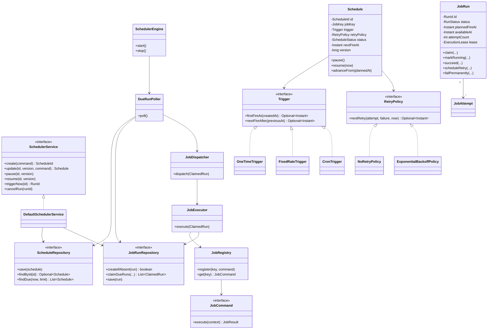
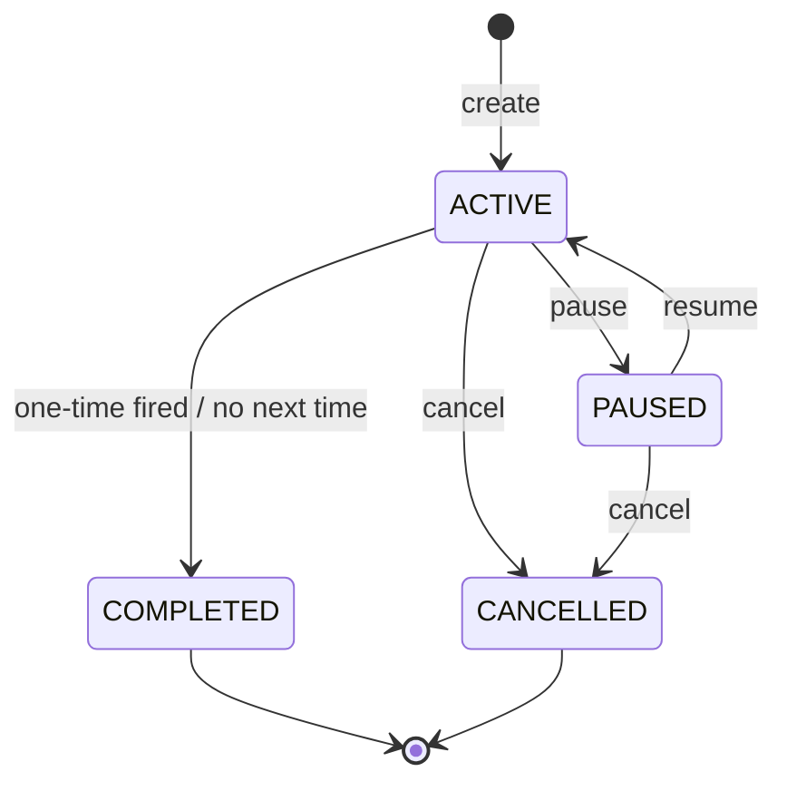
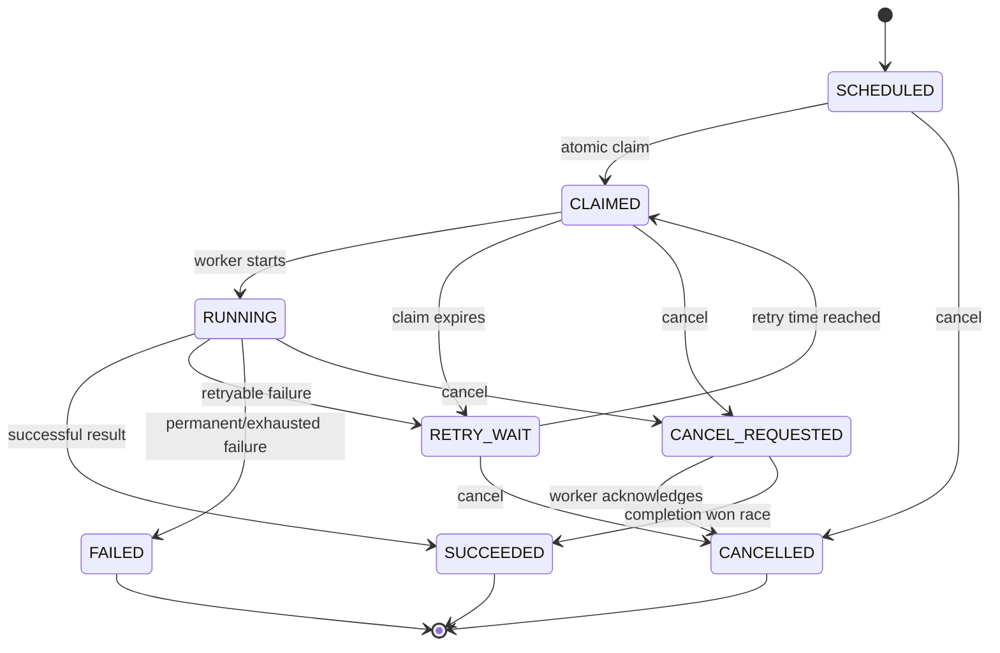
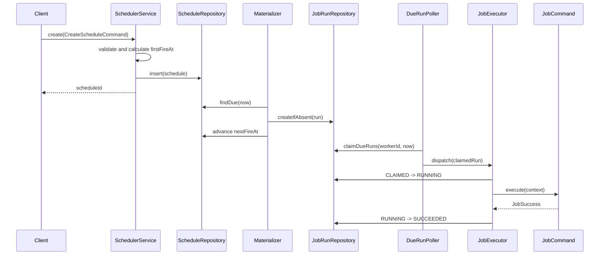
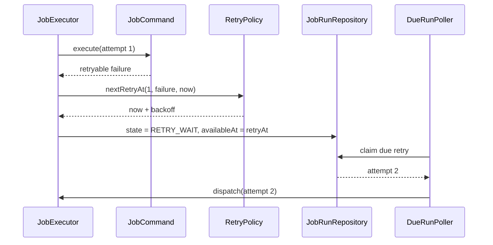
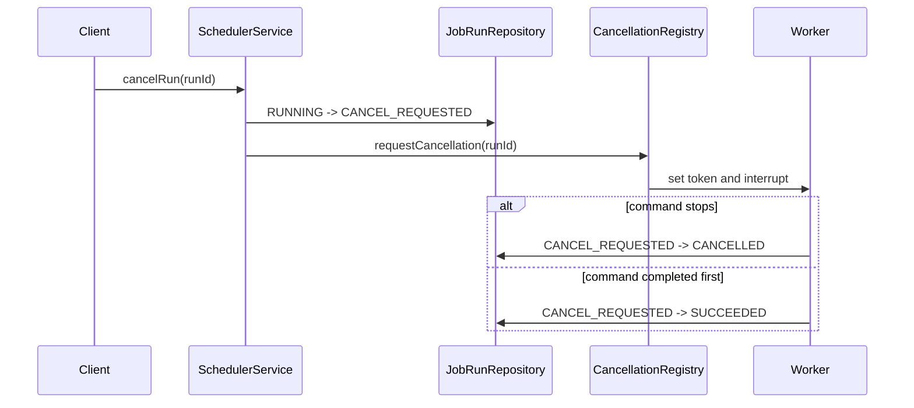

# Job Scheduler System - Low-Level Design (LLD Interview)

> **Standalone document:** This LLD is an independent object-oriented design. It does not require or assume any architecture from a separate HLD.
> **Language used for examples:** Java 17
> **Interview duration:** 60 minutes
> **Prompt:** "Design the classes and interactions for a job scheduler."

---

## Table of Contents

1. [Interview strategy and timeline](#1-interview-strategy-and-timeline)
2. [Clarifying questions and assumed scope](#2-clarifying-questions-and-assumed-scope)
3. [Requirements and invariants](#3-requirements-and-invariants)
4. [Use cases](#4-use-cases)
5. [Domain model](#5-domain-model)
6. [Class diagram](#6-class-diagram)
7. [Package structure](#7-package-structure)
8. [Core interfaces and classes](#8-core-interfaces-and-classes)
9. [State machines](#9-state-machines)
10. [Scheduling and execution algorithms](#10-scheduling-and-execution-algorithms)
11. [Service orchestration](#11-service-orchestration)
12. [Sequence diagrams](#12-sequence-diagrams)
13. [Concurrency and thread safety](#13-concurrency-and-thread-safety)
14. [Persistence model and transactions](#14-persistence-model-and-transactions)
15. [Design patterns and SOLID](#15-design-patterns-and-solid)
16. [Validation and exception model](#16-validation-and-exception-model)
17. [Edge cases](#17-edge-cases)
18. [Testing strategy](#18-testing-strategy)
19. [Extensions](#19-extensions)
20. [Interview follow-up questions](#20-interview-follow-up-questions)
21. [Final interview presentation](#21-final-interview-presentation)

---

## 1. Interview Strategy and Timeline

### 1.1 How I Would Approach the Round

> **Candidate:** "I will clarify the scheduler's boundaries, identify the entities and state transitions, define the interfaces around time, persistence, and execution, then deep dive into the due-job algorithm and concurrency. I will keep policies pluggable so cron calculation, retries, and job execution can change independently."

| Time | Activity | Deliverable |
|---|---|---|
| 0-5 min | Clarify scope | Supported triggers, commands, persistence, concurrency |
| 5-10 min | Requirements and use cases | Functional requirements and explicit assumptions |
| 10-16 min | Identify nouns and verbs | Entities, value objects, services |
| 16-25 min | Draw class diagram | Relationships and interface boundaries |
| 25-33 min | Define states and flows | Schedule, run, and attempt transitions |
| 33-43 min | Explain algorithms | Due queue, claiming, retries, overlap control |
| 43-51 min | Discuss concurrency and persistence | Locks, transactions, leases, thread pools |
| 51-56 min | Patterns, SOLID, testability | Why each abstraction exists |
| 56-60 min | Edge cases and summary | Follow-ups and final walkthrough |

### 1.2 The Mental Model

Start with nouns:

- `JobDefinition`: what code should run and with what input.
- `Schedule`: when a job should run.
- `Trigger`: calculates fire times.
- `JobRun`: one logical scheduled occurrence.
- `JobAttempt`: one execution try for a run.
- `RetryPolicy`: decides whether and when to retry.
- `JobCommand`: executable behavior.

Then verbs:

- Schedule, pause, resume, cancel.
- Calculate next fire time.
- Claim due work.
- Execute a command.
- Record success/failure.
- Retry or dead-letter.
- Notify listeners.

The important modeling insight is:

```text
Schedule != JobRun != JobAttempt

Schedule:
    "Run invoice generation every day at 01:00."

JobRun:
    "The logical occurrence planned for 2026-08-29 01:00."

JobAttempt:
    "Attempt 2 to execute that occurrence after attempt 1 timed out."
```

---

## 2. Clarifying Questions and Assumed Scope

### 2.1 Questions to Ask First

| # | Question | Design impact |
|---|---|---|
| 1 | Is this a reusable in-process library or a standalone scheduler application? | Determines API and persistence boundaries |
| 2 | What can a job execute? | Determines the Command interface |
| 3 | Which trigger types are required? | Determines Trigger hierarchy |
| 4 | Must schedules survive restart? | Determines repository and recovery |
| 5 | May two runs of the same job overlap? | Determines concurrency policy |
| 6 | How are failures retried? | Determines RetryPolicy |
| 7 | Can jobs be paused, resumed, or cancelled? | Determines state machine |
| 8 | How accurate must scheduling be? | Determines polling and queue design |
| 9 | Can jobs run for a long time? | Determines timeout and interruption |
| 10 | Is execution in one JVM or multiple scheduler instances? | Determines local locking versus leases |
| 11 | How should missed executions after downtime behave? | Determines misfire policy |
| 12 | Do cron schedules use time zones? | Determines trigger value objects |

### 2.2 Assumptions for This Design

This standalone LLD assumes:

- A scheduler application written in Java 17.
- Jobs are trusted application commands implementing `JobCommand`.
- One-time, fixed-rate, and cron triggers are supported.
- Schedule definitions and run state are persisted through repository interfaces.
- One or more scheduler instances may share the same database.
- Execution uses a bounded worker pool.
- At-least-once invocation is acceptable.
- Retry uses configurable exponential backoff.
- A schedule has an overlap policy: allow, forbid, or queue one.
- Pause/resume, cancellation, timeout, run history, and graceful shutdown are supported.
- Trigger precision is approximately one second, not hard real time.

### 2.3 Out of Scope

- Arbitrary untrusted code execution and sandboxing.
- Workflow DAGs and dependencies between jobs.
- A public REST controller implementation.
- A particular cron parsing library implementation.
- Cross-region deployment.

---

## 3. Requirements and Invariants

### 3.1 Functional Requirements

1. Register a command implementation.
2. Create a schedule for a registered command.
3. Support one-time, fixed-rate, and cron triggers.
4. Pause, resume, update, and delete a schedule.
5. Materialize a run when the trigger becomes due.
6. Execute due runs using a bounded worker pool.
7. Retry retryable failures according to policy.
8. Enforce timeout and overlap policy.
9. Cancel queued or running work on a best-effort basis.
10. Query schedules and run history.
11. Recover unfinished work after process restart.
12. Notify listeners about lifecycle events.

### 3.2 Non-Functional Requirements

- Thread-safe public services.
- No unbounded task queues or unbounded thread creation.
- Extensible trigger, retry, command, and listener implementations.
- Testable without sleeping or using the real system clock.
- Persistent state changes use explicit transaction boundaries.
- A job failure must not terminate scheduler threads.
- Duplicate command invocation must be possible to detect.
- Invalid state transitions must fail explicitly.

### 3.3 Core Invariants

1. A schedule ID identifies exactly one schedule.
2. Schedule version increases on every mutation.
3. A logical run is unique for `(scheduleId, plannedFireAt)`.
4. Attempt numbers start at 1 and increase by one.
5. A terminal run cannot become runnable again.
6. A paused or cancelled schedule cannot materialize new runs.
7. A run can be claimed only when its `availableAt` has arrived.
8. A stale owner cannot complete a run after its execution lease is replaced.
9. `runningCount` for a non-overlapping schedule is never greater than one.
10. The next trigger time is calculated from the planned time, not polling time, unless the trigger explicitly uses fixed delay.

---

## 4. Use Cases

### 4.1 Primary Actors

| Actor | Responsibility |
|---|---|
| Scheduler client | Creates and manages schedules |
| Scheduler engine | Finds and materializes due work |
| Worker | Executes commands |
| Operator | Inspects, retries, or cancels runs |
| Job author | Implements and registers a `JobCommand` |

### 4.2 Public Operations

```java
public interface SchedulerService {
    ScheduleId create(CreateScheduleCommand command);

    Schedule get(ScheduleId scheduleId);

    Schedule update(
            ScheduleId scheduleId,
            long expectedVersion,
            UpdateScheduleCommand command);

    void pause(ScheduleId scheduleId, long expectedVersion);

    void resume(ScheduleId scheduleId, long expectedVersion);

    void delete(ScheduleId scheduleId, long expectedVersion);

    RunId triggerNow(ScheduleId scheduleId);

    void cancelRun(RunId runId);

    Page<JobRun> findRuns(ScheduleId scheduleId, PageRequest pageRequest);
}
```

The service accepts command DTOs rather than exposing mutable domain objects to callers.

### 4.3 Example Client Use

```java
ScheduleId scheduleId = schedulerService.create(
        new CreateScheduleCommand(
                "daily-invoice-job",
                "generate-invoices",
                Map.of("country", "IN"),
                new CronTrigger("0 0 1 * * *", ZoneId.of("Asia/Kolkata")),
                new ExponentialBackoffPolicy(5, Duration.ofSeconds(10),
                        Duration.ofMinutes(10), 2.0, true),
                Duration.ofMinutes(15),
                OverlapPolicy.FORBID,
                MisfirePolicy.FIRE_ONCE_NOW));
```

---

## 5. Domain Model

### 5.1 Aggregate Boundaries

Use two aggregates:

1. **Schedule aggregate**
   - Owns scheduling configuration and lifecycle.
   - Computes and stores the next planned time.
   - Uses optimistic versioning.

2. **JobRun aggregate**
   - Owns one occurrence, attempts, execution ownership, and terminal result.
   - Enforces run-state transitions.

Keeping run history outside the schedule aggregate avoids loading thousands of runs to update one schedule.

### 5.2 Value Objects

Use immutable value objects rather than raw strings:

```java
public record ScheduleId(UUID value) {
    public ScheduleId {
        Objects.requireNonNull(value, "value");
    }

    public static ScheduleId newId() {
        return new ScheduleId(UUID.randomUUID());
    }
}

public record RunId(UUID value) {
    public RunId {
        Objects.requireNonNull(value, "value");
    }

    public static RunId newId() {
        return new RunId(UUID.randomUUID());
    }
}

public record JobKey(String value) {
    public JobKey {
        if (value == null || value.isBlank()) {
            throw new IllegalArgumentException("Job key must not be blank");
        }
    }
}
```

### 5.3 Schedule

```java
public final class Schedule {
    private final ScheduleId id;
    private final String name;
    private final JobKey jobKey;
    private final Map<String, Object> jobData;
    private Trigger trigger;
    private RetryPolicy retryPolicy;
    private Duration timeout;
    private OverlapPolicy overlapPolicy;
    private MisfirePolicy misfirePolicy;
    private ScheduleStatus status;
    private Instant nextFireAt;
    private long version;

    public void pause() {
        requireStatus(ScheduleStatus.ACTIVE);
        status = ScheduleStatus.PAUSED;
    }

    public void resume(Instant now) {
        requireStatus(ScheduleStatus.PAUSED);
        status = ScheduleStatus.ACTIVE;
        nextFireAt = trigger.nextFireAfter(now).orElse(null);
    }

    public void cancel() {
        if (status == ScheduleStatus.CANCELLED) {
            return;
        }
        status = ScheduleStatus.CANCELLED;
        nextFireAt = null;
    }

    public Optional<Instant> advanceFrom(Instant plannedFireAt) {
        Optional<Instant> next = trigger.nextFireAfter(plannedFireAt);
        nextFireAt = next.orElse(null);
        if (next.isEmpty()) {
            status = ScheduleStatus.COMPLETED;
        }
        return next;
    }

    private void requireStatus(ScheduleStatus expected) {
        if (status != expected) {
            throw new InvalidScheduleStateException(id, status, expected);
        }
    }
}
```

In production, mutation methods would also append domain events or return transition results. Setters are intentionally absent.

### 5.4 Trigger

```java
public sealed interface Trigger
        permits OneTimeTrigger, FixedRateTrigger, CronTrigger {

    Optional<Instant> firstFireAt(Instant createdAt);

    Optional<Instant> nextFireAfter(Instant previousPlannedFireAt);
}
```

```java
public record OneTimeTrigger(Instant fireAt) implements Trigger {
    public OneTimeTrigger {
        Objects.requireNonNull(fireAt, "fireAt");
    }

    @Override
    public Optional<Instant> firstFireAt(Instant createdAt) {
        return fireAt.isAfter(createdAt) ? Optional.of(fireAt) : Optional.empty();
    }

    @Override
    public Optional<Instant> nextFireAfter(Instant ignored) {
        return Optional.empty();
    }
}
```

```java
public record FixedRateTrigger(
        Instant startAt,
        Duration interval
) implements Trigger {
    public FixedRateTrigger {
        Objects.requireNonNull(startAt, "startAt");
        if (interval == null || interval.isZero() || interval.isNegative()) {
            throw new IllegalArgumentException("Interval must be positive");
        }
    }

    @Override
    public Optional<Instant> firstFireAt(Instant createdAt) {
        if (startAt.isAfter(createdAt)) {
            return Optional.of(startAt);
        }

        long elapsed = Duration.between(startAt, createdAt).toMillis();
        long step = interval.toMillis();
        long intervals = Math.floorDiv(elapsed, step) + 1;
        return Optional.of(startAt.plusMillis(Math.multiplyExact(intervals, step)));
    }

    @Override
    public Optional<Instant> nextFireAfter(Instant previousPlannedFireAt) {
        return Optional.of(previousPlannedFireAt.plus(interval));
    }
}
```

```java
public final class CronTrigger implements Trigger {
    private final CronExpression expression;
    private final ZoneId zoneId;
    private final DstPolicy dstPolicy;

    @Override
    public Optional<Instant> firstFireAt(Instant createdAt) {
        return nextFireAfter(createdAt);
    }

    @Override
    public Optional<Instant> nextFireAfter(Instant previousPlannedFireAt) {
        ZonedDateTime local = previousPlannedFireAt.atZone(zoneId);
        return expression.nextAfter(local, dstPolicy).map(ZonedDateTime::toInstant);
    }
}
```

`CronExpression` is an abstraction over a well-tested cron library. Writing a complete cron parser during an interview is not useful.

### 5.5 JobRun and JobAttempt

```java
public final class JobRun {
    private final RunId id;
    private final ScheduleId scheduleId;
    private final long scheduleVersion;
    private final Instant plannedFireAt;
    private Instant availableAt;
    private RunStatus status;
    private int attemptCount;
    private ExecutionLease lease;
    private JobResult result;

    public JobAttempt claim(
            String workerId,
            Instant now,
            Duration leaseDuration,
            long fencingToken) {

        if (!status.isClaimable() || availableAt.isAfter(now)) {
            throw new RunNotClaimableException(id, status, availableAt);
        }

        attemptCount++;
        status = RunStatus.CLAIMED;
        lease = new ExecutionLease(
                workerId,
                fencingToken,
                now.plus(leaseDuration));

        return new JobAttempt(
                id,
                attemptCount,
                AttemptStatus.CLAIMED,
                now);
    }

    public void markRunning(long fencingToken, Instant now) {
        requireLease(fencingToken, now);
        requireStatus(RunStatus.CLAIMED);
        status = RunStatus.RUNNING;
    }

    public void succeed(long fencingToken, JobResult result, Instant now) {
        requireLease(fencingToken, now);
        requireStatus(RunStatus.RUNNING);
        this.result = Objects.requireNonNull(result);
        status = RunStatus.SUCCEEDED;
        lease = null;
    }

    public void scheduleRetry(
            long fencingToken,
            Instant availableAt,
            JobResult failure,
            Instant now) {
        requireLease(fencingToken, now);
        requireStatus(RunStatus.RUNNING);
        this.result = failure;
        this.availableAt = availableAt;
        status = RunStatus.RETRY_WAIT;
        lease = null;
    }

    public void failPermanently(
            long fencingToken,
            JobResult failure,
            Instant now) {
        requireLease(fencingToken, now);
        requireStatus(RunStatus.RUNNING);
        result = failure;
        status = RunStatus.FAILED;
        lease = null;
    }
}
```

`JobAttempt` is persisted as an audit record. The `JobRun` keeps only the current aggregate state and count.

### 5.6 Job Result

```java
public sealed interface JobResult
        permits JobSuccess, JobFailure {
}

public record JobSuccess(
        Map<String, Object> output
) implements JobResult {
}

public record JobFailure(
        String errorCode,
        String message,
        FailureType type
) implements JobResult {
}

public enum FailureType {
    RETRYABLE,
    PERMANENT,
    TIMEOUT,
    CANCELLED
}
```

Do not persist arbitrary exception objects. Persist a bounded, serializable error representation and keep the full stack trace in logs.

---

## 6. Class Diagram



---

## 7. Package Structure

```text
org.systemdesign.jobscheduler/
|-- api/
|   |-- SchedulerService.java
|   |-- CreateScheduleCommand.java
|   |-- UpdateScheduleCommand.java
|   |-- Page.java
|   `-- PageRequest.java
|-- domain/
|   |-- Schedule.java
|   |-- JobRun.java
|   |-- JobAttempt.java
|   |-- JobResult.java
|   |-- ExecutionLease.java
|   |-- ScheduleId.java
|   |-- RunId.java
|   |-- JobKey.java
|   `-- enums/
|       |-- ScheduleStatus.java
|       |-- RunStatus.java
|       |-- AttemptStatus.java
|       |-- OverlapPolicy.java
|       `-- MisfirePolicy.java
|-- trigger/
|   |-- Trigger.java
|   |-- OneTimeTrigger.java
|   |-- FixedRateTrigger.java
|   |-- CronTrigger.java
|   |-- CronExpression.java
|   `-- DstPolicy.java
|-- retry/
|   |-- RetryPolicy.java
|   |-- NoRetryPolicy.java
|   |-- FixedDelayRetryPolicy.java
|   `-- ExponentialBackoffPolicy.java
|-- execution/
|   |-- JobCommand.java
|   |-- JobExecutionContext.java
|   |-- JobRegistry.java
|   |-- JobExecutor.java
|   |-- DefaultJobExecutor.java
|   `-- CancellationToken.java
|-- engine/
|   |-- SchedulerEngine.java
|   |-- DueScheduleMaterializer.java
|   |-- DueRunPoller.java
|   |-- JobDispatcher.java
|   |-- RecoveryService.java
|   `-- SchedulerConfiguration.java
|-- repository/
|   |-- ScheduleRepository.java
|   |-- JobRunRepository.java
|   |-- JobAttemptRepository.java
|   `-- TransactionManager.java
|-- event/
|   |-- SchedulerEvent.java
|   |-- SchedulerEventListener.java
|   `-- CompositeSchedulerEventListener.java
|-- service/
|   `-- DefaultSchedulerService.java
`-- exception/
    |-- ScheduleNotFoundException.java
    |-- InvalidScheduleStateException.java
    |-- OptimisticLockException.java
    |-- JobNotRegisteredException.java
    |-- RunNotClaimableException.java
    `-- InvalidTriggerException.java
```

### Why This Structure?

- `domain` contains state and invariants, not database or threading code.
- `trigger` and `retry` contain interchangeable policies.
- `execution` maps persisted job keys to executable commands.
- `engine` owns background loops and orchestration.
- `repository` hides database details.
- `service` is the application boundary.
- `event` isolates metrics, audit, and notifications from execution logic.

---

## 8. Core Interfaces and Classes

### 8.1 JobCommand - Command Pattern

```java
@FunctionalInterface
public interface JobCommand {
    JobResult execute(JobExecutionContext context) throws Exception;
}
```

```java
public record JobExecutionContext(
        ScheduleId scheduleId,
        RunId runId,
        int attemptNumber,
        Instant plannedFireAt,
        Map<String, Object> data,
        CancellationToken cancellationToken
) {
    public JobExecutionContext {
        data = Map.copyOf(data);
    }
}
```

A sample job:

```java
public final class GenerateInvoicesJob implements JobCommand {
    private final InvoiceService invoiceService;

    public GenerateInvoicesJob(InvoiceService invoiceService) {
        this.invoiceService = invoiceService;
    }

    @Override
    public JobResult execute(JobExecutionContext context) {
        context.cancellationToken().throwIfCancellationRequested();

        String country = (String) context.data().get("country");
        int generated = invoiceService.generate(
                country,
                context.runId().value().toString());

        return new JobSuccess(Map.of("generated", generated));
    }
}
```

The run ID is available as an idempotency key for business operations.

### 8.2 JobRegistry

```java
public final class JobRegistry {
    private final ConcurrentMap<JobKey, JobCommand> commands =
            new ConcurrentHashMap<>();

    public void register(JobKey key, JobCommand command) {
        Objects.requireNonNull(key);
        Objects.requireNonNull(command);

        JobCommand previous = commands.putIfAbsent(key, command);
        if (previous != null) {
            throw new DuplicateJobRegistrationException(key);
        }
    }

    public JobCommand require(JobKey key) {
        JobCommand command = commands.get(key);
        if (command == null) {
            throw new JobNotRegisteredException(key);
        }
        return command;
    }
}
```

Runtime replacement is intentionally not supported by default. Replacing executable behavior while runs are active needs an explicit versioned job-definition design.

### 8.3 RetryPolicy - Strategy Pattern

```java
public interface RetryPolicy {
    Optional<Instant> nextRetryAt(
            int completedAttempts,
            JobFailure failure,
            Instant now,
            RandomGenerator random);
}
```

```java
public record ExponentialBackoffPolicy(
        int maxAttempts,
        Duration initialDelay,
        Duration maxDelay,
        double multiplier,
        boolean jitter
) implements RetryPolicy {

    public ExponentialBackoffPolicy {
        if (maxAttempts < 1) {
            throw new IllegalArgumentException("maxAttempts must be at least 1");
        }
        if (initialDelay.isNegative() || initialDelay.isZero()) {
            throw new IllegalArgumentException("initialDelay must be positive");
        }
        if (maxDelay.compareTo(initialDelay) < 0) {
            throw new IllegalArgumentException(
                    "maxDelay must be greater than or equal to initialDelay");
        }
        if (multiplier < 1.0) {
            throw new IllegalArgumentException("multiplier must be at least 1");
        }
    }

    @Override
    public Optional<Instant> nextRetryAt(
            int completedAttempts,
            JobFailure failure,
            Instant now,
            RandomGenerator random) {

        if (failure.type() != FailureType.RETRYABLE
                || completedAttempts >= maxAttempts) {
            return Optional.empty();
        }

        double scaledMillis = initialDelay.toMillis()
                * Math.pow(multiplier, completedAttempts - 1);
        long cappedMillis = Math.min(
                maxDelay.toMillis(),
                Math.max(1L, (long) scaledMillis));
        long delayMillis = jitter
                ? random.nextLong(cappedMillis + 1)
                : cappedMillis;

        return Optional.of(now.plusMillis(delayMillis));
    }
}
```

Passing `RandomGenerator` makes retry timing deterministic in tests.

### 8.4 Repository Interfaces

```java
public interface ScheduleRepository {
    Schedule insert(Schedule schedule);

    Optional<Schedule> findById(ScheduleId id);

    Schedule update(Schedule schedule, long expectedVersion);

    List<Schedule> findDue(
            Instant upperBound,
            int limit,
            DueCursor cursor);
}
```

```java
public interface JobRunRepository {
    boolean createIfAbsent(JobRun run);

    List<ClaimedRun> claimDueRuns(
            String workerId,
            Instant now,
            int limit,
            Duration leaseDuration);

    JobRun requireById(RunId runId);

    JobRun save(JobRun run, long expectedVersion);

    List<JobRun> findExpiredLeases(Instant now, int limit);

    Page<JobRun> findBySchedule(
            ScheduleId scheduleId,
            PageRequest pageRequest);
}
```

Repository methods represent atomic operations, not merely collection access.

### 8.5 Transaction Manager

```java
public interface TransactionManager {
    <T> T required(Supplier<T> work);

    default void required(Runnable work) {
        required(() -> {
            work.run();
            return null;
        });
    }
}
```

This keeps transaction ownership in application services while domain classes remain persistence-agnostic.

### 8.6 SchedulerConfiguration

```java
public record SchedulerConfiguration(
        Duration pollingInterval,
        Duration lookAhead,
        Duration executionLease,
        Duration heartbeatInterval,
        Duration shutdownGracePeriod,
        int materializationBatchSize,
        int claimBatchSize,
        int workerThreads,
        int workerQueueCapacity
) {
    public SchedulerConfiguration {
        requirePositive(pollingInterval, "pollingInterval");
        requirePositive(executionLease, "executionLease");
        requirePositive(heartbeatInterval, "heartbeatInterval");

        if (heartbeatInterval.multipliedBy(2).compareTo(executionLease) >= 0) {
            throw new IllegalArgumentException(
                    "Execution lease must safely exceed heartbeat interval");
        }
        if (workerThreads < 1 || workerQueueCapacity < 1) {
            throw new IllegalArgumentException(
                    "Worker threads and queue capacity must be positive");
        }
    }
}
```

### 8.7 SchedulerEngine Lifecycle

```java
public final class SchedulerEngine implements AutoCloseable {
    private final ScheduledExecutorService controlExecutor;
    private final DueScheduleMaterializer materializer;
    private final DueRunPoller runPoller;
    private final RecoveryService recoveryService;
    private final AtomicReference<EngineState> state =
            new AtomicReference<>(EngineState.NEW);

    public void start() {
        if (!state.compareAndSet(EngineState.NEW, EngineState.RUNNING)) {
            throw new IllegalStateException("Scheduler can only be started once");
        }

        controlExecutor.scheduleWithFixedDelay(
                materializer::runSafely,
                0,
                500,
                TimeUnit.MILLISECONDS);

        controlExecutor.scheduleWithFixedDelay(
                runPoller::runSafely,
                0,
                200,
                TimeUnit.MILLISECONDS);

        controlExecutor.scheduleWithFixedDelay(
                recoveryService::runSafely,
                5,
                5,
                TimeUnit.SECONDS);
    }

    @Override
    public void close() {
        if (!state.compareAndSet(EngineState.RUNNING, EngineState.STOPPING)) {
            return;
        }

        controlExecutor.shutdown();
        awaitConfiguredGracePeriod();
        state.set(EngineState.STOPPED);
    }
}
```

Use separate control and worker executors. A long-running job must never occupy the thread responsible for discovering due schedules.

---

## 9. State Machines

### 9.1 Schedule State



Allowed transitions:

| Current | Operation | Next |
|---|---|---|
| `ACTIVE` | pause | `PAUSED` |
| `PAUSED` | resume | `ACTIVE` |
| `ACTIVE` | no next trigger | `COMPLETED` |
| `ACTIVE`, `PAUSED` | cancel/delete | `CANCELLED` |

Update may change configuration in `ACTIVE` or `PAUSED`, but not in terminal states.

### 9.2 Run State



### 9.3 Transition Table

Centralize transition validation:

```java
public enum RunStatus {
    SCHEDULED,
    CLAIMED,
    RUNNING,
    RETRY_WAIT,
    CANCEL_REQUESTED,
    SUCCEEDED,
    FAILED,
    CANCELLED;

    public boolean isTerminal() {
        return this == SUCCEEDED || this == FAILED || this == CANCELLED;
    }

    public boolean isClaimable() {
        return this == SCHEDULED || this == RETRY_WAIT;
    }
}
```

Do not allow repositories to set arbitrary status strings. State changes go through domain methods or narrowly named atomic repository operations.

---

## 10. Scheduling and Execution Algorithms

### 10.1 Two-Stage Processing

Separate:

1. **Materialization:** Convert a due schedule into one logical `JobRun` and advance the schedule.
2. **Execution:** Claim a due run and invoke its `JobCommand`.

Benefits:

- The command may be delayed or retried without changing trigger calculation.
- Run history exists even before worker execution.
- A scheduler restart does not lose already materialized work.
- Retries do not accidentally advance recurring schedules.

### 10.2 Due Schedule Materialization

```text
function materializeDueSchedules():
    upperBound = clock.instant() + lookAhead
    cursor = firstCursor

    do:
        schedules = scheduleRepository.findDue(
            upperBound, batchSize, cursor)

        for schedule in schedules:
            transaction:
                current = scheduleRepository.lockOrReload(schedule.id)

                if current.status != ACTIVE:
                    continue

                while current.nextFireAt <= upperBound:
                    plannedAt = current.nextFireAt
                    apply misfire policy

                    runId = deterministic(schedule.id, plannedAt)
                    runRepository.createIfAbsent(
                        JobRun.scheduled(runId, schedule, plannedAt))

                    current.advanceFrom(plannedAt)

                    if overlap/misfire policy says stop:
                        break

                scheduleRepository.update(
                    current, expectedVersion)

        cursor = schedules.nextCursor
    while batch is full and engine is running
```

`createIfAbsent` plus the unique key `(schedule_id, planned_fire_at)` makes the operation safe if retried.

### 10.3 In-Memory Queue Option

For one JVM without shared persistence, use a `DelayQueue`:

```java
public final class ScheduledToken implements Delayed {
    private final ScheduleId scheduleId;
    private final Instant fireAt;
    private final Clock clock;

    @Override
    public long getDelay(TimeUnit unit) {
        long millis = Duration.between(clock.instant(), fireAt).toMillis();
        return unit.convert(millis, TimeUnit.MILLISECONDS);
    }

    @Override
    public int compareTo(Delayed other) {
        ScheduledToken token = (ScheduledToken) other;
        return fireAt.compareTo(token.fireAt);
    }
}
```

Complexities:

| Operation | DelayQueue complexity |
|---|---:|
| Insert | `O(log n)` |
| Read next due item | `O(1)` peek, blocking take |
| Remove arbitrary item | `O(n)` |

For updates and cancellation, use lazy invalidation:

- Queue token contains schedule version.
- On dequeue, compare with current version/status.
- Ignore stale tokens.

This avoids an `O(n)` removal on each update.

### 10.4 Database-Backed Claim

For several application instances:

```sql
WITH due AS (
    SELECT run_id
    FROM job_runs
    WHERE status IN ('SCHEDULED', 'RETRY_WAIT')
      AND available_at <= :now
    ORDER BY available_at, run_id
    FOR UPDATE SKIP LOCKED
    LIMIT :batch_size
)
UPDATE job_runs r
SET status = 'CLAIMED',
    owner_id = :worker_id,
    fencing_token = r.fencing_token + 1,
    lease_expires_at = :lease_expires_at,
    attempt_count = r.attempt_count + 1,
    version = r.version + 1
FROM due
WHERE r.run_id = due.run_id
RETURNING r.*;
```

The claim is atomic. `SKIP LOCKED` prevents scheduler instances from blocking one another on the same rows.

### 10.5 Worker Dispatch

```java
public final class JobDispatcher {
    private final ThreadPoolExecutor workerPool;

    public void dispatch(ClaimedRun run) {
        try {
            workerPool.execute(() -> executeSafely(run));
        } catch (RejectedExecutionException saturated) {
            releaseClaimForRetry(run, saturated);
        }
    }
}
```

Use:

```java
new ThreadPoolExecutor(
        workerThreads,
        workerThreads,
        0L,
        TimeUnit.MILLISECONDS,
        new ArrayBlockingQueue<>(workerQueueCapacity),
        new NamedThreadFactory("job-worker-"),
        new ThreadPoolExecutor.AbortPolicy());
```

`AbortPolicy` is intentional: rejection becomes a visible retryable event. `CallerRunsPolicy` is dangerous because it may execute a long job on the scheduler polling thread.

### 10.6 Job Execution

```text
function execute(claimedRun):
    command = registry.require(claimedRun.jobKey)
    cancellation = cancellationRegistry.create(claimedRun.runId)

    persist CLAIMED -> RUNNING using fencing token
    emit JobStarted

    submit callable to timeoutExecutor

    try:
        result = future.get(timeout)

        if result is success:
            persist RUNNING -> SUCCEEDED
            emit JobSucceeded
        else:
            handleFailure(result)

    catch TimeoutException:
        cancellation.cancel()
        future.cancel(true)
        handleFailure(TIMEOUT)

    catch InterruptedException:
        restore interrupt flag
        handleWorkerShutdown()

    catch Exception:
        map exception to bounded JobFailure
        handleFailure(failure)

    finally:
        cancellationRegistry.remove(runId)
```

Java interruption is cooperative. A command that ignores interrupts may continue after timeout; document that command implementations must observe the cancellation token and interruption.

### 10.7 Retry Decision

```java
private void handleFailure(
        JobRun run,
        long fencingToken,
        JobFailure failure,
        Instant now) {

    Schedule schedule = scheduleRepository
            .findById(run.scheduleId())
            .orElseThrow(() -> new ScheduleNotFoundException(run.scheduleId()));

    Optional<Instant> nextAttempt = schedule.retryPolicy().nextRetryAt(
            run.attemptCount(),
            failure,
            now,
            random);

    if (nextAttempt.isPresent()) {
        run.scheduleRetry(fencingToken, nextAttempt.get(), failure, now);
    } else {
        run.failPermanently(fencingToken, failure, now);
    }

    runRepository.save(run, run.version());
}
```

The schedule snapshot/version should be captured on the run if updating a schedule must not change the retry policy of an existing run. This is a product decision; immutable run snapshots are safer.

### 10.8 Overlap Policies

#### ALLOW

Create and execute every due run independently.

#### FORBID

Inside the materialization transaction:

```sql
SELECT running_count
FROM schedule_execution_guard
WHERE schedule_id = :schedule_id
FOR UPDATE;
```

Create a runnable run only if `running_count = 0`. Increment it when a run becomes running and decrement on every terminal path.

A safer alternative is a partial unique index:

```sql
CREATE UNIQUE INDEX one_active_run_per_schedule
ON job_runs (schedule_id)
WHERE status IN ('CLAIMED', 'RUNNING', 'CANCEL_REQUESTED');
```

The index protects the invariant even if application logic races.

#### QUEUE_ONE

Keep at most one pending run. If another occurrence becomes due, update the pending run's coalesced count or latest planned time rather than insert another row.

### 10.9 Misfire Handling

```java
public enum MisfirePolicy {
    SKIP,
    FIRE_ONCE_NOW,
    CATCH_UP
}
```

```text
SKIP:
    advance until nextFireAt > now

FIRE_ONCE_NOW:
    create one run with original planned time and misfire metadata
    advance until nextFireAt > now

CATCH_UP:
    create one run per missed planned time
    stop at configured catch-up limit
```

Always cap catch-up work.

---

## 11. Service Orchestration

### 11.1 Create Schedule

```java
public final class DefaultSchedulerService implements SchedulerService {
    private final ScheduleRepository scheduleRepository;
    private final JobRegistry jobRegistry;
    private final Clock clock;
    private final TransactionManager transactions;
    private final SchedulerEventListener events;

    @Override
    public ScheduleId create(CreateScheduleCommand command) {
        validate(command);
        jobRegistry.require(command.jobKey());

        Instant now = clock.instant();
        Instant firstFireAt = command.trigger()
                .firstFireAt(now)
                .orElseThrow(() -> new InvalidTriggerException(
                        "Trigger has no future fire time"));

        Schedule schedule = Schedule.create(
                ScheduleId.newId(),
                command,
                firstFireAt,
                now);

        Schedule saved = transactions.required(
                () -> scheduleRepository.insert(schedule));

        events.onEvent(new ScheduleCreated(
                saved.id(), saved.version(), now));
        return saved.id();
    }
}
```

Event listeners should not be able to roll back a successful schedule unless they are explicitly transactional. Operational listeners should be isolated and receive events through a durable mechanism in a production implementation.

### 11.2 Pause

```java
public void pause(ScheduleId id, long expectedVersion) {
    Schedule paused = transactions.required(() -> {
        Schedule schedule = requireSchedule(id);
        schedule.pause();
        return scheduleRepository.update(schedule, expectedVersion);
    });

    events.onEvent(new SchedulePaused(
            paused.id(), paused.version(), clock.instant()));
}
```

The repository throws `OptimisticLockException` if the version changed.

### 11.3 Manual Trigger

A manual trigger:

- Does not advance `nextFireAt`.
- Creates a run with source `MANUAL`.
- Uses a unique manual request ID for idempotency.
- Still honors overlap, timeout, and retry policies unless the API explicitly overrides them.

```java
public RunId triggerNow(ScheduleId scheduleId) {
    return transactions.required(() -> {
        Schedule schedule = requireSchedule(scheduleId);
        schedule.requireNotCancelled();

        Instant now = clock.instant();
        JobRun run = JobRun.manual(RunId.newId(), schedule, now);
        runRepository.insert(run);
        return run.id();
    });
}
```

### 11.4 Cancellation Registry

```java
public final class CancellationRegistry {
    private final ConcurrentMap<RunId, CancellationTokenSource> active =
            new ConcurrentHashMap<>();

    public CancellationTokenSource register(RunId runId) {
        CancellationTokenSource source = new CancellationTokenSource();
        if (active.putIfAbsent(runId, source) != null) {
            throw new IllegalStateException("Run already registered: " + runId);
        }
        return source;
    }

    public boolean requestCancellation(RunId runId) {
        CancellationTokenSource source = active.get(runId);
        return source != null && source.cancel();
    }

    public void remove(RunId runId) {
        active.remove(runId);
    }
}
```

Persist `CANCEL_REQUESTED` before signaling the local worker. Another instance can observe and signal its own worker through polling or a control channel.

### 11.5 Recovery Service

```text
every recoveryInterval:
    expired = runRepository.findExpiredLeases(now, batchSize)

    for run in expired:
        transaction:
            reload and lock run
            if lease is no longer expired:
                continue

            record current attempt as ABANDONED

            if retry policy allows:
                transition to RETRY_WAIT
                availableAt = now + recoveryBackoff
            else:
                transition to FAILED
```

Recovery must use a new fencing token on the next claim. A late worker completion with the previous token is rejected.

---

## 12. Sequence Diagrams

### 12.1 Create and Execute a Recurring Schedule



### 12.2 Retry



### 12.3 Cancellation Race



Success winning the race is legitimate if the business action completed before cancellation took effect.

---

## 13. Concurrency and Thread Safety

### 13.1 Threads in the Application

```text
Control scheduler:
    materializer thread(s)
    due-run poller thread(s)
    recovery thread

Worker executor:
    bounded N-thread pool
    bounded queue

Heartbeat scheduler:
    small scheduled pool
```

Never use one executor for all three concerns.

### 13.2 Shared Mutable State

| State | Protection |
|---|---|
| Registered commands | `ConcurrentHashMap`, immutable after startup where possible |
| Engine lifecycle | `AtomicReference<EngineState>` |
| Active cancellation tokens | `ConcurrentHashMap` |
| Domain objects | Not shared between threads; reload per transaction |
| Cross-instance run ownership | Database conditional update and lease |
| Worker queue | Bounded `ArrayBlockingQueue` |

### 13.3 Optimistic Locking

Each aggregate has a version:

```sql
UPDATE schedules
SET status = :status,
    next_fire_at = :next_fire_at,
    version = version + 1
WHERE schedule_id = :id
  AND version = :expected_version;
```

Zero updated rows means a conflict. Do not silently overwrite another operation.

### 13.4 Lease and Fencing Token

A lease alone is insufficient:

```text
Worker A pauses for 60 seconds.
Its 30-second lease expires.
Worker B acquires the run and completes it.
Worker A resumes and writes a stale completion.
```

Use a monotonically increasing fencing token:

```sql
UPDATE job_runs
SET status = 'SUCCEEDED'
WHERE run_id = :run_id
  AND owner_id = :owner_id
  AND fencing_token = :token
  AND status = 'RUNNING';
```

Worker A's stale token cannot mutate the recovered run.

### 13.5 Heartbeats

```java
public interface LeaseManager {
    ExecutionLease renew(
            RunId runId,
            String ownerId,
            long fencingToken,
            Instant now,
            Duration extension);
}
```

Rules:

- Lease duration should be at least 3x heartbeat interval.
- Heartbeat only active runs.
- Several transient heartbeat failures may be tolerated before cancellation.
- Failure to renew must stop accepting the result as authoritative.

### 13.6 Backpressure

When the worker pool is full:

- Stop or reduce run claiming.
- Release a rejected claim back to `RETRY_WAIT`.
- Emit saturation metrics.
- Never keep claiming into an unbounded in-memory list.

A useful limit:

```text
claim batch <= worker queue remaining capacity + immediately available threads
```

### 13.7 Deadlocks

If a transaction must lock both schedule and run:

- Always lock schedule first, then run.
- Keep remote command execution outside database transactions.
- Keep transactions short.
- Retry recognized serialization/deadlock failures a bounded number of times.

### 13.8 Command Thread Safety

`JobRegistry` usually stores singleton command objects. Therefore:

- Commands should be stateless, or their dependencies must be thread-safe.
- Per-run mutable state belongs in local variables or `JobExecutionContext`.
- If a command is not thread-safe, register a `JobCommandFactory` that creates one per run.

---

## 14. Persistence Model and Transactions

### 14.1 Tables

```sql
CREATE TABLE schedules (
    schedule_id         UUID PRIMARY KEY,
    name                VARCHAR(200) NOT NULL UNIQUE,
    job_key             VARCHAR(200) NOT NULL,
    job_data            JSONB NOT NULL,
    trigger_type        VARCHAR(30) NOT NULL,
    trigger_config      JSONB NOT NULL,
    retry_config        JSONB NOT NULL,
    timeout_ms          BIGINT NOT NULL,
    overlap_policy      VARCHAR(30) NOT NULL,
    misfire_policy      VARCHAR(30) NOT NULL,
    status              VARCHAR(30) NOT NULL,
    next_fire_at        TIMESTAMPTZ,
    version             BIGINT NOT NULL,
    created_at          TIMESTAMPTZ NOT NULL,
    updated_at          TIMESTAMPTZ NOT NULL
);

CREATE INDEX schedules_due_idx
    ON schedules (next_fire_at, schedule_id)
    WHERE status = 'ACTIVE';
```

```sql
CREATE TABLE job_runs (
    run_id              UUID PRIMARY KEY,
    schedule_id         UUID NOT NULL REFERENCES schedules(schedule_id),
    schedule_version    BIGINT NOT NULL,
    source              VARCHAR(20) NOT NULL,
    planned_fire_at     TIMESTAMPTZ NOT NULL,
    available_at        TIMESTAMPTZ NOT NULL,
    status              VARCHAR(30) NOT NULL,
    attempt_count       INTEGER NOT NULL,
    owner_id            VARCHAR(200),
    fencing_token       BIGINT NOT NULL DEFAULT 0,
    lease_expires_at    TIMESTAMPTZ,
    result_data         JSONB,
    error_code          VARCHAR(100),
    error_message       VARCHAR(2000),
    version             BIGINT NOT NULL,
    created_at          TIMESTAMPTZ NOT NULL,
    updated_at          TIMESTAMPTZ NOT NULL,
    UNIQUE (schedule_id, planned_fire_at, source)
);

CREATE INDEX job_runs_due_idx
    ON job_runs (available_at, run_id)
    WHERE status IN ('SCHEDULED', 'RETRY_WAIT');
```

```sql
CREATE TABLE job_attempts (
    run_id              UUID NOT NULL REFERENCES job_runs(run_id),
    attempt_number      INTEGER NOT NULL,
    status              VARCHAR(30) NOT NULL,
    worker_id           VARCHAR(200),
    fencing_token       BIGINT NOT NULL,
    started_at          TIMESTAMPTZ,
    completed_at        TIMESTAMPTZ,
    error_code          VARCHAR(100),
    error_message       VARCHAR(2000),
    PRIMARY KEY (run_id, attempt_number)
);
```

### 14.2 Transaction Boundaries

#### Create schedule

```text
validate outside transaction
BEGIN
    insert schedule
    optionally insert audit/outbox event
COMMIT
```

#### Materialize due run

```text
BEGIN
    lock/reload schedule
    insert run if absent
    update schedule.next_fire_at and version
COMMIT
```

These writes must be atomic. Otherwise a run could be created without advancing the schedule, or the schedule could advance without creating the run.

#### Claim run

```text
BEGIN
    claim due run conditionally
    insert attempt
COMMIT
```

#### Execute command

Never hold a transaction open while executing job code.

#### Complete attempt

```text
BEGIN
    check fencing token
    update attempt
    transition run
    release overlap guard if terminal
    append event
COMMIT
```

### 14.3 Serialization

Use explicit type discriminators and versioned JSON:

```json
{
  "type": "FIXED_RATE",
  "schemaVersion": 1,
  "startAt": "2026-08-29T00:00:00Z",
  "interval": "PT5M"
}
```

Never deserialize arbitrary class names from database JSON. Use an allowlisted codec registry:

```java
public interface TriggerCodec<T extends Trigger> {
    String type();
    int schemaVersion();
    JsonNode encode(T trigger);
    T decode(JsonNode json);
}
```

### 14.4 Retention

- Keep schedule records until explicitly deleted or retention expires.
- Keep hot run/attempt history for an operational window.
- Archive or delete terminal runs in batches.
- Never delete active or retry-wait runs.
- Retention jobs themselves should use bounded, checkpointed batches.

---

## 15. Design Patterns and SOLID

### 15.1 Patterns

| Pattern | Location | Why |
|---|---|---|
| Command | `JobCommand` | Encapsulates executable behavior |
| Strategy | `Trigger`, `RetryPolicy` | Pluggable timing and retry algorithms |
| Repository | `ScheduleRepository`, `JobRunRepository` | Separates domain from persistence |
| Observer | `SchedulerEventListener` | Decouples metrics/audit/notifications |
| Factory/Registry | `JobRegistry` or `JobCommandFactory` | Resolves persisted job key to behavior |
| State | Schedule and run transitions | Makes legal lifecycle transitions explicit |
| Facade | `SchedulerService` | Simple boundary over multiple collaborators |
| Dependency Injection | Constructors | Testability and lifecycle clarity |

### 15.2 Why Not Singleton?

Do not make `SchedulerEngine` or repositories global singletons:

- Tests need isolated instances.
- Applications may host schedulers with different configurations.
- Dependency injection should own lifecycle.
- Global mutable state makes shutdown and command registration unsafe.

Singleton is not required just because only one engine is normally created.

### 15.3 Single Responsibility

| Class | One reason to change |
|---|---|
| `CronTrigger` | Cron next-fire semantics |
| `ExponentialBackoffPolicy` | Retry timing formula |
| `DefaultSchedulerService` | Schedule-management use cases |
| `DueScheduleMaterializer` | Turning trigger times into runs |
| `DueRunPoller` | Claiming execution-ready runs |
| `DefaultJobExecutor` | Command invocation lifecycle |
| `RecoveryService` | Expired execution recovery |

### 15.4 Open/Closed Principle

Adding:

- `CalendarTrigger`
- `LinearBackoffPolicy`
- `KafkaPublishJob`
- `TracingEventListener`
- `JdbcScheduleRepository`

should not require changes to the scheduler engine's core loop.

### 15.5 Interface Segregation

Do not create one giant repository interface. For example, operators querying history do not need mutation methods. A larger implementation may split:

```java
ScheduleReader
ScheduleWriter
DueScheduleStore
RunReader
RunClaimer
RunWriter
```

Keep the initial design pragmatic; split only where clients truly differ.

### 15.6 Dependency Inversion

Core services depend on:

- `Clock`, not `Instant.now()`.
- `ScheduleRepository`, not JDBC.
- `JobCommand`, not a specific invoice service.
- `RetryPolicy`, not hardcoded sleep.
- `SchedulerEventListener`, not a concrete monitoring SDK.

---

## 16. Validation and Exception Model

### 16.1 Validation Rules

At schedule creation/update:

- Name and job key are present and bounded.
- Job key is registered.
- Job data is serializable and within size limit.
- One-time trigger is in the future.
- Fixed-rate interval is positive and above minimum precision.
- Cron expression and time zone are valid.
- Timeout is positive and below configured maximum.
- Retry count and backoff are bounded.
- Catch-up limit is bounded.
- Policies form a supported combination.

### 16.2 Exceptions

```java
public abstract class SchedulerException extends RuntimeException {
    private final String code;

    protected SchedulerException(String code, String message) {
        super(message);
        this.code = code;
    }
}
```

| Exception | Meaning |
|---|---|
| `ScheduleNotFoundException` | Unknown schedule ID |
| `RunNotFoundException` | Unknown run ID |
| `InvalidTriggerException` | Trigger cannot produce valid fire time |
| `InvalidScheduleStateException` | Illegal lifecycle operation |
| `OptimisticLockException` | Stale client or concurrent update |
| `JobNotRegisteredException` | Persisted job key has no implementation |
| `RunNotClaimableException` | Run state/time does not allow claim |
| `LeaseLostException` | Worker fencing token is no longer valid |
| `SchedulerSaturatedException` | Bounded execution capacity exhausted |

### 16.3 Exception Mapping for Job Commands

Do not treat every exception as retryable:

```java
public interface JobFailureClassifier {
    JobFailure classify(Throwable throwable);
}
```

Examples:

- `SocketTimeoutException` -> retryable.
- `IllegalArgumentException` from invalid persisted job data -> permanent.
- `CancellationException` -> cancelled.
- Unknown exception -> configurable; commonly retryable for a small bounded count.

Log the original exception with run context, but store only a sanitized bounded error.

---

## 17. Edge Cases

### 17.1 Time and Trigger Cases

| Case | Expected behavior |
|---|---|
| One-time trigger in past | Reject or require explicit fire-now option |
| Clock moves backward | Duration uses monotonic clock; duplicate run prevented by unique key |
| Clock moves forward | Misfire policy determines recovery |
| DST skipped local time | Apply explicit DST policy |
| DST repeated local time | Fire once or twice according to policy |
| Trigger has no next time | Mark schedule `COMPLETED` |
| Interval overflows `Instant` | Reject trigger as invalid |

### 17.2 Lifecycle Races

| Race | Resolution |
|---|---|
| Pause versus materialize | Schedule row version/lock determines winner |
| Update versus materialize | Run captures committed schedule version |
| Cancel versus claim | Conditional state update determines winner |
| Cancel versus success | Success may win if command already completed |
| Lease recovery versus late completion | Fencing token rejects stale completion |
| Two materializers | Unique run constraint and schedule optimistic lock |
| Two workers | Atomic claim plus row lock |

### 17.3 Execution Cases

- Command not registered after deployment: fail permanently or keep retrying based on rollout policy; emit a high-severity alert.
- Command returns `null`: convert to permanent contract failure.
- Command ignores interrupt after timeout: mark timed out when authoritative lease is lost; isolate truly unsafe jobs in a process.
- Worker pool full: stop claiming and release rejected claims.
- Result too large: store bounded metadata or external reference.
- Process terminates abruptly: expired leases are recovered at startup.
- Retry delay exceeds schedule lifetime: still retry the existing run unless cancellation policy says otherwise.

### 17.4 Recurrence Cases

- A fixed-rate job takes longer than its interval: overlap policy decides whether runs overlap, skip, or coalesce.
- Catch-up after a long outage: enforce per-schedule and global batch limits.
- Schedule updated while a run retries: run should normally retain its original execution snapshot.
- Deleted schedule with historical runs: soft delete or preserve referential history.

---

## 18. Testing Strategy

### 18.1 Unit Tests

#### Trigger tests

- One-time first and final firing.
- Fixed-rate alignment without drift.
- Cron boundaries for minute, day, month, leap year.
- DST gap and overlap for representative zones.
- Invalid and overflow inputs.

#### State-machine tests

- Every allowed transition.
- Every forbidden transition.
- Terminal state immutability.
- Lease token mismatch.
- Retry attempt count.

#### Retry tests

- First delay and exponential growth.
- Maximum cap.
- Maximum attempts.
- Permanent failure returns no retry.
- Deterministic jitter with seeded random generator.

### 18.2 Fake Clock

```java
public final class MutableClock extends Clock {
    private final AtomicReference<Instant> instant;
    private final ZoneId zone;

    public void advance(Duration duration) {
        instant.updateAndGet(current -> current.plus(duration));
    }

    @Override
    public Instant instant() {
        return instant.get();
    }
}
```

Tests advance virtual time instead of calling `Thread.sleep`, which makes them fast and deterministic.

### 18.3 Repository Contract Tests

Run the same test suite for in-memory and JDBC repositories:

- Insert and load fidelity.
- Optimistic-lock conflict.
- Unique occurrence enforcement.
- Atomic claim by competing threads.
- Expired lease lookup.
- Pagination stability.
- JSON codec version compatibility.

### 18.4 Concurrency Tests

Use barriers to force races:

```text
two threads claim same run -> exactly one succeeds
pause races with materialize -> no run after winning pause
two materializers -> one logical run
late worker completes after recovery -> stale fencing token rejected
cancel races with success -> one valid terminal outcome
```

Verify invariants, not a particular thread interleaving.

### 18.5 Integration Tests

1. Create one-time schedule.
2. Advance fake clock.
3. Materialize and claim run.
4. Execute fake command.
5. Assert schedule completed and run succeeded.

Other scenarios:

- Fail twice, then succeed.
- Timeout and cooperative cancellation.
- Restart with `RUNNING` expired lease.
- Pause, pass several trigger times, then resume under each misfire policy.
- Saturate worker queue and verify no work is lost.

### 18.6 Load and Soak Tests

Measure:

- Due-scan query latency.
- Dispatch latency from planned time.
- Worker queue utilization.
- Claim contention with several instances.
- Database growth and index health.
- Memory growth in cancellation registry.
- Graceful shutdown with in-flight work.

### 18.7 Fault Injection

Crash at these points:

1. Before run insert.
2. After run insert but before schedule advance.
3. After claim but before command.
4. During command.
5. After command side effect but before completion write.
6. During retry transition.

The transaction and idempotency design should predict every resulting state.

---

## 19. Extensions

### 19.1 Fixed-Delay Trigger

Fixed delay depends on completion, unlike fixed rate:

```java
public interface CompletionBasedTrigger {
    Optional<Instant> nextFireAfterCompletion(Instant completedAt);
}
```

The executor or completion handler schedules the next run. Do not force this into `nextFireAfter(previousPlannedAt)` because the semantics differ.

### 19.2 Priority

Add a small enum:

```java
public enum JobPriority {
    HIGH,
    NORMAL,
    LOW
}
```

Use separate bounded worker queues or weighted fair selection. Arbitrary integer priority can starve lower values without aging.

### 19.3 Job Dependencies

For simple dependencies:

```text
JobRunDependency(parentRunId, childRunId, requiredStatus)
```

A completion handler releases the child when all conditions are met. For complex DAGs, separate workflow orchestration from the scheduler.

### 19.4 Process Isolation

Trusted commands can run in threads. Untrusted, memory-heavy, or non-cooperative commands need:

- Separate process/container.
- Resource limits.
- IPC execution protocol.
- External execution ID.
- Kill semantics and log capture.

The `JobExecutor` interface allows this replacement.

### 19.5 Event Publication

Replace synchronous listeners with an outbox:

```text
domain state transaction:
    update run
    insert scheduler_event

event relay:
    publish to message broker
```

Metrics can remain local, but business notifications should be durable.

### 19.6 Calendar Exclusions

Wrap triggers:

```java
public final class ExcludingTrigger implements Trigger {
    private final Trigger delegate;
    private final BusinessCalendar calendar;
}
```

This supports holidays, maintenance windows, and trading calendars without changing cron logic.

### 19.7 Command Versioning

Persist `(jobKey, jobVersion)` on the schedule/run. A registry can retain multiple compatible versions during rolling deployment:

```java
JobCommand require(JobKey key, JobVersion version);
```

This prevents a retried old run from unexpectedly using new behavior.

---

## 20. Interview Follow-Up Questions

### Q1. Why are `Schedule`, `JobRun`, and `JobAttempt` separate?

> A schedule is a reusable timing definition, a run is one logical occurrence, and an attempt is a transport/execution retry. Separation gives stable idempotency, correct retry counts, clean history, and prevents retries from advancing recurring schedules.

### Q2. Why not use only `ScheduledExecutorService`?

> It is useful for non-durable, single-process timers. It does not provide persistent recovery, run history, cross-instance claiming, retry state, or schedule lifecycle. This design can use it to wake background loops, but durable state remains behind repositories.

### Q3. Why use `DelayQueue` instead of a priority queue?

> `DelayQueue.take()` blocks until the head item is due and already provides thread-safe priority ordering. A raw `PriorityQueue` requires explicit locking and condition signaling. For shared persistent instances, database claiming remains authoritative.

### Q4. How do you prevent duplicate execution?

> I prevent concurrent ownership with an atomic claim and fencing token, but a crash after the business side effect and before completion can still cause retry. The command receives the stable run ID and should use it as a business idempotency key.

### Q5. How do you avoid schedule drift?

> Fixed-rate and cron triggers calculate from the previous planned time, not actual polling or completion time. Fixed delay is modeled separately because it intentionally calculates from completion.

### Q6. How do you stop a running Java job?

> Cancellation is cooperative: persist `CANCEL_REQUESTED`, set a cancellation token, and interrupt the future. A command must observe both. Java cannot safely force-stop an arbitrary thread, so non-cooperative work needs process isolation.

### Q7. Why is `CallerRunsPolicy` a bad rejection handler here?

> The caller may be the due-run polling thread. Running a long job there blocks scheduling and creates cascading lateness. I use a bounded queue with explicit rejection, then release the claim and apply backpressure.

### Q8. How do two scheduler instances coordinate?

> Due rows are atomically claimed using a database transaction and `FOR UPDATE SKIP LOCKED` or a compare-and-set update. Each claim increments a fencing token and has an expiry. Recovery reclaims expired runs; stale owners cannot commit.

### Q9. Why inject `Clock`?

> Scheduling is time-dependent. Injecting `Clock` makes trigger and recovery tests deterministic, avoids sleeps, and centralizes time semantics. Duration measurement should still use a monotonic source where needed.

### Q10. What if a schedule is updated while its run is retrying?

> I snapshot command key/version, input, timeout, and retry policy onto the run when it is materialized. Existing runs retain their semantics; the updated schedule applies to future runs.

### Q11. How do you ensure a non-overlapping job never overlaps?

> Application checks are insufficient. I enforce the invariant transactionally with an execution guard row or a partial unique index over active run states. Every terminal and recovery path releases the guard.

### Q12. Where would you use the State pattern?

> The domain already encapsulates transitions using enums and guarded methods. Full state classes are justified only if each state accumulates substantial distinct behavior. For this scope, enum plus aggregate methods is clearer and avoids unnecessary classes.

### Q13. What happens on application restart?

> Schedules remain persisted. Materialization resumes from `nextFireAt`. Queued/retry runs remain claimable. The recovery service finds expired `CLAIMED` or `RUNNING` leases and retries or fails them according to policy.

### Q14. How do you handle millions of schedules?

> At LLD level the repositories expose batched cursor queries and atomic claims. The engine never loads everything into memory. Due-time indexes, partitioning, and sharding are repository implementation concerns, while the domain and service contracts remain unchanged.

### Q15. What is the most important test?

> The crash window after a command's business side effect but before completion persistence. It proves why at-least-once execution and command-level idempotency are required. Concurrency tests for double claim and stale fencing are equally important.

---

## 21. Final Interview Presentation

### 21.1 Five-Minute Whiteboard Walkthrough

```text
Client
  |
  v
SchedulerService
  |---- ScheduleRepository ----> Schedule aggregate
  `---- JobRunRepository ------> JobRun aggregate

Background control loops:

DueScheduleMaterializer
  1. finds ACTIVE schedules whose nextFireAt is due
  2. creates one unique JobRun
  3. advances the schedule in the same transaction

DueRunPoller
  1. atomically claims SCHEDULED/RETRY_WAIT runs
  2. creates the next JobAttempt
  3. submits to a bounded JobDispatcher

JobExecutor
  1. resolves JobCommand from JobRegistry
  2. marks RUNNING
  3. executes with timeout and cancellation
  4. marks SUCCEEDED, RETRY_WAIT, FAILED, or CANCELLED

RecoveryService
  1. finds expired leases
  2. rejects stale owners using fencing tokens
  3. retries or terminates abandoned runs
```

### 21.2 Thirty-Second Closing Answer

> "The design separates timing configuration, logical occurrences, and execution attempts. Immutable trigger and retry strategies make timing behavior extensible. A materializer atomically creates unique runs and advances schedules; a poller atomically claims due runs and feeds a bounded worker pool. Commands execute through a registry with timeout and cooperative cancellation. Optimistic versions protect schedule updates, leases plus fencing tokens protect run ownership, and a recovery service handles crashed workers. Repositories and an injected clock keep the domain independent, persistent, and testable."

### 21.3 What to Emphasize to the Interviewer

1. Start with `Schedule`, `JobRun`, and `JobAttempt`.
2. Show the state transitions before implementation details.
3. Keep materialization separate from execution.
4. Never execute commands inside a database transaction.
5. Use bounded executors and explicit backpressure.
6. Use leases with fencing tokens for multiple instances.
7. Treat timeout/cancellation as cooperative in Java.
8. Inject time and randomness for deterministic tests.
9. Enforce concurrency invariants in storage, not only in memory.
10. Explain that stable run IDs enable idempotent job code.
