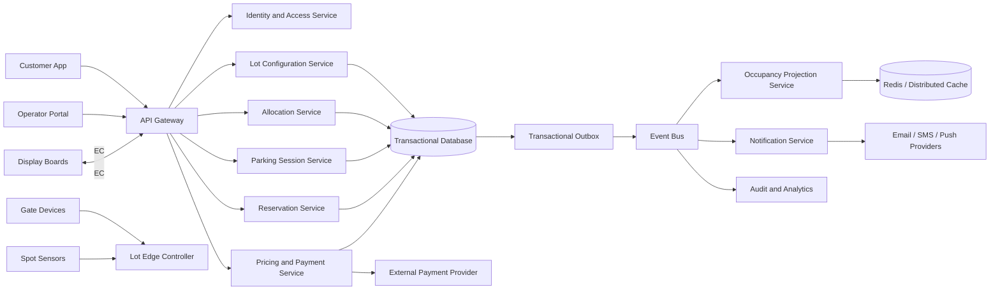
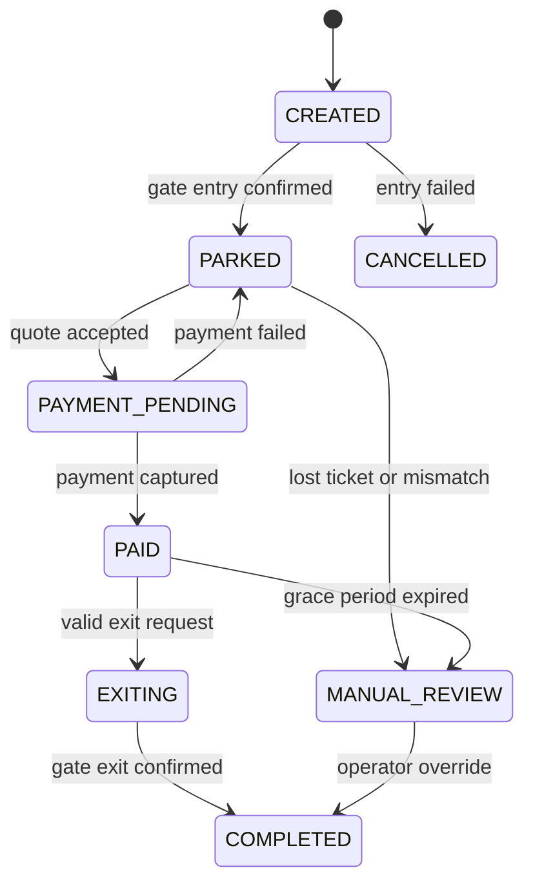
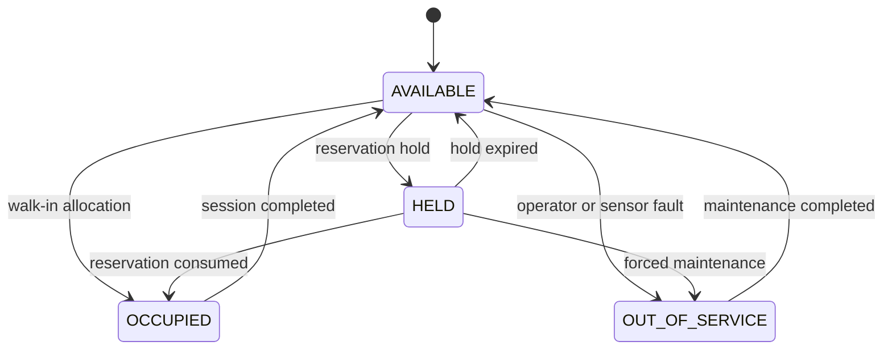
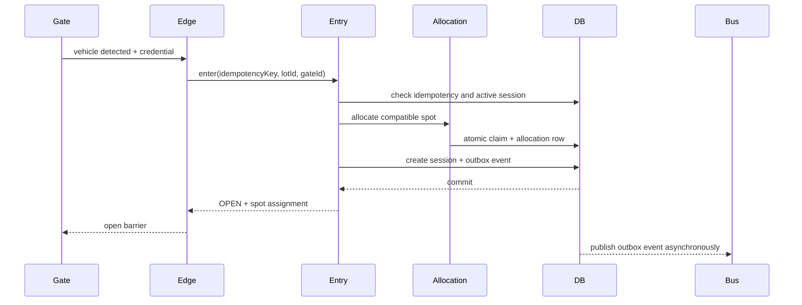
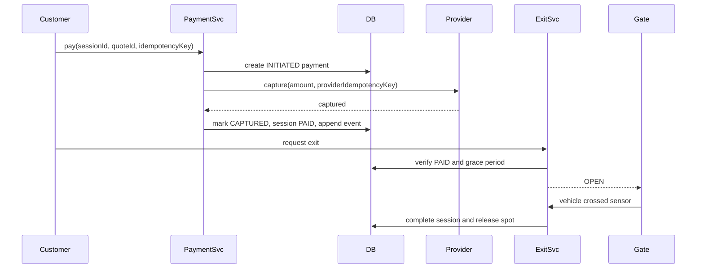

# Parking Lot System Design - Amazon Interview Guide

## 1. How I Would Start the Interview

I would not begin by drawing classes or choosing a database. I would first establish scope, users, traffic, correctness requirements, and failure expectations.

A strong opening could be:

> "I will first clarify the product scope and scale. Then I will define functional and non-functional requirements, estimate capacity, design the APIs and data model, walk through the main workflows, and finally deep dive into concurrency, fault tolerance, notifications, and trade-offs. Since a parking system contains both physical devices and cloud software, I will also cover degraded operation when network connectivity is unavailable."

This structure demonstrates customer focus, ownership, and the ability to work backward from requirements.

---

## 2. Clarifying Questions to Ask

### 2.1 Product and Scope

1. Are we designing one parking lot or a platform for many parking lots?
2. Is this for malls, offices, airports, street parking, or all of them?
3. Is parking first-come-first-served, reservation-based, or both?
4. Do customers receive a physical ticket, use a QR code, or use license-plate recognition?
5. Do we need hourly, daily, monthly, and event-based pricing?
6. Which vehicle and spot types must be supported?
7. Can an electric vehicle reserve or occupy a regular spot?
8. Are accessible spots assignable only to authorized vehicles?
9. Must the system assign a specific spot, or only direct a driver to a floor or zone?
10. Do we need multiple entrances and exits operating concurrently?
11. Which payment methods are required: card, cash, mobile wallet, prepaid account, or subscription?
12. Do we support lost tickets, refunds, grace periods, and manual overrides?
13. Do operators need real-time occupancy dashboards and audit history?
14. Should customers receive reservation, expiry, payment, and availability notifications?

### 2.2 Scale

1. How many parking lots, floors, spots, gates, and devices exist?
2. What are average and peak entry and exit rates?
3. How many availability reads occur from signs, apps, and operator dashboards?
4. How long must ticket, payment, and audit data be retained?
5. Is the product regional or global?

### 2.3 Correctness and Availability

1. Is preventing two cars from receiving the same spot a strict requirement?
2. Can occupancy displays be eventually consistent?
3. What should a gate do if the cloud, payment provider, camera, or sensor is unavailable?
4. Is charging a customer twice less acceptable than temporarily opening a gate without confirmed payment?
5. What latency is acceptable at an entry or exit gate?
6. What are the availability, recovery time objective (RTO), and recovery point objective (RPO)?

### 2.4 Security and Compliance

1. Are license plates considered personally identifiable information under the target jurisdiction?
2. Must the system comply with PCI DSS for card payments?
3. How long may images and license-plate data be retained?
4. Which operator actions require approval or an immutable audit record?

These questions prevent premature design decisions and expose the business trade-offs that matter most.

---

## 3. Assumptions for This Design

If the interviewer does not specify constraints, I would state the following assumptions and continue:

| Area | Assumption |
|---|---|
| Product | Multi-tenant platform managing many parking lots |
| Lot topology | Each lot contains floors, zones, spots, entry gates, and exit gates |
| Capacity | 10,000 lots, up to 5,000 spots per lot |
| Traffic | 50 million parking sessions per day globally |
| Peak load | 10,000 entry/exit transactions per second globally |
| Availability reads | Up to 100,000 reads per second from apps, signs, and dashboards |
| Entry | Ticket, QR code, or license plate; each request also has an idempotency key |
| Allocation | The cloud authoritatively assigns a compatible spot or zone |
| Reservations | Supported, with an expiry window and configurable grace period |
| Payments | Card and digital payment through an external payment service provider |
| Consistency | Strong for spot allocation, active sessions, and payments; eventual for signs and analytics |
| Availability target | 99.99% for gate operations |
| Gate behavior | A local edge controller supports degraded operation during WAN failure |
| Deployment | Active-active service instances within a region; each lot has one home region |
| Data retention | Sessions and payments retained for seven years; raw camera images retained briefly |

### Explicitly Out of Scope for the First Version

- Valet key management
- Vehicle damage claims
- Dynamic license-plate recognition model training
- Navigation to a spot using indoor maps
- Enforcement and towing workflows
- Cross-city parking subscriptions

I would mention that these can be added later without changing the core allocation and session model.

---

## 4. Requirements

### 4.1 Functional Requirements

#### Customer

- Discover a parking lot and view approximate availability by spot type.
- Reserve a compatible spot for a limited time.
- Enter through any supported entry gate.
- Receive a ticket or associate the parking session with a reservation or license plate.
- Be assigned a compatible available spot or zone.
- View the active session, elapsed time, and estimated price.
- Pay for the session using a supported payment method.
- Exit after successful payment or an authorized manual override.
- Receive reservation, payment, expiry, and receipt notifications.

#### Gate and Device

- Process concurrent requests from multiple entry and exit gates.
- Read QR codes, tickets, access cards, and license plates.
- Open or keep closed based on an explicit gate decision.
- Report heartbeats, health, and device events.
- Continue limited operations when disconnected from the cloud.
- Reconcile locally recorded events after connectivity returns.

#### Operator

- Configure lots, floors, zones, spots, gates, pricing rules, and operating hours.
- Mark a spot out of service or reserved for maintenance.
- View occupancy and device health.
- Search sessions and payments.
- Resolve lost-ticket and plate-mismatch cases.
- Override a gate with authorization and an audit reason.
- Reconcile cash and digital payments.

#### System

- Never allocate the same spot to two active sessions.
- Prevent the same vehicle, reservation, or ticket from creating duplicate active sessions.
- Release expired reservations.
- Calculate fees using the pricing policy version effective for the session.
- Track all state transitions in an audit trail.
- Publish occupancy changes and update signs asynchronously.

### 4.2 Non-Functional Requirements

| Concern | Target |
|---|---|
| Availability | 99.99% for entry and exit decisions |
| Entry latency | p50 below 150 ms, p99 below 500 ms when online |
| Exit latency | p50 below 300 ms, p99 below 1 second excluding customer interaction |
| Availability query latency | p99 below 200 ms |
| Correctness | No double allocation and no duplicate successful charge |
| Durability | No acknowledged parking session or payment may be lost |
| Scalability | Horizontally scalable by lot ID and region |
| Consistency | Strong for allocations and money; bounded staleness for occupancy displays |
| Fault isolation | Failure at one lot must not block other lots |
| Recovery | RTO below 15 minutes and RPO near zero for committed transactions |
| Security | Encryption in transit and at rest, least privilege, audited operator actions |
| Observability | Metrics, structured logs, traces, business alarms, and device health |
| Maintainability | Versioned APIs, modular pricing and allocation strategies, backward-compatible events |

---

## 5. Core Invariants

I would write these before designing implementation details because they drive transactions and concurrency controls:

1. A parking spot can have at most one active allocation.
2. A parking session has at most one currently assigned spot.
3. A reservation can be consumed at most once.
4. A ticket or entry idempotency key creates at most one parking session.
5. A payment attempt identified by an idempotency key produces at most one successful charge.
6. A gate opens only for a valid decision, a configured degraded-mode rule, or an audited manual override.
7. Session state transitions must follow the defined state machine.
8. A completed session is immutable except through an auditable correction workflow.
9. Capacity counters are projections; spot or allocation rows are the source of truth.
10. Every external side effect must be retryable without duplicating the effect.

---

## 6. Back-of-the-Envelope Capacity Estimate

Using the assumptions above:

- 50 million sessions/day is about 580 sessions/second on average.
- A 15x peak gives approximately 8,700, rounded to 10,000 entry/exit operations/second.
- If each session creates about 10 durable records or events, the write volume is roughly 500 million records/day.
- At 2 KB per session-related record, the raw annual storage is approximately:

```text
50,000,000 sessions/day * 2 KB * 365 = 36.5 TB/year
```

- With indexes, replicas, audit events, and backups, budget 3x to 5x the raw size.
- Availability reads dominate writes, so they should be served from cached occupancy projections rather than transactional allocation tables.

The important interview conclusion is that one database is not sufficient globally, but each parking lot is a natural partition. A request for one lot rarely needs a cross-lot transaction.

---

## 7. High-Level Architecture



### 7.1 Component Responsibilities

| Component | Responsibility |
|---|---|
| API Gateway | Authentication, rate limiting, routing, request IDs, and API versioning |
| Lot Configuration Service | Floors, zones, spots, devices, hours, and policies |
| Reservation Service | Reservation creation, expiry, cancellation, and consumption |
| Allocation Service | Finds and atomically claims a compatible spot |
| Parking Session Service | Owns entry, parked, payment-pending, and exit lifecycle |
| Pricing Service | Calculates charges from a versioned pricing policy |
| Payment Service | Creates idempotent payment attempts and integrates with providers |
| Occupancy Projection Service | Builds fast eventually consistent availability views |
| Notification Service | Delivers asynchronous customer and operator notifications |
| Edge Controller | Coordinates on-site devices and degraded-mode behavior |
| Event Bus | Decouples transactional flows from displays, notifications, and analytics |
| Transactional Database | Source of truth for allocations, sessions, reservations, and payment state |
| Cache | Serves availability and configuration reads with low latency |

### 7.2 Why Separate Services?

For an initial implementation, I would use a modular monolith with clear module boundaries because it is operationally simpler and still allows local ACID transactions. At large scale, Allocation, Session, Payment, and Notification can be extracted independently.

I would not begin with many microservices unless the scale and team boundaries justify them. The architecture diagram shows logical boundaries, not a requirement that every box be a separate deployment.

---

## 8. Storage Design

### 8.1 Primary Database: Relational Database

I would choose PostgreSQL or Amazon Aurora PostgreSQL for the transactional source of truth.

#### Why Relational?

- Spot allocation requires conditional updates, unique constraints, and short transactions.
- Sessions, reservations, allocations, and payments have clear relationships.
- Row locking and optimistic concurrency are well understood.
- Financial records benefit from ACID guarantees.
- Queries for operator support often join sessions, vehicles, tickets, and payments.

#### Why Not Use Only DynamoDB?

DynamoDB can support this design with conditional writes and transactions, and it is a strong option at very high scale. However:

- Modeling operator queries and evolving relational access patterns is harder.
- Multi-item transactional workflows require more careful design.
- Capacity must be distributed to avoid a hot partition for a very busy lot.

At Amazon scale, a valid alternative is DynamoDB partitioned by `lot_id` plus sharded availability buckets, with conditional expressions enforcing allocation. I would choose based on expected scale, team expertise, query patterns, and operational constraints rather than assuming one database is always superior.

### 8.2 Supporting Stores

| Store | Use | Consistency |
|---|---|---|
| Aurora PostgreSQL | Authoritative configuration, reservations, sessions, allocations, payments | Strong |
| Redis or ElastiCache | Availability projection, hot configuration, rate limits | Eventual |
| Kafka, Kinesis, or SNS/SQS | Durable domain event distribution | At-least-once |
| Object storage | Receipts, exports, archived audit events, temporary images | Durable |
| Analytics warehouse | Historical utilization, revenue, forecasting | Eventual |

### 8.3 Logical Schema

#### `parking_lot`

| Column | Type | Notes |
|---|---|---|
| `id` | UUID | Primary key |
| `tenant_id` | UUID | Ownership boundary |
| `name` | VARCHAR | Display name |
| `timezone` | VARCHAR | Required for pricing and reporting |
| `status` | ENUM | ACTIVE, CLOSED, MAINTENANCE |
| `home_region` | VARCHAR | Request routing |
| `version` | BIGINT | Optimistic concurrency |

#### `parking_spot`

| Column | Type | Notes |
|---|---|---|
| `id` | UUID | Primary key |
| `lot_id` | UUID | Partitioning and foreign key |
| `floor_id` | UUID | Parent floor |
| `zone_id` | UUID | Optional zone |
| `display_number` | VARCHAR | Human-readable identifier |
| `spot_type` | ENUM | COMPACT, LARGE, MOTORCYCLE, ACCESSIBLE, EV |
| `status` | ENUM | AVAILABLE, HELD, OCCUPIED, OUT_OF_SERVICE |
| `active_allocation_id` | UUID | Nullable current allocation |
| `version` | BIGINT | Compare-and-swap field |
| `updated_at` | TIMESTAMP | Reconciliation |

Indexes:

```sql
CREATE INDEX idx_spot_candidate
    ON parking_spot(lot_id, spot_type, status, floor_id, id);

CREATE UNIQUE INDEX uq_spot_active_allocation
    ON parking_spot(active_allocation_id)
    WHERE active_allocation_id IS NOT NULL;
```

#### `reservation`

| Column | Type | Notes |
|---|---|---|
| `id` | UUID | Primary key |
| `lot_id` | UUID | Reservation location |
| `customer_id` | UUID | Owner |
| `vehicle_id` | UUID | Optional vehicle |
| `requested_spot_type` | ENUM | Required capability |
| `spot_id` | UUID | Nullable until assigned |
| `start_at` | TIMESTAMP | Reservation window |
| `expires_at` | TIMESTAMP | Includes grace period |
| `status` | ENUM | PENDING, CONFIRMED, CONSUMED, EXPIRED, CANCELLED |
| `idempotency_key` | VARCHAR | Unique per customer operation |
| `version` | BIGINT | Optimistic locking |

Constraints:

```sql
UNIQUE (customer_id, idempotency_key)
```

#### `parking_session`

| Column | Type | Notes |
|---|---|---|
| `id` | UUID | Primary key |
| `lot_id` | UUID | Session location |
| `ticket_number` | VARCHAR | Unique opaque value |
| `vehicle_id` | UUID | Nullable for anonymous ticket |
| `license_plate_hash` | VARCHAR | Searchable protected identifier |
| `reservation_id` | UUID | Optional |
| `spot_id` | UUID | Assigned spot |
| `entry_gate_id` | UUID | Entry source |
| `exit_gate_id` | UUID | Set at exit |
| `pricing_policy_id` | UUID | Version pinned at entry |
| `status` | ENUM | Session state |
| `entry_time` | TIMESTAMP | Server time |
| `paid_until` | TIMESTAMP | Exit grace window |
| `exit_time` | TIMESTAMP | Nullable |
| `version` | BIGINT | Optimistic locking |

Important constraints:

```sql
UNIQUE (ticket_number);
UNIQUE (reservation_id) WHERE reservation_id IS NOT NULL;
```

A partial unique index can also enforce one active session per vehicle when vehicle identity is reliable:

```sql
CREATE UNIQUE INDEX uq_vehicle_active_session
    ON parking_session(lot_id, vehicle_id)
    WHERE vehicle_id IS NOT NULL
      AND status IN ('CREATED', 'PARKED', 'PAYMENT_PENDING', 'PAID', 'EXITING');
```

#### `spot_allocation`

| Column | Type | Notes |
|---|---|---|
| `id` | UUID | Primary key |
| `lot_id` | UUID | Partition key |
| `spot_id` | UUID | Allocated spot |
| `session_id` | UUID | Owning session |
| `status` | ENUM | ACTIVE, RELEASED, EXPIRED |
| `allocated_at` | TIMESTAMP | Audit |
| `released_at` | TIMESTAMP | Nullable |
| `version` | BIGINT | Optimistic locking |

Critical constraint:

```sql
CREATE UNIQUE INDEX uq_active_spot_allocation
    ON spot_allocation(spot_id)
    WHERE status = 'ACTIVE';
```

This database constraint is the final safety net against double allocation, even if application logic has a bug.

#### `payment`

| Column | Type | Notes |
|---|---|---|
| `id` | UUID | Primary key |
| `session_id` | UUID | Parking session |
| `amount_minor` | BIGINT | Never use floating point for money |
| `currency` | CHAR(3) | ISO currency |
| `status` | ENUM | INITIATED, AUTHORIZED, CAPTURED, FAILED, REFUNDED |
| `provider` | VARCHAR | Payment provider |
| `provider_reference` | VARCHAR | Provider transaction |
| `idempotency_key` | VARCHAR | Client retry protection |
| `failure_code` | VARCHAR | Nullable |
| `created_at` | TIMESTAMP | Audit |

Constraints:

```sql
UNIQUE (session_id, idempotency_key);
UNIQUE (provider, provider_reference);
```

#### Other Tables

- `floor`
- `zone`
- `gate`
- `device`
- `vehicle`
- `pricing_policy`
- `pricing_rule`
- `notification`
- `operator_override`
- `audit_event`
- `outbox_event`
- `idempotency_record`

### 8.4 Partitioning

- Route requests by `home_region`, then partition operational data by `lot_id`.
- A single parking lot stays in one write region to avoid cross-region allocation races.
- Large tables such as sessions, payments, and audit events can be partitioned by time and hashed by lot.
- Move completed historical sessions to cheaper storage while retaining searchable summaries.
- Avoid partitioning only by timestamp because the newest partition becomes a global write hotspot.

---

## 9. API Design

All mutating APIs accept:

- `Idempotency-Key`
- authenticated actor or device identity
- `X-Request-Id`
- API version

### 9.1 Availability

```http
GET /v1/lots/{lotId}/availability
```

Response:

```json
{
  "lotId": "lot-123",
  "asOf": "2026-09-10T18:55:00Z",
  "availability": [
    { "spotType": "COMPACT", "available": 120 },
    { "spotType": "EV", "available": 8 }
  ]
}
```

This is a projection and may be a few seconds stale.

### 9.2 Create Reservation

```http
POST /v1/lots/{lotId}/reservations
Idempotency-Key: 6642681d-...

{
  "customerId": "customer-1",
  "vehicleId": "vehicle-1",
  "spotType": "EV",
  "startAt": "2026-09-11T10:00:00Z"
}
```

Use `201 Created` for a new reservation and return the original response for an idempotent replay.

### 9.3 Enter Lot

```http
POST /v1/lots/{lotId}/entries
Idempotency-Key: gate-2-event-991

{
  "gateId": "gate-2",
  "credential": {
    "type": "LICENSE_PLATE",
    "value": "REDACTED"
  },
  "reservationId": "optional-reservation-id",
  "vehicleType": "CAR",
  "requestedSpotType": "COMPACT",
  "deviceTimestamp": "2026-09-11T09:58:01Z"
}
```

Response:

```json
{
  "decision": "OPEN",
  "sessionId": "session-42",
  "ticketNumber": "opaque-signed-token",
  "assignment": {
    "spotId": "spot-701",
    "displayNumber": "B-114",
    "floor": "B1",
    "zone": "BLUE"
  }
}
```

Possible decisions: `OPEN`, `KEEP_CLOSED`, or `MANUAL_REVIEW`.

### 9.4 Calculate Price

```http
GET /v1/sessions/{sessionId}/quote
```

The response includes a quote ID, itemized amount, expiry, currency, and pricing policy version.

### 9.5 Pay

```http
POST /v1/sessions/{sessionId}/payments
Idempotency-Key: customer-payment-attempt-1

{
  "quoteId": "quote-9",
  "paymentMethodToken": "provider-token"
}
```

The API never accepts raw card numbers into the parking platform if provider-hosted tokenization is available.

### 9.6 Exit Lot

```http
POST /v1/lots/{lotId}/exits
Idempotency-Key: gate-8-event-778

{
  "gateId": "gate-8",
  "ticketNumber": "opaque-signed-token",
  "licensePlate": "REDACTED",
  "deviceTimestamp": "2026-09-11T12:32:19Z"
}
```

The response contains a gate decision, amount due if any, and reason code.

### 9.7 Error Model

```json
{
  "code": "NO_COMPATIBLE_SPOT",
  "message": "No compatible parking spot is currently available.",
  "requestId": "req-123",
  "retryable": false
}
```

Useful status codes:

- `400` invalid request
- `401` or `403` authentication or authorization failure
- `404` resource not found
- `409` state conflict or capacity exhausted
- `422` valid request that violates a business rule
- `429` rate limited
- `503` temporary dependency failure

---

## 10. Domain Model

The examples use Java 17 because this repository is Java-based. The code is illustrative: persistence annotations and framework-specific details are intentionally omitted.

### 10.1 Enums

```java
public enum VehicleType {
    MOTORCYCLE,
    CAR,
    VAN,
    TRUCK
}

public enum SpotType {
    MOTORCYCLE,
    COMPACT,
    LARGE,
    ACCESSIBLE,
    EV
}

public enum SpotStatus {
    AVAILABLE,
    HELD,
    OCCUPIED,
    OUT_OF_SERVICE
}

public enum ReservationStatus {
    PENDING,
    CONFIRMED,
    CONSUMED,
    EXPIRED,
    CANCELLED
}

public enum SessionStatus {
    CREATED,
    PARKED,
    PAYMENT_PENDING,
    PAID,
    EXITING,
    COMPLETED,
    CANCELLED,
    MANUAL_REVIEW
}

public enum AllocationStatus {
    ACTIVE,
    RELEASED,
    EXPIRED
}

public enum PaymentStatus {
    INITIATED,
    AUTHORIZED,
    CAPTURED,
    FAILED,
    REFUNDED
}

public enum GateType {
    ENTRY,
    EXIT,
    BIDIRECTIONAL
}

public enum GateDecision {
    OPEN,
    KEEP_CLOSED,
    MANUAL_REVIEW
}

public enum CredentialType {
    TICKET,
    QR_CODE,
    LICENSE_PLATE,
    ACCESS_CARD
}

public enum NotificationType {
    RESERVATION_CONFIRMED,
    RESERVATION_EXPIRING,
    ENTRY_CONFIRMED,
    PAYMENT_SUCCEEDED,
    PAYMENT_FAILED,
    RECEIPT,
    OVERSTAY,
    DEVICE_OFFLINE
}

public enum NotificationChannel {
    PUSH,
    SMS,
    EMAIL,
    OPERATOR_ALERT
}
```

### 10.2 Value Objects

```java
public record Money(long amountMinor, Currency currency) {
    public Money {
        if (amountMinor < 0) {
            throw new IllegalArgumentException("Amount cannot be negative");
        }
        Objects.requireNonNull(currency);
    }
}

public record TimeRange(Instant start, Instant end) {
    public TimeRange {
        Objects.requireNonNull(start);
        Objects.requireNonNull(end);
        if (!end.isAfter(start)) {
            throw new IllegalArgumentException("End must be after start");
        }
    }
}

public record SpotAssignment(
        UUID spotId,
        String displayNumber,
        String floorName,
        String zoneName) {
}

public record GateCredential(
        CredentialType type,
        String protectedValue) {
}
```

### 10.3 Entities

```java
public final class ParkingLot {
    private final UUID id;
    private final UUID tenantId;
    private final String name;
    private final ZoneId timeZone;
    private final List<ParkingFloor> floors;
    private long version;
}

public final class ParkingFloor {
    private final UUID id;
    private final UUID lotId;
    private final String name;
    private final List<ParkingZone> zones;
}

public final class ParkingZone {
    private final UUID id;
    private final UUID floorId;
    private final String name;
    private final Set<SpotType> supportedSpotTypes;
}

public final class ParkingSpot {
    private final UUID id;
    private final UUID lotId;
    private final UUID floorId;
    private final UUID zoneId;
    private final String displayNumber;
    private final SpotType type;
    private SpotStatus status;
    private UUID activeAllocationId;
    private long version;

    public boolean canFit(VehicleType vehicleType, SpotType requestedType) {
        return SpotCompatibility.isCompatible(vehicleType, requestedType, type)
                && status == SpotStatus.AVAILABLE;
    }
}

public final class Vehicle {
    private final UUID id;
    private final VehicleType type;
    private final String encryptedLicensePlate;
    private final String normalizedPlateHash;
}

public final class Reservation {
    private final UUID id;
    private final UUID lotId;
    private final UUID customerId;
    private final UUID vehicleId;
    private final SpotType requestedSpotType;
    private UUID spotId;
    private final TimeRange window;
    private ReservationStatus status;
    private long version;
}

public final class ParkingSession {
    private final UUID id;
    private final UUID lotId;
    private final String ticketNumber;
    private final UUID vehicleId;
    private final UUID reservationId;
    private final UUID spotId;
    private final UUID entryGateId;
    private UUID exitGateId;
    private final UUID pricingPolicyId;
    private final Instant entryTime;
    private Instant paidUntil;
    private Instant exitTime;
    private SessionStatus status;
    private long version;
}

public final class SpotAllocation {
    private final UUID id;
    private final UUID lotId;
    private final UUID spotId;
    private final UUID sessionId;
    private final Instant allocatedAt;
    private Instant releasedAt;
    private AllocationStatus status;
    private long version;
}

public final class Payment {
    private final UUID id;
    private final UUID sessionId;
    private final Money amount;
    private final String provider;
    private final String idempotencyKey;
    private String providerReference;
    private PaymentStatus status;
    private String failureCode;
}
```

Domain entities enforce valid local state transitions, while services coordinate changes spanning multiple aggregates.

### 10.4 State Machines

#### Parking Session



#### Parking Spot



Invalid transitions return a domain conflict and are recorded for investigation; they are never silently ignored.

---

## 11. Service and Interface Design

### 11.1 Application Services

```java
public interface ParkingEntryService {
    EntryResult enter(EntryCommand command);
}

public interface ParkingExitService {
    ExitResult requestExit(ExitCommand command);
    void confirmPhysicalExit(ConfirmExitCommand command);
}

public interface ReservationService {
    Reservation create(CreateReservationCommand command);
    Reservation cancel(UUID reservationId, String idempotencyKey);
    Reservation consume(UUID reservationId, UUID sessionId);
}

public interface SpotAllocationService {
    SpotAllocation allocate(AllocationRequest request);
    void release(UUID allocationId, ReleaseReason reason);
}

public interface PricingService {
    PriceQuote quote(ParkingSession session, Instant exitTime);
}

public interface PaymentService {
    PaymentResult pay(PaymentCommand command);
    RefundResult refund(RefundCommand command);
}

public interface NotificationService {
    void schedule(NotificationCommand command);
}

public interface OccupancyQueryService {
    LotAvailability getAvailability(UUID lotId);
}

public interface GateControlService {
    GateCommand issueDecision(UUID gateId, GateDecision decision, String reasonCode);
}
```

### 11.2 Strategy Interfaces

```java
public interface SpotAssignmentStrategy {
    List<UUID> rankCandidateSpots(
            UUID lotId,
            VehicleType vehicleType,
            SpotType requestedType,
            Optional<UUID> preferredZoneId);
}

public interface PricingStrategy {
    PriceBreakdown calculate(
            ParkingSession session,
            PricingPolicy policy,
            Instant calculationTime);
}

public interface NotificationChannelSender {
    NotificationChannel channel();
    DeliveryResult send(NotificationMessage message);
}

public interface DegradedModePolicy {
    GateDecision decide(DeviceEvent event, CachedLotState state);
}
```

Examples of assignment strategies:

- Nearest compatible spot
- Lowest floor first
- Balanced floor utilization
- EV-only preservation
- Reservation-priority assignment
- Accessible spot policy

Examples of pricing strategies:

- Flat rate
- Hourly slabs
- Daily maximum
- Weekend or event pricing
- Lost-ticket maximum fee
- Subscription entitlement

Using strategies keeps policy variation out of entry and exit orchestration.

### 11.3 Repository Interfaces

```java
public interface ParkingSpotRepository {
    Optional<ParkingSpot> findById(UUID spotId);

    Optional<ParkingSpot> claimFirstAvailable(
            UUID lotId,
            Set<SpotType> compatibleTypes,
            List<UUID> rankedCandidateIds,
            UUID allocationId);

    void release(UUID spotId, UUID allocationId);
}

public interface ParkingSessionRepository {
    Optional<ParkingSession> findById(UUID sessionId);
    Optional<ParkingSession> findByTicketNumber(String ticketNumber);
    ParkingSession save(ParkingSession session);
}

public interface ReservationRepository {
    Optional<Reservation> findById(UUID reservationId);
    Reservation save(Reservation reservation);
}

public interface PaymentRepository {
    Optional<Payment> findByIdempotencyKey(UUID sessionId, String key);
    Payment save(Payment payment);
}

public interface OutboxRepository {
    void append(DomainEvent event);
}
```

Repositories expose business operations such as `claimFirstAvailable`, not generic persistence mechanics. This makes the concurrency contract explicit.

---

## 12. Main Workflows

### 12.1 Walk-In Entry



Transaction boundary:

1. Claim the spot.
2. Create the allocation.
3. Create the parking session.
4. Store the idempotency result.
5. Append `ParkingSessionStarted` to the outbox.
6. Commit once.

The gate command is sent only after commit. If the response is lost, the edge controller retries with the same idempotency key and receives the original decision.

### 12.2 Reserved Entry

1. Validate that the reservation is confirmed and inside its usable window.
2. Verify vehicle or credential when configured.
3. Atomically transition reservation from `CONFIRMED` to `CONSUMED`.
4. Claim its held spot or another compatible spot according to policy.
5. Create the session and allocation in the same transaction.
6. Return the gate decision and assignment.

The conditional reservation transition prevents two gates from consuming the same reservation.

### 12.3 Payment and Exit



The physical exit confirmation, not merely the open-gate command, completes the session. Otherwise a customer who opens the gate but does not leave could incorrectly free a spot.

### 12.4 Reservation Expiry

- Store expiration time on the reservation.
- A delayed queue or scheduler publishes expiry candidates.
- A worker conditionally updates only rows still in `CONFIRMED` state and whose `expires_at <= now`.
- The same transaction releases the held allocation and appends an event.
- A periodic database sweeper repairs missed scheduler events.

This combines an efficient primary path with a reconciliation safety net.

---

## 13. Concurrency Control

Concurrency is the central correctness challenge in this design.

### 13.1 Double Allocation Race

Suppose Gate A and Gate B both select Spot 101 from a cached list. Application-level checking alone is unsafe.

#### Recommended Relational Approach

Use a short transaction and lock only a candidate row:

```sql
BEGIN;

SELECT id
FROM parking_spot
WHERE lot_id = :lot_id
  AND spot_type = ANY(:compatible_types)
  AND status = 'AVAILABLE'
ORDER BY allocation_priority, id
FOR UPDATE SKIP LOCKED
LIMIT 1;

UPDATE parking_spot
SET status = 'OCCUPIED',
    active_allocation_id = :allocation_id,
    version = version + 1
WHERE id = :spot_id
  AND status = 'AVAILABLE';

INSERT INTO spot_allocation (..., status)
VALUES (..., 'ACTIVE');

INSERT INTO parking_session (...);
INSERT INTO outbox_event (...);

COMMIT;
```

`SKIP LOCKED` allows concurrent allocators to claim different rows instead of waiting on one candidate. The partial unique index on active allocations is an additional invariant.

#### Optimistic Alternative

```sql
UPDATE parking_spot
SET status = 'OCCUPIED',
    active_allocation_id = :allocation_id,
    version = version + 1
WHERE id = :spot_id
  AND status = 'AVAILABLE'
  AND version = :expected_version;
```

If the affected row count is zero, another request won and the service tries the next ranked candidate. This works well when contention is low.

#### Which One Would I Choose?

- Use optimistic compare-and-swap for broadly distributed spots and low contention.
- Use `FOR UPDATE SKIP LOCKED` when many gates compete for a small candidate set.
- Benchmark with realistic traffic before choosing.
- Never use a distributed lock as the only correctness mechanism; database constraints remain authoritative.

### 13.2 Counter Accuracy

An `available_count` field can drift because of retries, missed events, or sensor discrepancies. Therefore:

- Allocation decisions use spot or allocation rows, not a cached counter.
- Redis counters and display boards are projections.
- Occupancy events update projections asynchronously.
- A reconciliation job periodically compares the projection with authoritative rows.
- Display responses include an `asOf` timestamp.

### 13.3 Idempotency

Every device event and client mutation has an idempotency key.

The server stores:

```text
(scope, idempotency_key, request_hash, response_status, response_body, expires_at)
```

Rules:

1. The same key and same request return the stored response.
2. The same key with a different request hash returns `409 Conflict`.
3. The idempotency record is committed in the same transaction as the business change.
4. Device-generated keys use stable event sequence numbers, not random values regenerated on retry.
5. Payment provider calls reuse a stable provider idempotency key.

### 13.4 Lost Updates

Use a `version` column:

```sql
UPDATE parking_session
SET status = :new_status,
    version = version + 1
WHERE id = :id
  AND status = :expected_status
  AND version = :expected_version;
```

A zero-row update indicates a concurrent state change. The caller reloads state and either returns the already-completed result or reports a conflict.

### 13.5 Deadlocks

- Keep transactions short.
- Lock rows in a deterministic order: reservation, spot, session, payment.
- Do not call external services while holding database locks.
- Retry only known transient deadlock or serialization failures with bounded exponential backoff and jitter.
- Record retry metrics and alarm on sustained contention.

---

## 14. Consistency Model

| Data | Model | Reason |
|---|---|---|
| Spot claim | Strong | Prevent double allocation |
| Active session | Strong | Entry and exit correctness |
| Reservation consumption | Strong | At-most-once use |
| Payment state | Strong | Financial correctness |
| Gate decision | Read-your-write / strongly derived | Safety and customer experience |
| Availability display | Eventual, normally below 2 seconds stale | High read scale |
| Notifications | Eventual | Not on critical path |
| Analytics | Eventual | Throughput over freshness |
| Sensor projection | Eventual with reconciliation | Physical readings may be noisy |

This is not "eventual consistency everywhere." Each workflow uses the weakest consistency model that still preserves its business invariant.

---

## 15. Fault Tolerance and Failure Scenarios

### 15.1 Cloud Service Instance Failure

- Run stateless instances across multiple availability zones.
- Use load balancer health checks and automatic replacement.
- Store no required session state only in process memory.
- Retry safe reads and idempotent mutations with backoff and jitter.
- Use timeouts and circuit breakers for dependencies.

### 15.2 Database Failure

- Use synchronous multi-zone replication.
- Automatically fail over to a replica.
- Keep transactions short to reduce recovery time.
- Use point-in-time recovery and regularly test restores.
- Route each lot to a single writable home region.
- During uncertain commit results, retry with the original idempotency key rather than initiating a new operation.

### 15.3 Network Failure Between Lot and Cloud

The edge controller maintains:

- Signed, versioned configuration and pricing snapshots
- A bounded cache of reservations and subscription entitlements
- A monotonically increasing local event sequence
- A durable local event log
- Recently active sessions and payment permits
- A configurable degraded-mode policy

Possible degraded behavior:

- Entry: issue a signed offline ticket and allocate from a reserved offline capacity pool.
- Exit: allow already-paid sessions using cached signed payment permits.
- Payment unavailable: direct the customer to an attendant or apply an explicit operator policy.
- Safety: a physical emergency-open mechanism always overrides software.

After reconnection:

1. Upload events in sequence with stable idempotency keys.
2. Detect duplicate or conflicting allocations.
3. Prefer physical evidence for actual occupancy.
4. Route irreconcilable conflicts to operator review.
5. Refresh authoritative configuration and invalidate stale snapshots.

Offline operation is intentionally bounded by time and capacity. Unlimited offline allocation would eventually violate correctness.

### 15.4 Payment Provider Timeout

A timeout does not mean the charge failed.

1. Keep payment state as `INITIATED` or `UNKNOWN`, not `FAILED`.
2. Query the provider using the same idempotency key or transaction reference.
3. Process provider webhooks idempotently.
4. Reconcile unresolved attempts in a scheduled job.
5. Do not start a second charge until the first attempt is resolved.

### 15.5 Event Bus Failure

Use the transactional outbox pattern:

- Save the domain state and event in one database transaction.
- An outbox relay publishes events later.
- Consumers are idempotent and store processed event IDs.
- Failed events move to a dead-letter queue after bounded retries.
- Alerts and replay tooling support operator recovery.

This avoids the dual-write failure where the database commits but event publication fails.

### 15.6 Sensor Failure or Contradiction

Sensors are observations, not the sole source of truth.

- Debounce rapid state changes.
- Correlate gate crossings, plate recognition, and spot sensors.
- Assign confidence scores.
- Mark persistently inconsistent spots for inspection.
- Never automatically charge solely because a noisy sensor reported occupancy.
- Reconciliation can update projections or open a manual case; it must preserve audit history.

### 15.7 Notification Provider Failure

- Notification delivery is asynchronous.
- Retry transient failures with exponential backoff and jitter.
- Apply per-channel and per-recipient rate limits.
- Fall back to another channel only when the customer has consented and policy allows it.
- Move permanent failures to a dead-letter queue.
- Notification failure never rolls back entry, exit, or payment.

### 15.8 Regional Failure

For each lot, one region owns writes. Replicate data to a secondary region.

- DNS or global routing sends a lot to its home region.
- Promote the secondary only through a controlled fencing process.
- Ensure the old primary cannot continue accepting writes after promotion.
- The edge controller bridges the failover period.

Active-active writes for the same spot across regions are avoided because conflict resolution after double allocation is unacceptable.

---

## 16. Latency Design

### 16.1 Entry Latency Budget

Example p99 budget:

| Step | Budget |
|---|---:|
| Edge-to-cloud network | 100 ms |
| Authentication and routing | 30 ms |
| Reservation/session lookup | 50 ms |
| Spot claim transaction | 150 ms |
| Response and gate command | 100 ms |
| Buffer | 70 ms |
| **Total** | **500 ms** |

### 16.2 Techniques

- Route each lot to the nearest home-region endpoint.
- Cache immutable and versioned lot configuration at the edge.
- Keep availability queries off the primary transaction path.
- Index allocation candidates by lot, type, status, and ranking attributes.
- Keep transactions narrow and avoid external calls inside them.
- Precompute compatible spot sets and candidate rankings.
- Use connection pooling with bounded queueing.
- Set explicit deadlines and propagate them across services.
- Shed non-critical load such as analytics before gate traffic.
- Reserve separate thread pools or quotas for entry and exit operations.
- Return the gate decision before processing notifications and analytics.

### 16.3 Avoiding Retry Storms

- Exponential backoff with full jitter
- Retry budgets
- Circuit breakers
- Per-lot and per-device rate limits
- Idempotent operations
- Load shedding
- Bounded queues
- Server-provided `Retry-After`

---

## 17. Notification Design

### 17.1 Notification Events

| Event | Recipient | Channels | Timing |
|---|---|---|---|
| Reservation confirmed | Customer | Push, email | Immediate |
| Reservation expiring | Customer | Push, SMS | Configurable |
| Entry confirmed | Customer | Push | Immediate |
| Payment succeeded | Customer | Push, email receipt | Immediate |
| Payment failed | Customer | Push, SMS | Immediate |
| Overstay detected | Customer/operator | Push, SMS, alert | Policy-based |
| Device offline | Operator | Alert | After health threshold |
| Capacity threshold reached | Operator | Dashboard, alert | Debounced |

### 17.2 Delivery Pipeline

```text
Domain Event
  -> Notification Policy
  -> Preference and Consent Check
  -> Template Rendering
  -> Per-Channel Queue
  -> Provider Adapter
  -> Delivery Status / Retry / Dead-Letter Queue
```

Key design decisions:

- Use event IDs and notification deduplication keys.
- Store templates by locale and version.
- Respect quiet hours, channel preferences, and legal consent.
- Do not place sensitive license plate or payment data in SMS or push previews.
- Sign receipt links and give them short expiry.
- Track `QUEUED`, `SENT`, `DELIVERED`, `FAILED`, and `SUPPRESSED`.
- Separate operational alerts from customer messaging so one cannot exhaust the other's capacity.

---

## 18. Pricing Design

Pricing must be deterministic and auditable.

### Example Rules

- First 15 minutes free
- Then $3 per started hour
- Daily maximum of $25
- Weekend flat fee
- Event surcharge
- EV charging fee
- Lost-ticket maximum daily fee
- Grace period after payment

### Important Decisions

1. Pin a pricing policy version at session entry or reservation creation.
2. Store the full price breakdown with the payment.
3. Calculate using the lot's configured timezone, while storing timestamps in UTC.
4. Use integer minor units for money.
5. Define rounding explicitly.
6. Make discounts and taxes separate line items.
7. Give quotes a short expiry so the amount cannot change during payment.
8. Make policy changes effective-dated and immutable after activation.

Example:

```java
public record PriceQuote(
        UUID id,
        UUID sessionId,
        UUID pricingPolicyId,
        List<PriceLineItem> lineItems,
        Money total,
        Instant expiresAt) {
}

public record PriceLineItem(
        String code,
        String description,
        Money amount) {
}
```

---

## 19. Security, Privacy, and Compliance

- Authenticate devices with certificates and rotate credentials.
- Authorize customers, operators, attendants, and administrators separately.
- Use least-privilege service identities.
- Encrypt traffic with TLS and encrypt databases, queues, caches, and backups.
- Tokenize payment methods and minimize PCI scope.
- Encrypt license plates when reversible access is required.
- Store a keyed hash of normalized plates for exact lookup.
- Restrict and audit plate/image access.
- Apply retention and deletion policies by jurisdiction.
- Use signed, opaque ticket tokens; do not expose sequential database IDs.
- Rate-limit public endpoints and detect credential enumeration.
- Validate device sequence numbers and reject replayed commands.
- Require reason codes and stronger authorization for manual gate overrides and refunds.
- Place secrets in a managed secrets store, never in source code or device logs.
- Redact credentials, plates, payment tokens, and personal data from logs.

Threats to mention:

- Ticket cloning
- License-plate spoofing
- Replay of gate-open commands
- Compromised edge device
- Insider operator abuse
- Payment webhook forgery
- API denial of service
- Reservation hoarding

---

## 20. Observability and Operations

### 20.1 Metrics

#### Business Metrics

- Entries and exits per lot
- Current occupancy by spot type
- Allocation failures
- Average parking duration
- Reservation no-show rate
- Payment success and refund rate
- Revenue and unbilled exits

#### Technical Metrics

- Entry and exit latency percentiles
- Database lock wait and transaction retry rate
- Idempotency replay count
- Cache hit rate and projection lag
- Outbox age and queue depth
- Dead-letter queue size
- Provider error rate
- Device heartbeat age
- Edge offline duration
- Sensor contradiction rate

### 20.2 Logs and Traces

- Use structured logs with `requestId`, `lotId`, `gateId`, `sessionId`, and `eventId`.
- Do not log raw credentials, payment details, or license plates.
- Trace synchronous entry, payment, and exit flows.
- Propagate correlation IDs into events.
- Keep immutable audit events for money, configuration, and operator actions.

### 20.3 Alarms

- No entry decisions from an active lot
- p99 gate latency above target
- Allocation failures while projected capacity is available
- Outbox or notification queue lag above threshold
- Database replication lag
- Payment unknown-state backlog
- More than a configured percentage of devices offline
- Occupancy projection differs materially from source of truth

### 20.4 Runbooks

Maintain tested runbooks for:

- Lot disconnected from cloud
- Database failover
- Payment provider outage
- Stuck gate
- Incorrect occupancy
- Lost ticket
- Duplicate payment claim
- Regional failover
- Event replay from a dead-letter queue

---

## 21. Testing Strategy

### Unit Tests

- Spot compatibility
- Pricing boundary conditions and rounding
- Session state transitions
- Reservation windows and grace periods
- Notification preference rules

### Integration Tests

- Transactional spot claim
- Idempotency record and business state commit together
- Outbox publication
- Provider webhook deduplication
- Database constraints under concurrent requests

### Concurrency Tests

- Hundreds of parallel allocation requests for fewer spots
- Same reservation presented at multiple gates
- Same payment request retried concurrently
- Exit and payment occurring at the same time
- Reservation expiry racing with entry

Expected assertion:

```text
successful allocations <= available compatible spots
and every allocated spot has exactly one active session
```

### Failure Injection

- Kill a service after database commit but before HTTP response.
- Time out the payment provider after it captured payment.
- Disconnect the edge controller.
- Delay and duplicate events.
- Fail over the database during entry traffic.
- Send out-of-order device events.

### End-to-End Tests

- Walk-in entry through exit
- Reservation entry
- Full lot
- Lost ticket
- Payment failure and retry
- Offline entry and reconciliation
- Manual override with audit verification

---

## 22. Key Design Patterns

| Pattern | Use |
|---|---|
| Strategy | Spot assignment, pricing, notification channels, degraded-mode policy |
| Repository | Explicit persistence boundaries |
| State machine | Session, reservation, payment, and spot transitions |
| Transactional outbox | Reliable event publication |
| Idempotent consumer | Safe at-least-once delivery |
| Saga/process manager | Multi-step payment and exit coordination |
| Circuit breaker | External provider protection |
| Bulkhead | Isolate lots, providers, and critical gate traffic |
| Optimistic locking | Prevent lost updates |
| Compare-and-swap | Efficient conditional spot claim |
| CQRS-lite | Strong write model and cached availability read model |

I would avoid forcing patterns into the design. Each pattern appears only where it solves a concrete problem.

---

## 23. Trade-Offs and Alternatives

### 23.1 Assign a Spot vs Assign a Zone

**Specific spot**

- Better customer guidance
- Strict occupancy representation
- More contention and more dependence on sensor accuracy

**Zone only**

- Simpler and more resilient
- Lower allocation contention
- Customer may not find a free spot if the count is stale

For garages without reliable spot sensors, I would assign a zone and use gate counters. For premium reservations or EV charging, I would assign a specific spot.

### 23.2 Pessimistic vs Optimistic Locking

**Pessimistic**

- Predictable under high contention
- Can increase lock waits and deadlocks

**Optimistic**

- High throughput under low contention
- Requires retries when the lot is nearly full

A hybrid approach is reasonable: optimistic claims normally, then a small locked candidate query under high contention.

### 23.3 SQL vs NoSQL

**SQL**

- Natural transactions and constraints
- Flexible support queries
- Requires partitioning and careful connection management at very high scale

**DynamoDB**

- Large horizontal scale and managed availability
- Conditional writes enforce many invariants
- More complex access-pattern design and transactional modeling

The correct interview answer explains the access patterns and invariants before naming a database.

### 23.4 Synchronous vs Asynchronous Work

Keep synchronous:

- Authentication
- Reservation validation
- Spot claim
- Session creation
- Payment decision
- Gate decision

Make asynchronous:

- Notifications
- Display updates
- Analytics
- Archival
- Most reconciliation

---

## 24. Likely Interviewer Follow-Up Questions

### "How do you prevent two gates from assigning the same spot?"

Use an atomic conditional update or row lock, a unique constraint on active allocation, and an idempotent transaction. Cached availability is never authoritative.

### "What happens if the database commits but the gate does not receive the response?"

The gate retries with the same idempotency key. The service returns the previously committed response instead of creating another session or allocation.

### "What happens if payment times out?"

Treat the outcome as unknown, query the provider using the original idempotency key, process signed webhooks idempotently, and reconcile later. Never assume timeout means failure.

### "How does the lot operate without internet?"

The edge controller uses signed cached configuration, a durable local event log, bounded offline capacity, and explicit degraded-mode policies. It reconciles sequenced events after reconnecting.

### "Can availability be eventually consistent?"

Yes for signs and customer search, because small staleness is tolerable. No for the final allocation decision, which must use an authoritative atomic claim.

### "Why not trust the sensors?"

Sensors can fail, flap, or report late. They are evidence used for projection and reconciliation, while allocations and sessions remain the transactional source of truth.

### "How do you scale a very busy lot?"

Partition candidate spots by floor, zone, and spot type; rank candidates before the transaction; use `SKIP LOCKED` or conditional claims; keep the transaction short; isolate the lot's workload; and monitor contention.

### "How do you avoid overselling reservations?"

Maintain a capacity budget by time window and spot type, reserve only a controlled fraction of inventory, conditionally decrement the budget, expire holds, and keep walk-in/offline buffers.

### "What if a car parks in the wrong spot?"

Sensors or plate cameras detect a mismatch, update the observed occupancy projection, notify the customer or operator, and start a resolution workflow. The system must not silently rewrite the original allocation.

### "How do you support dynamic pricing?"

Use immutable, effective-dated policy versions and a strategy-based pricing engine. Pin the relevant policy version to the session and persist an itemized quote for auditability.

### "How do you prevent duplicate charges?"

Use one stable idempotency key across the client, payment service, and provider; enforce database uniqueness; and reconcile ambiguous provider results.

### "Would you use microservices?"

I would begin with a modular monolith unless scale or organization requires separate deployments. I would extract allocation, payment, notifications, and occupancy independently when their scaling or reliability requirements diverge.

### "What is the source of truth for occupancy?"

Active spot allocations and parking sessions are the logical source of truth. Sensor state is the physical observation. Differences are surfaced and reconciled rather than hidden.

### "How would you handle a lost ticket?"

Use plate history and entry images where legally permitted, ask an operator to verify the vehicle, apply a configured lost-ticket policy, and record every override and fee decision in the audit log.

### "How would you handle a regional split-brain?"

Fence the old writer before promoting a secondary. A lot has only one active write region. Edge controllers use bounded degraded mode during uncertain ownership.

---

## 25. Interview Presentation Plan

For a 45- to 60-minute interview, I would allocate time as follows:

| Time | Topic |
|---:|---|
| 0-5 min | Clarify scope, users, scale, and critical invariants |
| 5-10 min | State assumptions, FRs, and NFRs |
| 10-15 min | Estimate traffic and identify lot ID as partition key |
| 15-25 min | Draw high-level architecture and main APIs |
| 25-35 min | Define data model and walk through entry and exit |
| 35-45 min | Deep dive into concurrency and idempotency |
| 45-52 min | Fault tolerance, offline edge behavior, and payments |
| 52-57 min | Security, observability, and trade-offs |
| 57-60 min | Summarize decisions and answer follow-ups |

### What I Would Draw First

1. Actors: customer, operator, gate, sensor, and payment provider.
2. Core services: entry/session, allocation, reservation, pricing/payment.
3. Transactional database and cache.
4. Event bus feeding occupancy, notifications, and analytics.
5. Edge controller between physical devices and cloud.

### What I Would Deep Dive On

The most valuable deep dives are:

- Atomic spot allocation
- Idempotent entry and payment
- Offline gate operation
- Transactional outbox
- Strong versus eventual consistency

These areas demonstrate more senior judgment than spending excessive time listing classes.

---

## 26. Amazon-Style Interview Best Practices

### Do

- Start from customer and operator needs.
- Clarify ambiguous scope instead of guessing silently.
- State assumptions and continue confidently.
- Identify invariants before choosing technology.
- Explain why each major design choice was made.
- Discuss failure modes, not only the happy path.
- Separate correctness-critical data from derived projections.
- Quantify scale and latency, even with rough estimates.
- Point out trade-offs and when the chosen answer would change.
- Keep the design extensible without over-engineering the first version.
- Connect decisions to operational ownership: alarms, runbooks, reconciliation, and auditability.

### Avoid

- Jumping immediately into classes.
- Claiming that Redis or a distributed lock alone prevents double allocation.
- Holding a database transaction open during a payment provider call.
- Treating payment timeout as failure.
- Making notification delivery part of the gate latency path.
- Trusting cached counters for final allocation.
- Assuming exactly-once delivery from a message broker.
- Ignoring physical-device and network failures.
- Selecting a fashionable database without discussing access patterns.
- Saying "microservices" without defining boundaries or justification.

### Leadership-Principle Signals

| Principle | Design Signal |
|---|---|
| Customer Obsession | Fast gates, clear errors, receipts, accessible and EV policies |
| Ownership | Reconciliation, runbooks, audit trails, and disaster recovery |
| Dive Deep | Concurrency races, ambiguous payment results, physical sensor contradictions |
| Invent and Simplify | Modular monolith first, asynchronous non-critical work |
| Are Right, A Lot | Explicit assumptions, invariants, and measurable trade-offs |
| Insist on the Highest Standards | Database constraints, idempotency, security, and failure injection |
| Frugality | Tiered storage and scaling projections separately from transactions |
| Bias for Action | Define MVP and defer nonessential features |

---

## 27. Concise Final Design Summary

The system is partitioned by parking lot, with one authoritative write region per lot. A relational transactional database owns spots, allocations, reservations, sessions, and payments. Entry requests atomically claim a compatible spot, create a session, save an idempotency result, and append an outbox event. Availability displays are eventually consistent projections served from cache.

Gate operations remain available through an edge controller with signed cached configuration, a durable event log, stable event IDs, and bounded degraded-mode rules. Payments use end-to-end idempotency and explicit unknown states. Notifications, signs, and analytics consume durable events asynchronously. Database constraints, state machines, optimistic or row-level concurrency control, reconciliation, audit trails, and tested failover procedures protect the system's critical invariants.
