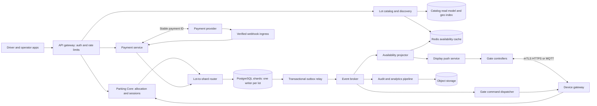
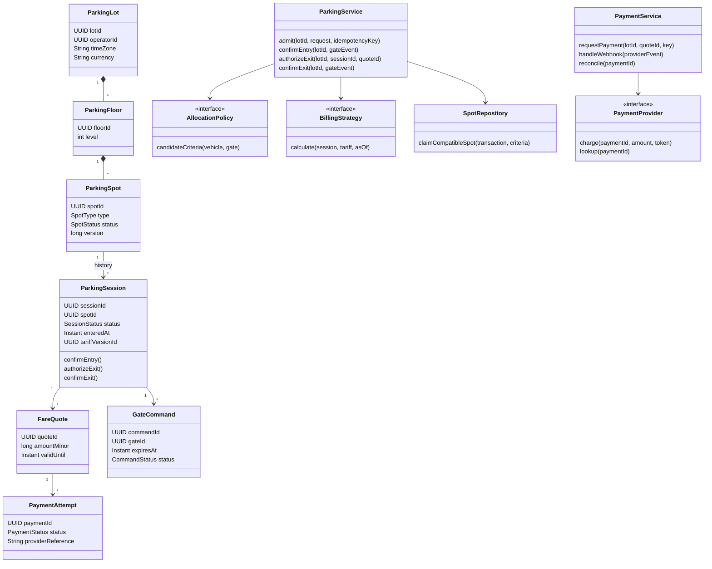
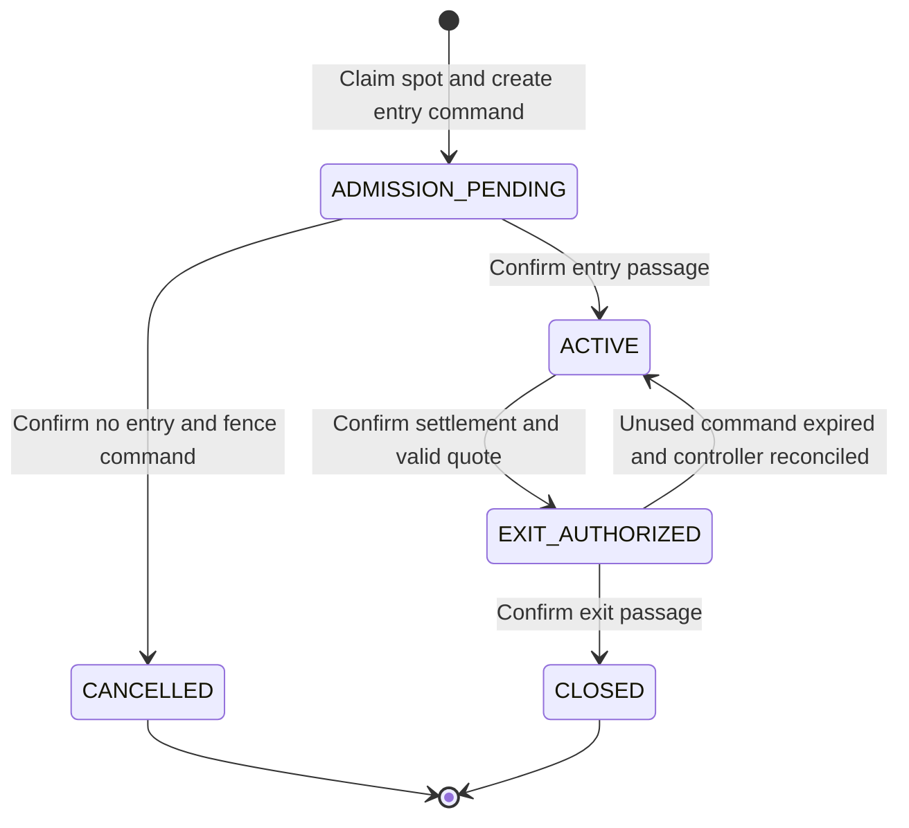

# Parking Lot at Production Scale - Amazon SDE-2 Interview Guide

This extends the [single-instance LLD](parking-lot-lld.md) into a multi-lot, multi-gate distributed system. It is a proposed architecture, not functionality implemented by the existing Java demo.

**Core idea:** Stateless application instances coordinate through transactional SQL, with each lot assigned to one writable database shard. Caches and events improve read scale; they do not decide who owns a spot. Payment and physical gate actions require retryable workflows, not one giant transaction.

## 1. Five questions to ask first

| Question | Assumed answer for this design |
|---|---|
| Are we managing one operator or many operators and lots? | Many operators, each with multiple lots, floors, and entry/exit gates. |
| Do we assign exact spots, and are reservations required? | Assign exact spots for walk-ins. Advance reservations are a follow-up. |
| How do pricing and payment work? | Versioned hourly/flat-rate pricing per lot, payment before exit, one currency per session. |
| What scale and latency should we design for? | 10,000 lots, 5 million spots, 10 million parking sessions/day; fast local gate decisions. |
| What should happen if connectivity, payment, or hardware fails? | Prefer no double allocation. Stop automated admissions without authority; provide audited manual/safety procedures. |

Spend about three minutes on these. State the assumptions explicitly instead of silently designing every possible feature.

## 2. Scope, assumptions, and invariants

### Functional requirements

Support lot discovery, approximate availability, vehicle admission, compatible spot allocation, digital/printed tickets, fare quotes, payments, exit authorization, and confirmed departure. Operators manage lot configuration, pricing, and maintenance status. Display boards receive availability updates.

Outside the initial scope: advance booking, subscriptions, valet operations, EV energy billing, dynamic pricing, and navigation within a floor.

### Operating assumptions

| Area | Decision |
|---|---|
| Allocation | Drivers follow assigned spots; sensors/attendants flag misparking. Software cannot guarantee physical compliance. |
| Vehicle compatibility | Size plus eligibility constraints. EV/accessibility spots are not available to every car merely because it fits. |
| Ownership | A lot belongs to one operator and one home region; its transactional records stay together. |
| Time and money | Store UTC instants and integer minor currency units; keep lot time zone for tariff rules. |
| Identity | Ticket/session ID is authoritative. Plates may be wrong, duplicated, or unavailable; do not use plates as global IDs. |
| Hardware | Controllers authenticate, durably record command/event IDs, and report passage separately from barrier opening. |

### Nonfunctional targets

Proposed targets, to confirm with the interviewer: 99.95% availability for the cloud admission/authorization APIs; p99 below 300 ms within the home region, excluding hardware and external payment latency; display/search availability usually within five seconds. At 99.95%, a 30-day month allows about 21.6 minutes of unavailability. Track successful physical passage separately from API availability.

**Correctness invariants:**

1. A spot has at most one live parking session across all application instances.
2. A request retry does not allocate another spot, create another ticket, or intentionally create another charge.
3. Exit authorization requires confirmed payment covering a valid quote, or an explicitly audited override.
4. Payment success or barrier opening alone does not free a spot; confirmed departure does.
5. Spot changes, session changes, and their outbox events commit together.
6. No request can read or mutate another operator's resources without authorization.

## 3. What changes from the original LLD?

| Single-instance concept | Production replacement | Reason |
|---|---|---|
| Singleton `ParkingLot` | Persistent `ParkingLot` entities identified by `lotId` | A process serves many lots; a lot is served by many processes. |
| `ConcurrentHashMap` spot storage | PostgreSQL tables and repositories | Memory disappears on restart and differs across instances. |
| Per-spot `ReentrantLock` | Database row locks, conditional transitions, unique constraints | JVM locks cannot coordinate different machines. |
| Scan every floor and spot | Indexed candidate selection inside an allocation transaction | Avoid loading the complete lot and racing after selection. |
| In-process Observer | Transactional outbox, broker, idempotent consumers | Notifications must survive crashes and support remote displays. |
| Synchronous pay-and-unpark | Payment workflow plus durable gate commands and passage confirmation | External services and physical devices cannot join a SQL transaction. |
| Mutable billing configuration | Immutable tariff version and persisted quote | Retries and price changes must not change an already accepted amount. |

Keep Strategy, Repository, dependency injection, and domain entities. Do not replace a local map with Redis and assume that spot ownership, ticket creation, and payment are now atomic.

## 4. Back-of-the-envelope sizing

These are planning assumptions, not measured traffic. Use decimal GB/TB.

| Input / calculation | Estimate |
|---|---|
| Lots x spots | 10,000 x 500 = 5 million spots |
| Turnover | 2 sessions/spot/day = 10 million sessions/day |
| Average arrivals | 10 million / 86,400 = about 116/second |
| Peak multiplier | 10x average = about 1,160 arrivals/second |
| Core mutations/session | 6: admission, entry passage, quote, payment request, exit authorization, exit passage |
| Core mutation traffic | 60 million/day = about 694/second average, 6,940/second peak |
| Payment callbacks | Assuming one/session: another 116/second average, 1,160/second peak, before retries |
| Availability reads | Assume 100 million/day = 1,157/second average, 11,570/second peak |
| Session bundle storage | Assume 2 KB/session for session, quote, payment, and compact audit records |
| Daily / annual logical storage | 20 GB/day; about 7.3 TB/year before indexes, replicas, and backups |
| Initial storage allowance | At an illustrative 3x overhead: about 21.9 TB/year; actual overhead must be measured |
| Event stream | 8 events/session x 1 KB = 80 GB/day, about 0.93 MB/s average and 9.3 MB/s peak |
| Spot-state storage | 5 million x 300 bytes = about 1.5 GB before indexes |
| Availability payload traffic | At 1 KB/response: about 11.6 MB/s at peak, excluding protocol overhead |

**Interpretation:** This is not millions of allocations per second. Stateless compute and partitioned SQL are sufficient starting points. The important problems are correctness, bursty lots, device connectivity, and payment recovery.

An average lot sees 1,000 sessions/day, but a stadium lot can dominate during an event. Do not size every lot from the global average. Load-test the largest lot and skewed arrival bursts.

The estimates exclude sensor telemetry, photos, broker replication, and extra database writes per transaction. Optional spot sensors reporting once/minute would add 5 million / 60 = about 83,333 messages/second. Route that traffic through separate ingestion and storage; do not update transactional SQL on every heartbeat. Upload images directly to object storage with short-lived upload permissions.

## 5. High-level architecture and service connections



### Boundaries and communication

| Component | Responsibility / connection |
|---|---|
| Parking Core | Owns spots, sessions, quotes, exit authorization, and gate commands; synchronous operations use the lot's SQL writer. |
| Catalog | Owns lot metadata and discovery; publishes configuration/read-model updates. A PostGIS index can serve initial geo search. |
| Payment service | Owns payment attempts, provider calls, callbacks, and reconciliation. |
| Device gateway | Authenticates controllers, validates lot/gate identity, and delivers commands and passage events. |
| Availability projector | Builds counts from committed inventory events; pushes snapshots to display boards. |
| Outbox relay / broker | Durable, at-least-once notification and background work, not the admission source of truth. |

For SDE-2 scope, start with a **modular Parking Core, payment worker, and asynchronous projections**, not ten independently deployed services. In this baseline, payment and session records are co-located in the lot database: the payment module can atomically record a successful payment and its session settlement reference through a defined transaction boundary.

If payments later own a separate database, replace that transaction with an idempotent `PaymentSucceeded` event consumed by Parking Core. Until the local settlement is recorded, exit remains pending. Do not pretend a remote service call is an atomic cross-database transaction.

Gate admission, allocation, and exit authorization are synchronous. Availability, analytics, and command delivery are asynchronous. The controller must persist pending operations so an API timeout does not cause a new admission request.

## 6. Class-level design



Historical sessions are one-to-many per spot; a database constraint restricts **live** sessions to one.

Use constructor-injected repositories, a transaction/unit-of-work abstraction, `Clock`, and policy implementations. `AllocationPolicy` supplies validated candidate filters and ranking, not an unlocked in-memory spot to claim later. `BillingStrategy` is deterministic for a tariff version and timestamp. `PaymentProvider` isolates provider-specific integration. A transaction boundary wraps spot, session, idempotency, and outbox repositories together.

The existing `Vehicle` hierarchy can remain, but a value object with type and eligibility is enough unless subtypes genuinely have different behavior. Keep device networking and SQL outside domain objects.

## 7. SQL or NoSQL?

**Choose PostgreSQL for authoritative inventory and financial/session records.** Allocation changes multiple related records, requires uniqueness, and benefits from short ACID transactions and row-level locking.

| Data | Storage | Why |
|---|---|---|
| Lots, spots, sessions, quotes, payments | PostgreSQL | Transactions, constraints, joins, and operational queries |
| Nearby-lot lookup | PostGIS initially; dedicated search index if needed | Geo queries, filters, eventual consistency acceptable |
| Availability and popular discovery responses | Redis | Fast, rebuildable reads; never authoritative allocation |
| Events and analytics | Broker plus object storage / warehouse | Durable fan-out and inexpensive long-term history |
| High-volume optional telemetry | Time-series or NoSQL store | Append-heavy ingestion and time-based retention |

A NoSQL design is possible with conditional writes and transactional operations within supported limits, often grouping records by `lotId`. It needs explicit access-pattern design and equivalent uniqueness guarantees. A hot lot can still become a hot partition. "NoSQL scales" is not a sufficient reason to give up convenient transactional invariants.

## 8. Tables, keys, and indexes

Unless noted otherwise, lot-local tables have `lot_id` as part of their primary and foreign keys. IDs are globally unique UUIDs, but the API still carries `lotId` for routing and authorization. Foreign keys must prevent attaching a spot, quote, or gate from another lot.

| Table | Important columns | Keys / indexes / constraints |
|---|---|---|
| `operators` | `operator_id`, name, status | Global catalog PK `operator_id` |
| `parking_lots` | `lot_id`, `operator_id`, name, location, time_zone, currency, config_version | PK `lot_id`; operator index; geo index in discovery store |
| `floors` | `lot_id`, `floor_id`, level | PK `(lot_id, floor_id)`; unique lot/level |
| `gates` | `lot_id`, `gate_id`, direction, device_identity, status | PK `(lot_id, gate_id)`; unique device identity |
| `parking_spots` | `lot_id`, `spot_id`, `floor_id`, spot_type, eligibility, status, allocation_rank, version | PK `(lot_id, spot_id)`; partial available-spot index |
| `parking_sessions` | `lot_id`, `session_id`, `spot_id`, plate_token, vehicle_type, status, admitted_at, entered_at, exited_at, tariff_version_id, settled_quote_id, version | PK `(lot_id, session_id)`; partial unique live session/spot; lot/time index |
| `tariff_versions` | `lot_id`, `tariff_version_id`, effective_from, rules, currency | Immutable versions; explicit active tariff selection |
| `fare_quotes` | `lot_id`, `quote_id`, `session_id`, tariff_version_id, calculated_at, valid_until, amount_minor, currency | Immutable; session/time index; nonnegative amount |
| `payment_attempts` | `lot_id`, `payment_id`, `session_id`, `quote_id`, status, provider_reference, amount_minor, currency, next_reconcile_at | Unique provider reference per provider; at most one unresolved attempt/session |
| `gate_commands` | `lot_id`, `command_id`, `session_id`, `gate_id`, kind, status, expires_at, passage_deadline | Unique live command/session/direction; delivery-status index |
| `gate_events` | `lot_id`, `gate_id`, `event_id`, `command_id`, kind, occurred_at, received_at | Unique `(lot_id, gate_id, event_id)` for durable device deduplication |
| `idempotency_requests` | `lot_id`, caller_id, operation, key, request_hash, resource_id, response_status, response_body, expires_at | Unique `(lot_id, caller_id, operation, key)` |
| `outbox_events` | `lot_id`, `event_id`, aggregate_id, aggregate_version, type, payload, created_at, published_at | Unique event ID; index unpublished events |
| `consumer_inbox` | consumer_name, event_id, processed_at | Consumer-local unique `(consumer_name, event_id)` |
| `audit_events` | `lot_id`, audit_id, actor, action, resource_id, reason, occurred_at | Append-only; lot/resource/time index; archive by retention policy |

Store local lot configuration on the owning shard; replicate catalog metadata to discovery. The routing directory maps `lotId` to region/shard and is not a cross-shard join in every transaction.

Representative PostgreSQL indexes:

```sql
CREATE INDEX available_spot_candidates
    ON parking_spots (lot_id, spot_type, allocation_rank, spot_id)
    WHERE status = 'AVAILABLE';

CREATE UNIQUE INDEX one_live_session_per_spot
    ON parking_sessions (lot_id, spot_id)
    WHERE status IN ('ADMISSION_PENDING', 'ACTIVE', 'EXIT_AUTHORIZED');

CREATE UNIQUE INDEX one_unresolved_payment_per_session
    ON payment_attempts (lot_id, session_id)
    WHERE status IN ('PENDING', 'UNKNOWN');

CREATE UNIQUE INDEX one_successful_payment_per_quote
    ON payment_attempts (lot_id, quote_id)
    WHERE status = 'SUCCEEDED';
```

These indexes supplement state-machine checks; they do not replace transactional updates. Use constrained status values, nonnegative amounts, and composite foreign keys. The payment module also serializes payment creation against the session row so a different quote cannot bypass an existing settlement or unresolved charge.

At larger history volumes, keep live sessions in an unpartitioned table per shard and move terminal sessions to time-partitioned history. Naively partitioning sessions by entry month can invalidate a uniqueness rule that must span all live sessions.

## 9. APIs and contracts

All routes below are under `/v1`. Authenticate drivers/operators with scoped tokens and controllers with device credentials. Derive operator permissions from identity; never trust a supplied `operatorId` alone.

| Method and route | Important request / response | Semantics |
|---|---|---|
| `GET /lots?lat=...&lon=...&radiusKm=...&cursor=...` | Lot metadata and approximate availability | Paginated geo discovery; cap radius and page size |
| `GET /lots/{lotId}/availability` | Counts by type, `asOf`, stale flag | Eventually consistent, not an allocation promise |
| `POST /lots/{lotId}/admissions` | Gate, arrival ID, vehicle type, eligibility; returns session, spot, command | Atomically claims inventory; `201`, or replay of original response |
| `GET /lots/{lotId}/sessions/{sessionId}` | Session, spot, payment summary | Authoritative status recovery after a timeout |
| `POST /lots/{lotId}/sessions/{sessionId}/quotes` | Returns quote ID, amount, currency, expiry | Server calculates and persists fare |
| `POST /lots/{lotId}/sessions/{sessionId}/payments` | Quote ID, payment-method token; returns payment ID/status | Usually `202`; external charge is asynchronous |
| `GET /lots/{lotId}/payments/{paymentId}` | Pending, unknown, succeeded, or failed | Polling/recovery without starting a new charge |
| `POST /lots/{lotId}/sessions/{sessionId}/exit-authorizations` | Exit gate, quote ID; returns durable command ID and expiry | Requires confirmed settlement and valid quote |
| `POST /lots/{lotId}/gates/{gateId}/events` | Event ID, command ID, passage kind, device timestamp | Device-only; entry/exit passage confirmation |
| `PATCH /lots/{lotId}/spots/{spotId}` | Desired maintenance state; `If-Match` version | Operator-only conditional transition; `412` on version mismatch |
| `POST /lots/{lotId}/tariff-versions` | New immutable pricing rules | Operator-only; does not rewrite existing session tariffs |
| `POST /payment-webhooks/{provider}` | Signed provider event | Provider authentication, replay protection, idempotent settlement |

Require `Idempotency-Key` on mutating admission, quote, payment, and exit-authorization requests. Device events use durable event IDs. Maintenance uses a version precondition; administrative creation endpoints also accept an idempotency key.

Example admission:

```http
POST /v1/lots/lot-42/admissions
Idempotency-Key: gate-3-arrival-901
Content-Type: application/json

{
  "gateId": "gate-3",
  "arrivalId": "arrival-901",
  "vehicle": {"type": "CAR", "plate": "KA-01-AB-1234"},
  "eligibility": {"accessiblePermit": false, "requiresEvCharging": false}
}
```

```json
{
  "sessionId": "session-123",
  "spotId": "spot-17",
  "status": "ADMISSION_PENDING",
  "gateCommandId": "command-456"
}
```

IDs here are readable placeholders. Return a signed ticket token or opaque high-entropy ticket credential, not merely a guessable session ID that authorizes actions.

Use structured errors such as `{ "code": "LOT_FULL", "retryable": false }`. Distinguish genuine `409 LOT_FULL` from transient `503 ALLOCATION_BUSY` with `Retry-After`. Use `409 IDEMPOTENCY_KEY_REUSED` for a changed payload, `409 PAYMENT_PENDING` for an unresolved charge, and `429` for throttling. A payment page redirect is not proof of payment.

## 10. State machines: business state versus physical state



| Entity | States and rules |
|---|---|
| Spot | `AVAILABLE -> HELD -> OCCUPIED -> AVAILABLE`; admission cancellation allows `HELD -> AVAILABLE` only after safe reconciliation |
| Session | `ADMISSION_PENDING -> ACTIVE -> EXIT_AUTHORIZED -> CLOSED`; cancellation only before confirmed entry |
| Payment attempt | `PENDING -> SUCCEEDED / FAILED / UNKNOWN`; resolve `UNKNOWN` by provider lookup, never by guessing |
| Gate command | `PENDING -> DELIVERED -> EXECUTED -> PASSAGE_CONFIRMED`; execution means barrier action, not vehicle passage |

`OUT_OF_SERVICE` spots cannot be allocated. Disabling an available spot competes for the same row lock as admission. An occupied spot must first drain; do not free it to satisfy a maintenance request.

**Timeout does not mean the space is physically empty.** If an entry acknowledgment is lost, keep the spot held until the controller's durable log, sensors, or an attendant establishes whether the vehicle entered. Revoke/fence any old command before releasing the spot.

## 11. Admission: races, transactions, and idempotency

### Transaction boundary

Route to the lot's writable shard. Use a short PostgreSQL `READ COMMITTED` transaction with explicit locks and constraints:

```sql
BEGIN;

-- Claim the scoped idempotency key with its request hash.
INSERT INTO idempotency_requests
    (lot_id, caller_id, operation, key, request_hash, expires_at)
VALUES
    (:lot_id, :caller_id, 'ADMIT', :key, :request_hash, :expires_at)
ON CONFLICT DO NOTHING;

-- Continue only if inserted. Otherwise read/replay the committed request
-- or reject a different hash; do not allocate another spot.

SELECT spot_id
FROM parking_spots
WHERE lot_id = :lot_id
  AND status = 'AVAILABLE'
  AND spot_type = ANY(:compatible_types)
  AND eligibility = ANY(:allowed_eligibility_classes)
ORDER BY allocation_rank, spot_id
LIMIT 1
FOR UPDATE SKIP LOCKED;

-- If no row is selected, handle contention/fullness outside this example.
UPDATE parking_spots
SET status = 'HELD', version = version + 1
WHERE lot_id = :lot_id AND spot_id = :spot_id AND status = 'AVAILABLE';

INSERT INTO parking_sessions
    (lot_id, session_id, spot_id, vehicle_type, status,
     admitted_at, tariff_version_id)
VALUES
    (:lot_id, :session_id, :spot_id, :vehicle_type,
     'ADMISSION_PENDING', CURRENT_TIMESTAMP, :tariff_version_id);

-- Insert durable entry gate_command and SpotHeld outbox event.
-- Persist the resource ID, HTTP status, and response in idempotency_requests.
COMMIT;
```

This is a transaction sketch, not a standalone migration. Validate the authenticated gate, compatibility, lot configuration, and tariff selection as part of admission. Assert exactly one spot update; any failure rolls back the entire transaction. Eligibility parameters are server-derived policy results, not arbitrary client claims.

`SKIP LOCKED` lets another allocator choose a different spot rather than wait. The unique live-session index is a second defense. "Nearest" becomes best available among unlocked eligible candidates, not a strict global ordering guarantee. Gate-specific distance ranking can be a later policy/index refinement.

An empty `SKIP LOCKED` result can mean that candidates are temporarily locked, **not that the lot is full**. Retry with jitter within a bounded deadline, inspect authoritative inventory if necessary, then report busy rather than falsely asserting full. Do not indefinitely retry or hold a lot-wide lock.

### Idempotency protocol

The scope is `(lotId, callerId, operation, key)`, with a hash of canonical request content. Same key and same payload returns the original resource/response; same key with different content is rejected.

Concurrent inserts for the same key coordinate through the unique constraint. After the competing transaction commits, replay its record; if it rolls back, retry claiming the key. Bound waits and return a retryable response on timeout. Admission idempotency is committed in the same transaction as allocation, so there is no durable half-created ticket.

For asynchronous payments, commit the payment ID and `202` response first, then let a worker invoke the provider. A replay returns that same payment ID; callers use the status API for current state.

Retain generic request records for at least the supported retry window, for example seven days. This is not infinite deduplication: reject expired offline arrivals, and retain payment references and gate-event deduplication for their longer business/replay windows. Controllers must reuse a stable arrival key across network retries; a new key represents a new request.

### Admission sequence

```mermaid
sequenceDiagram
    participant G as Gate controller
    participant C as Parking Core instance
    participant DB as Lot SQL writer
    participant D as Outbox and command dispatcher
    G->>C: Admit(arrivalId, stable idempotency key)
    C->>DB: Begin; claim key; lock eligible spot
    C->>DB: Hold spot + session + command + outbox + response
    DB-->>C: Commit
    C-->>G: Session ID, assigned spot, command ID
    D->>DB: Read committed command/outbox
    D->>G: Deliver entry command, retry same command ID
    G->>G: Persist command; enforce expiry and deduplication
    G->>C: Entry passage event with stable event ID
    C->>DB: Deduplicate; HELD to OCCUPIED; session to ACTIVE; outbox
    DB-->>C: Commit
    C-->>G: Acknowledge passage
```

Do not open the gate based only on a preliminary availability check. Never hold the database transaction open while operating hardware.

## 12. Payment and exit workflow

1. **Quote:** Lock/read the active session, use its pinned tariff version and server time, and persist an immutable quote. Assume a five-minute quote/payment-and-exit window; the UI shows the deadline.
2. **Prepare payment:** Lock the session, validate quote ownership/currency/expiry, and reject conflicting unresolved attempts. Persist a payment attempt plus outbox work and idempotency response, then commit.
3. **Charge externally:** The worker sends `paymentId` as the provider idempotency key. Do not hold SQL locks during the call. A transport timeout becomes `UNKNOWN`, not `FAILED`.
4. **Settle:** A verified callback or reconciliation lookup confirms provider status, amount, currency, and merchant. In one local transaction, deduplicate the notification, record success, and attach the settled quote to the session. Duplicate/late notifications cannot regress a terminal success.
5. **Authorize exit:** Lock the session. Require the settled quote and check its deadline at authorization time; create one live, short-lived command bound to session, lot, gate, and direction. Leave the spot occupied.
6. **Confirm departure:** A controller passage event locks the session and spot, deduplicates the event, closes the session, frees the spot, and writes the outbox event atomically.

If the quote expires before exit authorization, issue a new quote. Credit **all confirmed prior payments** when calculating the remaining amount, and charge only any positive difference. Persist credit references under the session lock; do not charge the full total twice. Never start another payment while an earlier attempt is `UNKNOWN`.

A command admitted before its expiry can complete within a bounded passage window; late event delivery is accepted after validating the controller's persisted execution record. Uncertain execution after expiry requires reconciliation, not a blind new command at another gate.

Payment providers must support idempotent charge creation and lookup by a stable merchant reference. If they do not, an ambiguous result requires manual/provider reconciliation before another charge. A database unique index cannot undo an external double charge.

| Failure / race | Handling |
|---|---|
| Client loses admission response after commit | Retry same key; return same session/spot, not a new allocation |
| Two gates request the last spot | Row lock and live-session uniqueness allow one claim |
| Two payment requests with different keys | Session lock plus unresolved-attempt constraint prevents concurrent external attempts |
| Provider charges but worker crashes before recording success | Retry/lookup the same payment ID; callback or reconciler records the original success |
| Duplicate or out-of-order payment callback | Deduplicate; validate monotonic state; fetch provider truth on contradictory status |
| Two exit gates authorize the same session | Session lock and one-live-command constraint bind one command to one gate |
| Exit passage event is delivered twice | Unique device event and terminal session state prevent duplicate release/events |
| Entry passage arrives after a cancellation request | Do not finalize cancellation until old command is fenced and device history is reconciled |
| Vehicle paid but gate is broken | Keep spot occupied; reconcile/revoke old command before another gate command or audited manual exit |
| Vehicle stays for days | Alert and investigate; never auto-release an occupied spot merely due to age |

For existing sessions, use a consistent lock order: session, then spot, then payment/command rows as required. Admission locks a spot and creates a new session; it does not lock an existing session. Retry detected deadlocks/serialization failures only with a bounded retry budget and the same idempotency identity.

## 13. Events, cache correctness, and "exactly once"

The outbox event is inserted with the business transaction. A relay publishes it and marks it sent. If it crashes after publish but before marking, it publishes again: **at-least-once delivery is expected**.

Use `eventId`, `lotId`, aggregate ID, aggregate version, timestamp, type, and schema version. Key inventory events by `lotId + spotId` for per-spot ordering without forcing a huge lot into one broker partition.

A SQL consumer can insert its inbox record and update its projection in one transaction. For Redis availability, use an atomic script that checks the spot's last applied version, replaces its projected state, and adjusts old/new type counts together. Events carry the resulting state, not only `+1/-1`, so a duplicate or stale event cannot corrupt the count. A SQL inbox alone cannot make a separate Redis update atomic.

Redis can lose data during failover. Rebuild from an authoritative inventory snapshot plus events captured after the snapshot boundary; compare per-spot versions to avoid overwriting newer updates. Periodically reconcile counts with SQL. Mark data stale or unavailable during rebuild; do not display an unverified count as exact.

Search and display consumers may lag. Allocation and exit checks read the writer, not a read replica/cache. The useful guarantee is **effectively-once business effects through transactions, deduplication, and reconciliation**, not magical exactly-once execution across SQL, a broker, a payment provider, and a physical barrier.

## 14. Scaling and availability strategy

### Scale in stages

| Stage | Design | Trigger for next step |
|---|---|---|
| Initial | Stateless application replicas, one HA PostgreSQL cluster, outbox worker, Redis for popular reads | Measured CPU, I/O, lock contention, storage growth, or blast-radius limits |
| Regional scale | Route lots across database shards; isolate device ingestion and payment workers | Growing regional traffic and noisy-neighbor impact |
| Large/global | Home region per lot, dedicated placement for exceptionally busy lots, replicated discovery | Geography, regional isolation, and disaster-recovery needs |

Use a routing directory or virtual buckets to map `lotId` to a shard, rather than a hard-coded modulo that moves most lots when capacity changes. Keep all of a lot's transactional entities on that shard. Put `lotId` into queue payloads, device identities, tickets, and provider routing metadata; resolve metadata only after authentication.

Do not shard spots randomly across databases: admission would lose a simple local transaction. Fleet-wide reports use the analytics pipeline rather than fan-out joins across transactional shards.

Scale application instances behind a load balancer; cap each instance's connection pool so scaling compute does not exhaust SQL connections. Use per-lot/device limits, bounded queues, worker concurrency limits, and load shedding. Cache immutable tariffs by version. Avoid synchronously updating one `lot.available_count` row on every admission: it becomes a hot lock.

At a hot lot, spread candidate ranking by gate/zone while preserving compatibility rules. Consider dedicated shard placement before introducing cross-shard allocation. SQL query throughput, transaction latency, and lock waits determine actual capacity, not the number of service boxes in the diagram.

### Consistency and failure policy

| Situation | Policy |
|---|---|
| Application instance dies | Another instance handles the retry using persistent state and the same key |
| Redis or discovery projection fails | Gate correctness unaffected; serve marked stale data or rate-limited SQL reads |
| Broker unavailable | Business changes and outbox persist; command delivery/displays can lag; stop new admissions if dispatch health makes holds unsafe |
| SQL writer unavailable | No new authoritative allocation; fail over to a fenced replacement writer |
| Gate loses connectivity | No independent cloud-and-edge allocations against the same inventory |
| Payment provider unavailable | Keep payments pending/unknown as appropriate; no automatic unpaid authorization |
| Region unavailable | Discovery may remain available; affected lots stop automated mutations until fenced recovery or a defined local policy |

Within a region, use managed failover with synchronous replication across failure zones where available; target RPO 0 for acknowledged transactions under the chosen configuration. Cross-region disaster recovery often uses asynchronous replication, so its RPO is nonzero. A proposed regional RTO such as 15 minutes requires exercises and sufficient standby capacity, not just a diagram.

Promoting a stale replica can lose acknowledged allocations or payments. Fence the old writer, reconcile affected lots against controller logs and the provider, and quarantine uncertain inventory before reopening admissions. Do not promise no double allocation with uncoordinated active-active regional writers.

Offline autonomous operation is an extension: give the edge controller **exclusive ownership of a disjoint inventory pool**, or hand over the entire lot under a fenced ownership protocol. A lease timeout alone is insufficient if a disconnected device can still open a barrier. The old authority must actually stop accepting commands before ownership is reassigned.

Emergency/manual egress follows site safety and legal policy even during outages; record overrides and reconcile occupancy/debt afterward. Business payment rules must not prevent required emergency evacuation.

## 15. Production concerns worth mentioning

| Concern | Concrete answer |
|---|---|
| Authentication / isolation | Device mTLS; operator RBAC scoped to lots; ownership checks on every session, quote, and spot API |
| Ticket fraud | Signed/opaque ticket credentials, expiry where applicable, server-side state checks, rate-limited lookup |
| Payment security | Tokenized payment methods; no raw card data; verified webhooks and protected provider credentials |
| Plate privacy | Encrypt raw plates, use keyed lookup tokens if needed, redact logs, define deletion/access policies |
| Billing correctness | UTC durations, explicit rounding and local tariff time zone, pinned tariff version, integer currency amounts |
| Device reliability | Durable command IDs, expiry, replay rejection, persisted passage events, clock health and controller reconciliation |
| Observability | p99 gate API latency, allocation conflicts, DB lock waits, outbox age, device offline rate, stale counts, unknown payments |
| Reconciliation | Compare live sessions with held/occupied spots, gateway logs, provider settlements, and availability projections |
| Auditability | Append-only records for overrides, refunds, pricing changes, maintenance changes, and session transitions |
| Retention | Keep live/recent records hot; archive historical sessions/events; align financial and personal-data retention with applicable rules |

Alert on invariants, not just CPU: a paid transaction without a settled session, a closed session retaining a spot, or an expired command with unknown passage is actionable. Use request/session/payment/command IDs for tracing while keeping high-cardinality identifiers out of metric labels.

### Correctness scenarios to propose in the interview

Drive hundreds of concurrent admissions against one remaining spot; exactly one live session should exist. Drop responses immediately after commits and replay the same keys. Simulate a successful provider charge followed by a worker crash. Duplicate and reorder callbacks and passage events. Disconnect a controller after it opens a barrier. Crash the outbox relay between publish and acknowledgment. Fail over the database and confirm old writers are fenced. These scenarios exercise the guarantees that a normal happy-path demo misses.

## 16. Follow-up questions and strong short answers

| Interviewer question | Answer / trade-off |
|---|---|
| Why not a Redis distributed lock? | A lock alone does not atomically create the ticket and change inventory. Leases expire and stale holders need fencing. SQL already provides the local transaction we need. |
| Can optimistic locking replace row locks? | Yes: conditional `UPDATE ... WHERE version = ? AND status = 'AVAILABLE'`, then insert session in the same transaction. Contention causes retries; pessimistic candidate locking is simpler here. |
| Do we need serializable isolation? | Not for the stated exact-spot invariant when every transition uses row locks and uniqueness. More complex predicate constraints may need serializable transactions or explicit capacity rows. |
| How would reservations work? | Define exact-spot versus category capacity first. Exact-spot bookings can use time-range exclusion constraints; category bookings need atomic capacity accounting. Redis TTL is not a reservation guarantee. |
| Can a walk-in use a spot reserved for later? | Only with a enforceable departure/buffer policy. With unbounded stays, isolate reserved inventory or avoid guaranteeing that future exact spot. |
| What if we allocate capacity, not exact spots? | Use conditional per-zone/type capacity decrement plus session creation in one transaction. Bucket hot counters and model shared fit rules carefully to avoid selling the same capacity twice. |
| Can one car enter two lots simultaneously? | The base design guarantees spot ownership, not global plate uniqueness. A strict cross-lot active-vehicle rule needs an authoritative vehicle claim and additional cross-shard workflow/availability cost. |
| How would you add EV charging? | Add charger capabilities and a metering/charging session with separate lifecycle and billing; inheritance alone does not integrate charger hardware or energy settlement. |
| How would refunds work? | Create an idempotent refund entity tied to the successful payment, reconcile with provider truth, and audit it. Never erase the original charge. |
| What about lost tickets or incorrect plates? | Attendant-assisted identity/evidence lookup with an audited replacement/override. Plate recognition is a hint, not authentication. |
| Can search promise the last spot? | No. Search is approximate; only a committed allocation or explicitly supported reservation can promise inventory. |
| Why not microservices for every class? | Classes are not service boundaries. Keep inventory and session transitions together; split deployment only for ownership, scale, or isolation benefits. |
| How do you migrate a lot to another shard? | Copy and catch up, pause/fence writes and in-flight work for that lot, update routing, resume on the new writer, reject stale routes. Never allow both shards to allocate. |
| How do you recover an unknown payment? | Query the provider using the original merchant reference; reuse its idempotency key while supported. If still uncertain, reconcile manually rather than charge again. |
| How do you guarantee exactly-once gate opening? | Do not claim it without hardware support. Durable device deduplication plus passage sensors limits duplicates; crashes around actuation require reconciliation. |
| Does CQRS help? | A separate availability/search read model helps read scale. We do not need full event sourcing: SQL remains the system of record, and outbox events drive projections. |

## 17. A 45-minute interview walkthrough

| Time | Focus |
|---|---|
| 0-4 minutes | Ask the five questions; agree on scope and failure policy |
| 4-8 minutes | State invariants, latency targets, and rough traffic/storage |
| 8-15 minutes | Draw services, database ownership, and synchronous/asynchronous connections |
| 15-22 minutes | Explain entities, APIs, SQL schema, and key indexes |
| 22-33 minutes | Deep dive on admission transaction, last-spot race, idempotency, payment uncertainty, physical exit |
| 33-39 minutes | Sharding, cache projections, hot lots, failover, and offline trade-offs |
| 39-45 minutes | Discuss interviewer-selected extensions and summarize the core guarantees |

**Opening pitch:**

> "I'll keep the domain model from the LLD, remove the process-wide singleton, and make spot ownership a SQL transaction. Each lot has one writable home shard, so multiple gates and application instances can safely compete for spots. Search and display counts are eventual, while allocation is authoritative. Payments and gates use durable IDs, retries, and reconciliation because neither can join our database transaction."

**Avoid these interview traps:** claiming JVM locks work across instances; allocating from cached availability; freeing a spot on payment or timeout; treating a payment timeout as failure; claiming exactly-once delivery; choosing active-active writes without fencing; or adding sharding and many microservices without a measured reason.
