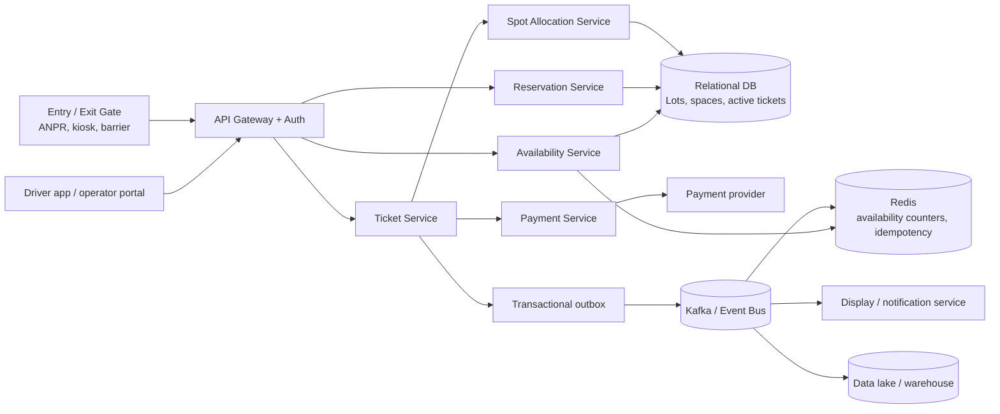
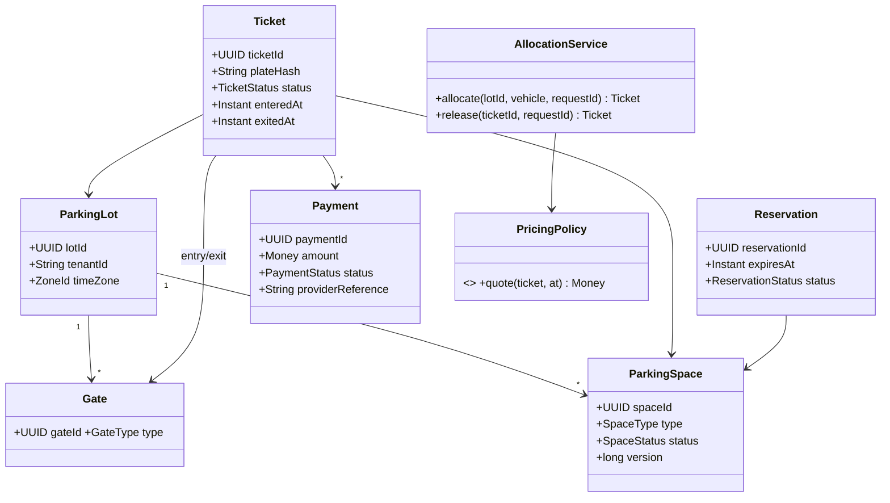

# Parking Lot at Production Scale (Amazon SDE-2)

Design a platform that operates many parking lots, supports concurrent entry and exit at many gates, and provides near-real-time availability.

## 1. Clarify First

1. Are spaces assigned at entry, reserved in advance, or both?
2. Is payment required before the barrier opens, and which payment methods/providers are supported?
3. Is availability exact or can displays tolerate a few seconds of delay?
4. Are lots independently operated tenants with different prices, rules, and time zones?
5. What is the peak gate traffic and availability-read QPS?

## 2. Scope and Assumptions

- 10,000 lots, 1,000 spaces/lot, 20 entry/exit gates per busy lot.
- Peak: 100,000 gate operations/minute; 1 million availability reads/minute.
- Vehicle entry, exit, spot assignment, hourly/daily pricing, payments, reservations, and displays are in scope.
- A space must never be assigned to two active tickets. A gate operation must be safe to retry.
- The payment ledger and active occupancy need strong consistency; display/search data may be eventually consistent (target <5 seconds).

## 3. Architecture



- **API Gateway** authenticates gates/operators and rate-limits clients.
- **Allocation Service** owns the atomic claim/release workflow. Partition/shard by `lot_id`.
- **Relational DB** is the source of truth for money and occupancy. Use read replicas for history/reporting.
- **Redis** serves per-lot/type availability and short-lived idempotency responses; it is never the source of truth.
- **Kafka + outbox** fan out immutable events (`TicketOpened`, `SpotAssigned`, `PaymentCaptured`, `SpotReleased`) without dual-write loss.

## 4. Core Model and Class-Level Design



Keep pricing as a versioned policy/strategy selected by lot and effective time; persist the policy version and final price on the ticket.

## 5. APIs

| API | Purpose |
|---|---|
| `POST /v1/lots/{lotId}/entries` | Claim a compatible space and create a ticket. Requires `Idempotency-Key`. |
| `POST /v1/tickets/{ticketId}/exit-quote` | Return the current payable amount and quote expiry. |
| `POST /v1/tickets/{ticketId}/payments` | Authorize/capture payment. Requires `Idempotency-Key`. |
| `POST /v1/tickets/{ticketId}/exits` | Finalize exit and release the space after successful payment. Requires `Idempotency-Key`. |
| `POST /v1/lots/{lotId}/reservations` | Hold a compatible space for a time window. |
| `GET /v1/lots/{lotId}/availability` | Return available counts by space type; normally served from Redis. |

Entry response: `{ticketId, spaceCode, entryTime, barcodeOrToken}`. Gate commands include a unique `gateEventId`, gate ID, observed timestamp, and plate/token.

## 6. Data Stores and Tables

Use **PostgreSQL/Aurora** (or a similarly transactional relational store) for the operational path: unique constraints, row locks, transactions, and an auditable payment ledger outweigh flexible-schema benefits. Use Kafka/object storage for event history and analytics; use Redis only as a rebuildable projection.

| Table | Key fields / constraints |
|---|---|
| `tenants` | `tenant_id PK` |
| `parking_lots` | `lot_id PK`, `tenant_id`, `timezone`, `pricing_policy_id` |
| `gates` | `gate_id PK`, `lot_id`, `type`, `status` |
| `parking_spaces` | `space_id PK`, `lot_id`, `type`, `status`, `version`; index `(lot_id, type, status, distance_rank)` |
| `tickets` | `ticket_id PK`, `lot_id`, `space_id`, `plate_hash`, entry/exit gate/times, `status`; partial unique index on `space_id WHERE status IN ('ACTIVE','EXIT_PENDING')` |
| `reservations` | `reservation_id PK`, `lot_id`, `space_id nullable`, vehicle reference, start/end/expiry, `status` |
| `payments` | `payment_id PK`, `ticket_id`, amount/currency, provider reference `UNIQUE`, `status` |
| `idempotency_keys` | `(scope, key) PK`, request hash, response, status, expiry |
| `outbox_events` | `event_id PK`, aggregate ID/type, payload, created/published timestamps |
| `availability_counters` | `lot_id`, `space_type`, available/reserved/occupied counts; projection/reconciliation aid |

Encrypt sensitive data; store a normalized, salted hash of license plates unless full plate retention is legally required. Partition large ticket/event tables by time and/or `lot_id`.

## 7. Correctness Under Concurrency

### Atomic allocation

Do not scan in application memory then mark a space occupied. In one database transaction:

```sql
SELECT space_id
FROM parking_spaces
WHERE lot_id = :lotId AND type IN (:compatibleTypes) AND status = 'AVAILABLE'
ORDER BY distance_rank
FOR UPDATE SKIP LOCKED
LIMIT 1;

UPDATE parking_spaces SET status = 'OCCUPIED', version = version + 1
WHERE space_id = :spaceId;
INSERT INTO tickets (..., status) VALUES (..., 'ACTIVE');
INSERT INTO outbox_events (..., type) VALUES (..., 'SpotAssigned');
COMMIT;
```

- `SKIP LOCKED` lets simultaneous gates choose different spaces instead of waiting behind one popular spot.
- The transaction and partial unique index protect against duplicate active assignment even during retries/failover.
- For a database without row locks, use compare-and-set: `UPDATE ... WHERE space_id=? AND status='AVAILABLE' AND version=?`; retry a different candidate on zero rows updated.
- Reserve a specific spot only when required; otherwise reserve a **capacity token** per lot/type to avoid stranded inventory. Expire holds with a scheduled worker.

### Idempotency and failures

- Persist the request key before work: same scope/key + same request hash returns the stored response; a different hash returns `409 Conflict`.
- Make payment calls idempotent using the same payment key/provider reference. Never release the space until capture is confirmed.
- Write the domain change and outbox record in one transaction. Publish asynchronously; consumers deduplicate by `event_id`.
- If a gate loses its response, retrying the same `gateEventId` returns the original ticket/exit result, not a second transition.
- Model ticket transitions explicitly: `ACTIVE -> EXIT_PENDING -> CLOSED`; reject invalid transitions with `409`.

## 8. Scale Estimate

| Item | Estimate |
|---|---:|
| Total spaces | 10,000 × 1,000 = **10M** |
| Gate write peak | 100K/min ≈ **1.7K writes/s** |
| Availability reads | 1M/min ≈ **16.7K reads/s** |
| Ticket history | 10M tickets/day × ~1 KB ≈ **10 GB/day** before indexes/replicas |
| Cache footprint | 10K lots × ~10 counters is small; cache hot lot responses and invalidate/project from events |

Shard the primary database by `lot_id` once a single writer cluster cannot meet latency/throughput. A request for one lot stays on one shard, so allocation needs no distributed transaction.

## 9. Operational Notes

- SLO: entry allocation p99 <300 ms; availability API p99 <100 ms; no double allocation.
- Use multi-AZ database and Kafka, retries with jitter, circuit breakers for payment provider, and a gate offline queue with signed events.
- Reconcile `parking_spaces`, active tickets, counters, and sensor feeds periodically; alert and route mismatches to an operator workflow.
- Audit all ticket/payment state changes. Use RBAC by tenant and lot.

## 10. Likely Follow-ups

| Follow-up | Concise answer |
|---|---|
| How do you support dynamic pricing? | Version pricing policies by lot, vehicle type, time, demand; snapshot the version and quote on the ticket. |
| What if a sensor disagrees with ticket state? | Treat it as a reconciliation event, flag the space, and require an operator/sensor-confirmed correction; do not silently overwrite ledger state. |
| How do you support a city-wide search? | Index eventually consistent availability projections in a geo-search store; booking revalidates capacity transactionally on the lot shard. |
| What if Redis is unavailable? | Read availability from a DB counter/replica with degraded latency; allocations continue against the primary database. |
| How do you handle offline gates? | Queue signed, ordered gate events locally; server-side idempotency and transition checks safely replay them on reconnect. |
